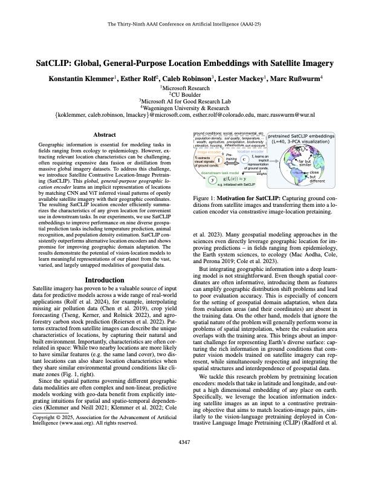

# Geospatial Representation Learning

## Course Structure and Format

Winter Semester 2026/27  
Mobile Robotics, Geodesy and Geoinformation & Geodetic Engineering

---

# Course Learning Outcomes

After completing the course, you will be able to:

1. **Explain** the main concepts of *geospatial representation learning*, including *explicit embeddings*, *embedding databases*, *location encoders*, and *implicit neural representations*.

2. **Identify and compare** relevant *geospatial data sources*, including satellite imagery, time series, GIS layers, and multimodal Earth observation datasets.

3. **Implement and evaluate** selected *machine learning workflows* for geospatial data using *Python-based tools*.

4. **Critically assess** recent *research papers* in geospatial AI, foundation models, and Earth embeddings.

5. **Design and execute** a small *research-oriented geospatial analysis project* in a student group.

6. **Develop and evaluate** a *prototype AI agent* for geospatial data analysis.

7. **Communicate** technical results through *written exercise reports*, *oral presentations*, and *scientific discussion*.

---

# Three Phases: 

<h3>Phase 1: Lectures &amp; Labs </h3>

Build conceptual and technical foundations through lectures and hands-on exercises.

<strong>Examination:</strong> final written exam on the course content.

<h3>Phase 2: Paper Analysis </h3>

Analyze and review recent research papers in student groups.

<strong>Examination:</strong> pass/fail paper presentation with questions.

<h3>Phase 3: Group Projects </h3>

Develop code and conduct a research-oriented geospatial analysis project in groups.

<strong>Examination:</strong> written project report.

Bloom's cognitive levels across the course

Remember

Understand

Apply

Analyze

Evaluate

Create

---

# Timeline at a Glance

Course week

1

2

3

4

5

6

7

8

9

10

11

12

13

14

Calendar week

CW42

CW43

CW44

CW45

CW46

CW47

CW48

CW49

CW50

CW51

CW02

CW03

CW04

CW05

Week starts

Oct 12

Oct 19

Oct 26

Nov 2

Nov 9

Nov 16

Nov 23

Nov 30

Dec 7

Dec 14

Jan 11

Jan 18

Jan 25

Feb 1

Phase 1

Lectures & Labs

Phase 2

Paper Analysis

Phase 3

Group Projects

<strong>University of Bonn academic calendar WS 2026/27:</strong>
Lecture period Oct 12, 2026 - Feb 05, 2027 · First-semester welcome Oct 8 · Opening of the academic year Oct 19 · Dies Academicus Dec 2 · Christmas break Dec 24 - Jan 6

## Examination Events

  

    <strong>Phase 1 Written exam</strong>
    Date: TBD
  

  

    <strong>Phase 2 Presentation pass/fail</strong>
    Date: TBD
  

  

    <strong>Phase 3 report deadline</strong>
    Date: TBD
  

---

# Phase 1: Lectures and Labs

<h3>Lectures</h3>

**1-2 hours**

Presentation slides introduce the core concepts, terminology, and research context.

They provide the shared conceptual foundation for the hands-on work.

<h3>Labs</h3>

**Remaining 1-3 hours**

Google Colab notebooks provide hands-on practice:

- Explore and process geospatial datasets
- Implement selected machine learning workflows in Python
- Work with embeddings, retrieval, and location-based representations
- Connect concepts from the lecture to executable examples

---

# Phase 1: Lecture Overview

<a href="./1-why-geospatial-representation-learning/" class="phase-content-tile no-underline text-current hover:bg-gray-50">
<h3>Lecture 1</h3>
Why Geospatial Representation Learning?
</a>

<a href="./2-geospatial-data-images-maps-time-series/" class="phase-content-tile no-underline text-current hover:bg-gray-50">
<h3>Lecture 2</h3>
Geospatial Data: Images, Maps, Time Series
</a>

<a href="./3-deep-learning-for-geospatial-prediction/" class="phase-content-tile no-underline text-current hover:bg-gray-50">
<h3>Lecture 3</h3>
Deep Learning for Geospatial Prediction
</a>

<a href="./4-self-supervised-learning-and-foundation-models/" class="phase-content-tile no-underline text-current hover:bg-gray-50">
<h3>Lecture 4</h3>
Self-Supervised Learning and Foundation Models
</a>

<a href="./5-earth-embeddings-and-location-encoders/" class="phase-content-tile no-underline text-current hover:bg-gray-50">
<h3>Lecture 5</h3>
Earth Embeddings and Location Encoders
</a>

<a href="./6-spatiotemporal-representations-and-neural-fields/" class="phase-content-tile no-underline text-current hover:bg-gray-50">
<h3>Lecture 6</h3>
Spatiotemporal Representations and Neural Fields
</a>

<a href="./7-geospatial-retrieval-reasoning-and-agents/" class="phase-content-tile no-underline text-current hover:bg-gray-50">
<h3>Lecture 7</h3>
Geospatial Retrieval, Reasoning, and Agents
</a>

<h3>Written Examination</h3>
Phase 1 content

---

# Phase 1: Lab Overview

<a href="#" class="phase-content-tile no-underline text-current hover:bg-gray-50">
<h3>Lab 1</h3>
Practical: Why Geospatial Representation Learning?
</a>

<a href="#" class="phase-content-tile no-underline text-current hover:bg-gray-50">
<h3>Lab 2</h3>
Practical: Geospatial Data - Images, Maps, Time Series
</a>

<a href="#" class="phase-content-tile no-underline text-current hover:bg-gray-50">
<h3>Lab 3</h3>
Practical: Deep Learning for Geospatial Prediction
</a>

<a href="#" class="phase-content-tile no-underline text-current hover:bg-gray-50">
<h3>Lab 4</h3>
Practical: Self-Supervised Learning and Foundation Models
</a>

<a href="#" class="phase-content-tile no-underline text-current hover:bg-gray-50">
<h3>Lab 5</h3>
Practical: Earth Embeddings and Location Encoders
</a>

<a href="#" class="phase-content-tile no-underline text-current hover:bg-gray-50">
<h3>Lab 6</h3>
Practical: Spatiotemporal Representations and Neural Fields
</a>

<a href="#" class="phase-content-tile no-underline text-current hover:bg-gray-50">
<h3>Lab 7</h3>
Practical: Geospatial Retrieval, Reasoning, and Agents
</a>

<h3>Lab Submission</h3>
Please upload your labs here.

---

# Phase 2: Paper Analysis

## Author Roleplay

PhD1

PhD2

Prof1

Prof2

Prof3

Each group presents the paper as if they were the author team: two students own the technical details, while three students connect the work to the field and review other groups' papers.

## Roles and Responsibilities

- **PhD Candidate**: Own the paper to a level where you can answer detailed technical questions
- **Professor**: Have an overivew over the paper and its impact in the field and serve as reviewer for other papers 

---

# Phase 3: Group Project

## Core project idea

Students investigate geospatial questions by **conducting a research study** or **developing GeoAI agents**.

Example themes:

- Deforestation monitoring
- Marine litter monitoring
- Urban expansion
- Agricultural change
- Flood or drought impacts
- Biodiversity and habitat suitability
- Land-cover and land-use change
- Climate-risk indicators
- Infrastructure and mobility patterns
- Human-environment interactions

## Examination Method: Short Research Paper

<h3 class="text-center">Application Paper</h3>

An in-depth study of a specific environmental or socio-economic phenomenon using geospatial AI models and representations.

<h3 class="text-center">Method Paper</h3>

A methodology paper describing how the group developed an AI agent to dynamically study a specific environmental or socio-economic phenomenon.

