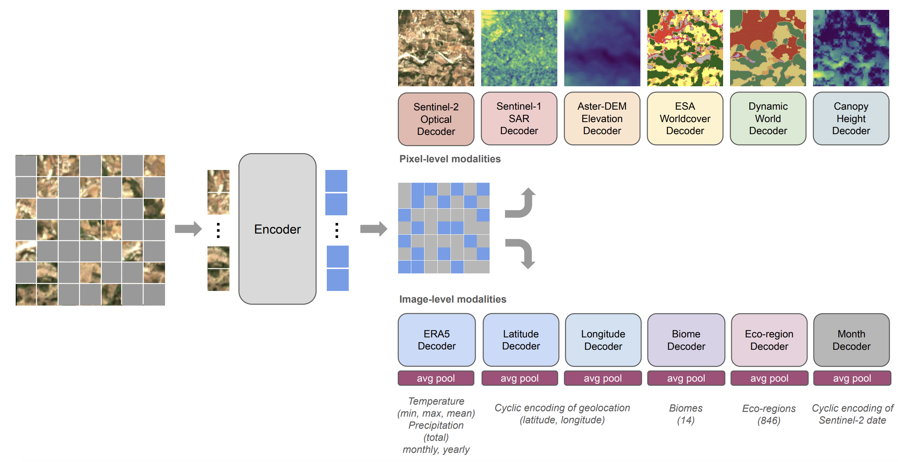
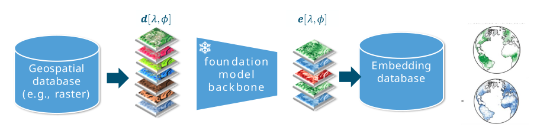
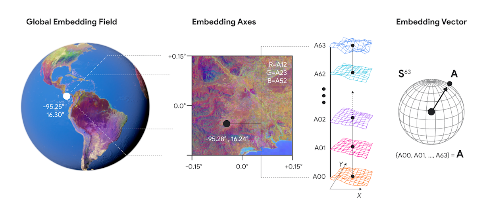
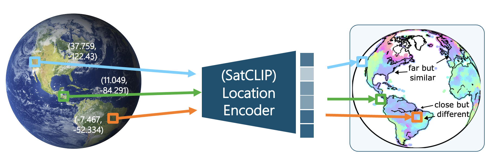
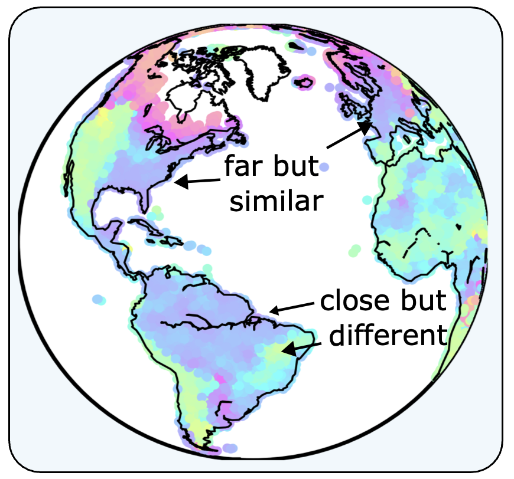

---
addons:
  - "../"
defaults:
  layout: bonn-content
layout: bonn-cover
subhead: Lecture 1
home: ../
---

<script setup>
import Lecture1AppleMatrixRepresentation from './components/Lecture1AppleMatrixRepresentation.vue'
import SoftmaxCosineDemo from './components/SoftmaxCosineDemo.vue'
import AutoregressiveNextTokenDemo from './components/AutoregressiveNextTokenDemo.vue'
</script>

# Representations

<div class="mt-8 text-xl text-gray-600 font-semibold">
What is a representation?
</div>

<!--
Welcome to the first lecture on geospatial representation learning.
-->

---
layout: bonn-section
sectionColor: "#00457c"
section: representations
sectionTitle: Representations
---

# Representations of our World


<div class="bonn-section-citation">
<a href="https://de.wikipedia.org/wiki/Datei:Pink_lady_and_cross_section.jpg" target="_blank" rel="noopener noreferrer">
Apple by Fir0002/Flagstaffotos license CC-BY-NC, Earth added via ChatGPT
</a>
</div>

<!--
Let's start with representations of our world. What do you think of when you see this image?

It is Earth inside an apple. Two concepts that do not really fit together. One is thousands of kilometers across; the other fits in our hand. One is a blue planet; the other is a red fruit.

We associate very different ideas with Earth and with an apple: different sizes, colors, shapes, and meanings. But on this screen, we are only seeing pixels. It is an image: a matrix of numbers translated into red, green, and blue light. The meaning comes from our own understanding and perception of the world. A large part of that is learned.

So I want to start with a small game.
-->

---
section: representations
sectionTitle: Representations
---

# Describe an Apple.

## Meaning and Encoding of Representations

<div class="mt-5 grid h-[310px] grid-cols-[550px_minmax(220px,280px)] gap-3 items-stretch justify-start">
  <div class="relative h-[310px] w-[550px] justify-self-start">
    
    
    
    
    
    
    
    
    
  </div>

  <div class="flex h-[310px] flex-col gap-3">
    <div class="h-1/2">
      <blockquote v-click="4" class="blockquote3 !m-0 flex h-full items-center text-[1.05rem] leading-snug">
        The same object can be encoded in many ways.
        A good encoding representation makes useful structure visible and computation easier.
      </blockquote>
    </div>
    <div class="h-1/2">
      <blockquote v-click="9" class="blockquote2 !m-0 flex h-full items-center text-[1.05rem] leading-snug">
        But representation is not only encoding.<br />
        Representation is also meaning.
      </blockquote>
    </div>
  </div>
</div>

<!--
How can we represent an apple?
[click]
What you see here is an SVG image: a vector representation of the apple. The same apple can be represented as SVG text, made of paths, shapes, and coordinates.
[click] 
We can also represent the apple as an image made of individual pixel values. That is an equally valid representation of the same object.
[click]
But images are not the only representations we understand. We can write "Apple" as ASCII text, which is stored as integer values, or we can use an apple emoji encoded in UTF-8.
[click]
The same object can be encoded in many ways. A good encoding makes structure visible and computation easier.
-->

---
section: representations
sectionTitle: Representations
---

# Choosing Right Encoding Representations

## Examples

<div class="mt-8 grid grid-cols-3 gap-5">
  <div class="min-h-[300px] rounded-xl border p-4">
    <h3>Images</h3>
    <Lecture1AppleMatrixRepresentation :click-index="1" />
  </div>

  <div class="min-h-[300px] rounded-xl border p-4">
    <h3>Math</h3>
    <div class="flex min-h-[238px] flex-col text-center">
      <div class="flex flex-1 flex-col items-center justify-center">
        <div v-click="2" class="rounded border border-gray-200 bg-gray-50 px-3 py-2 font-mono text-sm tracking-wide text-gray-700">
          XLVII + LXXVIII = ?
        </div>
        <div v-click="3" class="mt-5 font-mono text-sm text-blue-800">
          47 + 78 = 125
        </div>
      </div>
    </div>
  </div>

  <div class="min-h-[300px] rounded-xl border p-4">
    <h3>Places</h3>
    <div v-click="4" class="flex min-h-[238px] flex-col items-center text-center">
      <div class="mt-3 text-xs uppercase tracking-wide text-gray-500">
        Coordinates
      </div>
      <div class="mt-1 break-all font-mono text-sm leading-tight text-gray-700">
        50°43′57.73″ N,<br />
        7°06′16.63″ E
      </div>
      <div v-click="5" class="mt-5">
        <div class="text-xs uppercase tracking-wide text-gray-500">
          Place
        </div>
        <div class="mt-1 text-lg font-semibold text-blue-800">
          Hofgarten, Bonn, Germany
        </div>
      </div>
    </div>
  </div>
</div>

<!--
Let me show this with a few examples. A computer usually sees an image as a matrix of numbers, often between 0 and 255.
[click]
But when we represent those numbers as intensities of light, it becomes much easier for us to see structure in the raw data. Both are valid representations of the same underlying object.
[click]
What is the result of this addition in Roman numerals?
[click]
It is much easier to do math with Arabic numerals. And the shift from Roman numerals to Arabic numerals took roughly 300 to 600 years in the Western world. That gives us a sense of how hard it can be to move to a better but unfamiliar representation.
[click]
Similarly, coordinates are great for databases, but they are hard to read. Place descriptions are easier for people to understand, but they can be ambiguous.
-->

---
section: representations
sectionTitle: Representations
---

# Lecture Outline

<div class="grid grid-cols-4 gap-4 mt-8">

<div class="p-4 rounded-xl border box-card box-1">
<h3>Representations</h3>

<div class="box-body">What are representations?</div>
</div>

<div class="p-4 rounded-xl border box-card box-2" v-click>
<h3>Vision</h3>

<div class="box-body">How vision encodes the world</div>
</div>

<div class="p-4 rounded-xl border box-card box-3" v-click>
<h3>Language</h3>

<div class="box-body">How text becomes meaning</div>
</div>

<div class="p-4 rounded-xl border box-card box-4" v-click>
<h3>Spatial</h3>

<div class="box-body">How places carry spatial meaning</div>
</div>

</div>

<div class="slide-citation">
  <a href="https://www.sueddeutsche.de/muenchen/mental-maps-die-stadt-in-meinem-kopf-1.3087218" target="_blank" rel="noopener noreferrer">
    Die Stadt in meinem Kopf. (2016). <em>Süddeutsche Zeitung</em>.
  </a>
</div>

<!--
We will cover four sections:

First, we will talk about representations in general. We will look at how we perceive the world, how we encode objects, and how representations carry meaning.
[click]
Second, we focus on visual representations. We will ask how vision encodes the world and why useful visual representations depend on the task.
[click]
Third, we look at language representations. We will move from text encodings to tokens, embeddings, and language models.
[click] 
Finally, we focus on geospatial representations. We will ask how places carry meaning beyond coordinates and how this motivates geospatial representation learning.
-->

---
layout: bonn-section
sectionColor: "#2f7d32"
section: visual-representations
sectionTitle: Vision
---

# Visual Representations

---
section: visual-representations
sectionTitle: Vision
---

# We perceive our world in representations
## Example: Vision

  <div class="flex justify-center">
    <div class="relative h-[320px] w-full max-w-[900px]">
      
      
      
      
      
      
    </div>

<!---
  <div class="space-y-5 max-w-[380px]">
    <blockquote v-click class="blockquote1">
      Physically, sunlight of various wavelengths gets reflected from objects. Our eyes are evolutionarily engineered to only perceive three colors.
    </blockquote>
    <blockquote v-click class="blockquote2">
      Photo cameras are technically engineered to mimic human vision and capture Red-Green-Blue light through filters.
    </blockquote>
    <blockquote v-click class="blockquote3">
      Multi-spectral satellite sensors are built to capture more spectral wavelengths.
    </blockquote>
  </div>
  --->
</div>

<!--
Overall, we perceive the world through representations. Let us take vision as an example.
[click]
The sun emits photons across a wide range of wavelengths. 
[click]
Objects absorb, reflect, or emit photons in parts of that spectrum.
[click]
Our eyes have three types of cone cells that respond roughly to red, green, and blue light.
[click]
Normal cameras try to imitate human vision by placing spectral filters on photosensitive sensors.
[click]
But that is an engineering decision. Multi-spectral sensors capture more wavelengths across several bands. This gives us a richer representation of the world than our eyes or normal cameras can provide.
-->

--- 
section: visual-representations
sectionTitle: Vision
---

# Engineering suitable Reprepresentations.

<div class="mt-8 grid grid-cols-2 gap-8 items-start">
  <div v-click class="flex flex-col items-center">
    <h3 class="text-lg font-semibold text-blue-800 mb-4">Sensitivity of cone cells (S, M, L) in human eyes</h3>
    
  </div>

  <div v-click class="space-y-4 flex flex-col items-center">
    <h3 class="text-lg font-semibold text-blue-800 mb-4">Bayer Filter on Cameras</h3>
    
  </div>
</div>

<blockquote v-click>
Cameras are built to mimic our eyes: More green pixels in CCD camera mimics the color sensitivity in our eyes.
</blockquote>

<!--
In general, we build tools and engineer sensors for our needs. Very often, we design them to imitate human vision.

[click]
The cone cells in our retina are sensitive to specific wavelengths.
[click]
A camera CCD sensor is sensitive across optical wavelengths and could capture more information. But red, green, and blue filters remove much of the light our eyes cannot perceive. This is the Bayer filter used in most consumer cameras.
[click]
So cameras are built to mimic our eyes and capture similar representations. This is also why a Bayer filter has twice as many green pixels: our eyes are especially sensitive to green shades.
-->


---
section: visual-representations
sectionTitle: Vision
---

# Spectral information can make patterns visible.

<div class="mt-6 flex flex-col items-center gap-4">
  <div class="w-full max-w-[600px]">
    
    <div class="text-xs text-gray-600 mt-2">Example: plastic litter and marine debris (Sentinel-2)</div>
  </div>
</div>

<!--
But the world is not just red, green, and blue. The full light spectrum contains more information than our eyes can perceive, and some of that information is very useful.

Here is one example with plastic litter debris in the ocean from a satellite image. In the visible channels, we can hardly see anything. In a multi-spectral false-color representation, lines and features become visible.
-->

---
section: visual-representations
sectionTitle: Vision
---

# The representation depends on the Problem

<div class="mt-5 grid h-[350px] grid-cols-[550px_minmax(220px,280px)] gap-3 items-stretch justify-start">
  <div class="grid h-[350px] grid-rows-2 gap-3">
    
    
  </div>

  <div class="flex h-[350px] flex-col gap-3">
    <div class="h-1/2">
      <blockquote class="blockquote1 !m-0 flex h-full items-center text-[1.05rem] leading-snug">
        A useful representation depends on the problem we are trying to solve.
      </blockquote>
    </div>
    <div class="h-1/2">
      <blockquote v-click="1" class="blockquote2 !m-0 flex h-full items-center text-[1.05rem] leading-snug">
        Bees see ultraviolet patterns that humans miss, because their visual system is tuned to different tasks.
      </blockquote>
    </div>
  </div>
</div>

<!--
The representation we should choose depends on the problem. For us, this is a lush meadow. The flowers are nice to look at, but green is clearly the dominant color.
[click]
Bees are much more interested in the flowers. Their eyes are sensitive to ultraviolet patterns, which helps them find food and gives them an evolutionary advantage.
-->

---
section: visual-representations
sectionTitle: Vision
---

# Our eyes have edge detectors

<div class="mt-5 grid grid-cols-[420px_360px] gap-8 items-center justify-center">
  <div>
    <div class="mb-2 text-center text-sm font-bold text-blue-800">
      Retinal cells implement an
      <a href="https://en.wikipedia.org/wiki/Edge_detection" target="_blank" rel="noopener noreferrer">edge filter</a>
      through
      <a href="https://en.wikipedia.org/wiki/Lateral_inhibition" target="_blank" rel="noopener noreferrer">lateral inhibition</a>.
    </div>
    
  </div>

  <div v-click="1">
    <div class="mb-2 text-center text-sm font-bold text-blue-800">
      Mach Bands - Optical Illusion (Mach, 1865)
    </div>
    <div class="mach-bands-stage mach-bands-stage-compact">
      <div v-click-hide="2" class="mach-band-row">
        <div class="mach-band mach-band-1"><span>222</span></div>
        <div class="mach-band mach-band-2"><span>198</span></div>
        <div class="mach-band mach-band-3"><span>173</span></div>
        <div class="mach-band mach-band-4"><span>148</span></div>
      </div>
      <div v-click="2" class="mach-bands-overlay">
        <div class="mach-band-row mach-band-row-animated">
          <div class="mach-band mach-band-1"><span>222</span></div>
          <div class="mach-band mach-band-2"><span>198</span></div>
          <div class="mach-band mach-band-3"><span>173</span></div>
          <div class="mach-band mach-band-4"><span>148</span></div>
        </div>
      </div>
    </div>
  </div>
</div>

<blockquote v-click="3" class="blockquote1">
Our eyes are not objective, they capture an edge-enhanced representation of the world.
</blockquote>

<div class="slide-citation">
  <a href="https://pmc.ncbi.nlm.nih.gov/articles/PMC1350218/pdf/jphysiol00969-0168.pdf" target="_blank" rel="noopener noreferrer">
    Shapley, R. M., &amp; Tolhurst, D. J. (1973). Edge detectors in human vision. <em>Journal of Physiology</em>, 229, 165-183.
  </a>
</div>

<!--
Our eyes also do not represent the world exactly as it is. Photoreceptor cells in the retina inhibit each other laterally. This changes our perception across edges and makes those edges more visible.

[click]
This is the mechanism behind the optical illusion called Mach bands. Here you see four rectangles with uniform grayscale values. All pixels within each rectangle have the same color. Do you agree?

[click]
If I move the rectangles next to each other, we create hard edges between the blocks. Do you now see a grayscale gradient? The right edge of the lighter square appears lighter, and the left edge of the darker square appears darker. That is our visual system enhancing edges.
-->

--- 
section: visual-representations
sectionTitle: Vision
---

# Selective Vision: The Monkey Business Illusion

<div class="mt-0 flex justify-center">
  <iframe
    class="h-[330px] w-full max-w-[740px] rounded-xl shadow"
    src="https://www.youtube.com/embed/IGQmdoK_ZfY?rel=0&modestbranding=1"
    title="The Monkey Business Illusion"
    frameborder="0"
    allow="accelerometer; autoplay; clipboard-write; encrypted-media; gyroscope; picture-in-picture; web-share"
    allowfullscreen>
  </iframe>
</div>

<div class="slide-citation">
  <a href="https://doi.org/10.1068/i0386" target="_blank" rel="noopener noreferrer">
    Simons, D. J. (2010). Monkeying around with the gorillas in our midst: Familiarity with an inattentional-blindness task does not improve the detection of unexpected events. <em>i-Perception</em>. https://doi.org/10.1068/i0386
  </a>
</div>

<!--
But our selective vision goes beyond just edge-enhancement. Let me show you one experiment:
[click video]

After all, what we think we perceive in our environment is only a partial representation. Our mind selects what we see, often without us noticing.
-->

---
section: visual-representations
sectionTitle: Vision
---

# Our mind selects what we perceive

<div class="mt-4 flex justify-center">
  
</div>

<div class="slide-citation">
  <a href="https://www.nih.gov/news-events/news-releases/nih-researchers-identify-brain-circuits-responsible-visual-acuity" target="_blank" rel="noopener noreferrer">
    Yang, J., et al. (2025). Differential impact of retinal lesions on visual responses of LGN X and Y cells. <em>The Journal of Neuroscience</em>. DOI: 10.1523/JNEUROSCI.0436-25.2025.
  </a>
</div>

<!--
Overall, our vision is much more selective than just seeing edges more clearly.

We have a lateral geniculate nucleus, or LGN, between the eyes and the visual cortex. It can selectively change, focus, or suppress visual signals when our mind focuses on specific tasks.

While the retina encodes light into low-level, edge-enhanced representations, the visual cortex builds much more complex representations of the environment and the task. The LGN receives signals from both and creates a feedback loop between low-level and high-level visual representations.
-->

---
section: visual-representations
sectionTitle: Vision
---

# From Encoding to Meaning

### Feature Learning in Neural Networks

<div class="mt-5 flex justify-center">
  
</div>

<!--
So far, we have asked how we can represent an object, like an apple.
-->

---
layout: bonn-two-cols-header
section: Representations of our World
sectionTitle: Representations of our World
---

# Excurse: Dimensionality Reduction

We often need to visualize high-dimensional data on a lower-dimensional space, as here with 3D data on a 2D screen.

::left::

<div class="m-0">

**Principal Component Analysis (PCA)** linearly rotates high-dimensional data points so that a 2D projection best captures the variance (i.e., spread) of the data

<PcaEmbeddingDemo />

</div>

::right::

<div v-click class="m-0">

**t-distributed Stochastic Neighborhood Embedding (t-SNE)** moves data points onto a 2D plane and tries to preserve the local neighborhood relation between points.

<TsneEmbeddingDemo />

</div>

---
layout: bonn-two-cols-header
columns: minmax(0, 1.7fr) minmax(0, .8fr)
section: visual-representations
sectionTitle: Vision
---

# Feature Representations in LeNet (2000)

::left::

<div class="mt-5 flex justify-center">
  
</div>

::right::

<div class="mt-5 flex flex-col gap-3">
  
  
  
  <blockquote>
    Convolutional Neural Networks encode more high-level features in deeper layers, as shown in the t-SNE where where digit images are increasingly well separated on deeper layers
  </blockquote>
</div>

---
layout: bonn-two-cols-header
section: visual-representations
sectionTitle: Vision
---

# Supervised Learning: From Labels to Loss

::left::

### Learning from labeled images

- **Input:** a 28×28 image of a handwritten digit
- **Known truth:** the human-provided label `7`
- **Prediction:** probabilities over the ten digit classes
- **Learning:** iteratively adjust the model to minimize the prediction error
- **Goal:** make the probability for the true label `7` as high as possible

`image pixels → CNN representation → class probabilities → label`

> How do we measure whether the prediction is correct or incorrect?

::right::

### Classification example: Cross-Entropy Loss

$$
\mathcal{L}_{CE}(y,\hat{y}) = - \sum_{c=1}^{C} y_c \log(\hat{y}_c)
$$

For a one-hot target label:

$$
\mathcal{L}_{CE} = -\log(\hat{y}_{\text{correct}})
$$

Correct class: `7`

- If `p(7) = 0.90` → low loss
- If `p(7) = 0.10` → high loss

> Cross entropy rewards high probability on the correct class and penalizes confidence in wrong classes.

---
layout: bonn-two-cols-header
section: visual-representations
sectionTitle: Vision
---

# Self-supervised Learning

::left::

### Contrastive Learning

Identify the corresponding object among two different views of the same object.


<div class="slide-citation">
  Caron, M., Misra, I., Mairal, J., Goyal, P., Bojanowski, P., & Joulin, A. (2020).
  <a href="https://github.com/facebookresearch/swav" target="_blank" rel="noopener noreferrer">
    Unsupervised Learning of Visual Features by Contrasting Cluster Assignments
  </a>.
  NeurIPS. Code: <a href="https://github.com/facebookresearch/swav" target="_blank" rel="noopener noreferrer">facebookresearch/swav</a>.
</div>

::right::

### Masked Autoencoding

Train the model to correctly inpaint a masked portion of an image.


<div class="slide-citation">
  He, K., Chen, X., Xie, S., Li, Y., Dollár, P., & Girshick, R. (2022).
  <a href="https://openaccess.thecvf.com/content/CVPR2022/papers/He_Masked_Autoencoders_Are_Scalable_Vision_Learners_CVPR_2022_paper.pdf" target="_blank" rel="noopener noreferrer">
    Masked autoencoders are scalable vision learners
  </a>.
  CVPR, 16000-16009.
</div>

---
section: visual-representations
sectionTitle: Vision
---

# High-level Visual Features (Dinov3, 2025)

<div class="mt-6 flex justify-center">
  
</div>

<div class="slide-citation">
  Demo:
  <a href="https://github.com/devMuniz02/DINOv3-Interactive-Patch-Cosine-Similarity" target="_blank" rel="noopener noreferrer">
    devMuniz02/DINOv3-Interactive-Patch-Cosine-Similarity
  </a>
  <br />
  DINOv3 model:
  <a href="https://arxiv.org/abs/2508.10104" target="_blank" rel="noopener noreferrer">
    Siméoni, O., Vo, H. V., Seitzer, M., Baldassarre, F., Oquab, M., Jose, C., Khalidov, V., Szafraniec, M., Yi, S., Ramamonjisoa, M., et al. (2025). DINOv3. <em>arXiv:2508.10104</em>.
  </a>
</div>

---
section: visual-representations
sectionTitle: Vision
---

# High-level Visual Features (SAM 2, 2024)

<div class="mt-5 flex flex-col items-center gap-4">
  
  <a
    href="https://sam2.metademolab.com/"
    target="_blank"
    rel="noopener noreferrer"
    class="text-blue-800">
    Try the Segment Anything Model (SAM) 2 demo
  </a>
</div>

---
section: language-representations
sectionTitle: Language
---

# From Physical to Societal Representations

<div class="mt-6 grid grid-cols-2 gap-6">
  <div v-click="1" class="rounded-xl border-2 p-5" style="border-color: var(--grl-data-orange); background: color-mix(in srgb, var(--grl-data-orange) 8%, white);">
    <h3 class="text-blue-800">Observing the Physical World with Vision</h3>
    <div class="mt-4 flex h-[230px] items-center justify-center rounded-lg p-3">
      
    </div>
  </div>

  <div v-click="2" class="rounded-xl border-2 p-5" style="border-color: var(--grl-data-green); background: color-mix(in srgb, var(--grl-data-green) 8%, white);">
    <h3 class="text-blue-800">Understanding Societies by Language</h3>
    <div class="mt-4 flex h-[230px] items-center justify-center rounded-lg p-3">
      
    </div>
  </div>
</div>

<!--
So far, we looked at vision as a representation of the world. But vision is only one modality. Language is another.

When we describe an apple, a city, or a landscape in words, we create a symbolic representation of the world. Computers cannot use this representation directly. They first need to encode it, split it into units, and transform it into numbers that a model can process.

This gives us the path from character encodings to tokenization, embeddings, and language models.
-->

---
layout: bonn-section
sectionColor: "#6f2d7f"
section: language-representations
sectionTitle: Language
---

# Language Representations


---
section: language-representations
sectionTitle: Language
---

# From Text Encoding to Language Models

<div class="mt-8 grid grid-cols-[minmax(0,0.95fr)_24px_minmax(0,0.95fr)_24px_minmax(0,0.95fr)_24px_minmax(0,1.25fr)] gap-3 items-center">
  <div v-click="1" class="flex h-[245px] flex-col rounded-xl border-2 p-4" style="border-color: var(--grl-data-orange); background: color-mix(in srgb, var(--grl-data-orange) 10%, white);">
    <h3 class="h-[46px] text-[0.86rem] leading-tight">Words</h3>
    <div class="mt-3 flex h-[62px] items-center justify-center rounded-lg bg-white px-3 text-center text-xl text-blue-800">
      "Apple"
    </div>
    <p class="mt-4 text-[0.72rem] leading-snug text-gray-600">
      Text is a human-readable representation of concepts and meaning.
    </p>
  </div>

  <div v-click="2" class="flex items-center justify-center text-2xl font-bold" style="color: var(--grl-data-orange);">
    →
  </div>

  <div v-click="2" class="flex h-[245px] flex-col rounded-xl border-2 p-4" style="border-color: var(--grl-data-orange); background: color-mix(in srgb, var(--grl-data-orange) 10%, white);">
    <h3 class="h-[46px] text-[0.86rem] leading-tight">Token IDs</h3>
    <div class="mt-3 flex h-[62px] items-center justify-center rounded-lg bg-white px-3 text-center font-mono text-lg text-blue-800">
      [23182]
    </div>
    <p class="mt-4 text-[0.72rem] leading-snug text-gray-600">
      A tokenizer maps text pieces to numerical IDs that a computer can process.
    </p>
  </div>

  <div v-click="3" class="flex items-center justify-center text-2xl font-bold" style="color: var(--grl-data-orange);">
    →
  </div>

  <div v-click="3" class="flex h-[245px] flex-col rounded-xl border-2 p-4" style="border-color: var(--grl-data-green); background: color-mix(in srgb, var(--grl-data-green) 10%, white);">
    <h3 class="h-[46px] text-[0.86rem] leading-tight">Embeddings</h3>
    <div class="mt-3 flex h-[62px] items-center justify-center rounded-lg bg-white px-3 text-center font-mono text-[0.72rem] leading-snug text-blue-800">
      [0.12, -0.41, ...]
    </div>
    <p class="mt-4 text-[0.72rem] leading-snug text-gray-600">
      Embeddings turn tokens into dense vectors to encode semantic relationships.
    </p>
  </div>

  <div v-click="4" class="flex items-center justify-center text-2xl font-bold" style="color: var(--grl-data-green);">
    →
  </div>

  <div v-click="4" class="flex h-[245px] flex-col rounded-xl border-2 p-4" style="border-color: var(--grl-data-green); background: color-mix(in srgb, var(--grl-data-green) 10%, white);">
    <h3 class="h-[46px] whitespace-nowrap text-[0.82rem] leading-tight">Language Models</h3>
    <div class="mt-3 flex h-[62px] items-center justify-center rounded-lg bg-white px-3 text-center text-sm font-semibold text-blue-800">
      context + prediction
    </div>
    <p class="mt-4 text-[0.72rem] leading-snug text-gray-600">
      Language models use context to predict likely next tokens.
    </p>
  </div>
</div>

<blockquote v-click="5" class="blockquote1 mt-6">
Text and language captures the human world: machines move from low-level encodings of words and tokens to high-level representations associated with meaning in context.
</blockquote>

---
section: language-representations
sectionTitle: Language
---

# Character Encodings

<div class="grid grid-cols-2 gap-6 mt-4">

<div>

## Human writing systems

Societal history of representing meaning with symbols.

<div class="mt-3 grid grid-cols-3 gap-2">
  <div class="rounded-lg border-2 p-2" style="border-color: var(--grl-data-orange); background: color-mix(in srgb, var(--grl-data-orange) 8%, white);">
    <div class="text-[0.68rem] font-bold leading-tight text-blue-800">Cuneiform</div>
    <div class="mt-0.5 text-[0.56rem] leading-tight text-gray-600">c. 3200 BCE</div>
    <div class="mt-1 rounded bg-white px-1.5 py-1 text-center font-mono text-sm">𒀭 𒈗 𒆠</div>
  </div>

  <div class="rounded-lg border-2 p-2" style="border-color: var(--grl-data-orange); background: color-mix(in srgb, var(--grl-data-orange) 8%, white);">
    <div class="text-[0.68rem] font-bold leading-tight text-blue-800">Hieroglyphs</div>
    <div class="mt-0.5 text-[0.56rem] leading-tight text-gray-600">c. 3100 BCE</div>
    <div class="mt-1 rounded bg-white px-1.5 py-1 text-center font-mono text-sm">𓂀 𓅓 𓏏</div>
  </div>

  <div class="rounded-lg border-2 p-2" style="border-color: var(--grl-data-orange); background: color-mix(in srgb, var(--grl-data-orange) 8%, white);">
    <div class="text-[0.68rem] font-bold leading-tight text-blue-800">Chinese characters</div>
    <div class="mt-0.5 text-[0.56rem] leading-tight text-gray-600">c. 1200 BCE - today</div>
    <div class="mt-1 rounded bg-white px-1.5 py-1 text-center font-mono text-sm">山 水 人 木</div>
  </div>

  <div class="rounded-lg border-2 p-2" style="border-color: var(--grl-data-orange); background: color-mix(in srgb, var(--grl-data-orange) 8%, white);">
    <div class="text-[0.68rem] font-bold leading-tight text-blue-800">Alphabetic writing</div>
    <div class="mt-0.5 text-[0.56rem] leading-tight text-gray-600">c. 700 BCE - today</div>
    <div class="mt-1 rounded bg-white px-1.5 py-1 text-center font-mono text-sm">A B C ...</div>
  </div>

  <div class="rounded-lg border-2 p-2" style="border-color: var(--grl-data-orange); background: color-mix(in srgb, var(--grl-data-orange) 8%, white);">
    <div class="text-[0.68rem] font-bold leading-tight text-blue-800">Digital-era symbols</div>
    <div class="mt-0.5 text-[0.56rem] leading-tight text-gray-600">20th-21st century</div>
    <div class="mt-1 rounded bg-white px-1.5 py-1 text-center font-mono text-sm">@ # :) 😂 🌍</div>
  </div>

  <div class="rounded-lg border-2 p-2" style="border-color: var(--grl-data-green); background: color-mix(in srgb, var(--grl-data-green) 8%, white);">
    <div class="text-[0.68rem] font-bold leading-tight text-blue-800">Learned meaning</div>
    <div class="mt-0.5 text-[0.56rem] leading-tight text-gray-600">different fonts, same symbol</div>
    <div class="mt-1 flex flex-wrap justify-center gap-x-1.5 gap-y-0.5 rounded bg-white px-1.5 py-1 text-base text-blue-800">
      <span style="font-family: Georgia, serif;">A</span>
      <span style="font-family: 'Arial Black', sans-serif;">A</span>
      <span style="font-family: 'Courier New', monospace;">A</span>
      <span style="font-family: 'Brush Script MT', cursive;">A</span>
      <span style="font-family: 'Comic Sans MS', cursive;">A</span>
      <span style="font-family: Impact, fantasy;">A</span>
      <span style="font-family: Copperplate, fantasy;">A</span>
      <span style="font-family: Papyrus, fantasy;">A</span>
    </div>
  </div>
</div>

</div>

<div>

## Machine character encodings

Computers encode characters as integer numbers.

<div class="mt-3 grid grid-cols-[repeat(3,minmax(0,1fr))] gap-2">
  <div class="rounded-lg border-2 p-2" style="border-color: var(--grl-data-orange); background: color-mix(in srgb, var(--grl-data-orange) 8%, white);">
    <div class="text-[0.68rem] font-bold leading-tight text-blue-800">ASCII</div>
    <div class="mt-0.5 text-[0.56rem] leading-tight text-gray-600">early character numbers</div>
    <div class="mt-1 rounded bg-white px-1.5 py-1 font-mono text-[0.68rem] leading-tight">
      A → 65<br />
      B → 66<br />
      a → 97
    </div>
  </div>

  <div class="rounded-lg border-2 p-2" style="border-color: var(--grl-data-orange); background: color-mix(in srgb, var(--grl-data-orange) 8%, white);">
    <div class="text-[0.68rem] font-bold leading-tight text-blue-800">Unicode code points</div>
    <div class="mt-0.5 text-[0.56rem] leading-tight text-gray-600">global character IDs</div>
    <div class="mt-1 rounded bg-white px-1.5 py-1 font-mono text-[0.68rem] leading-tight">
      A → U+0041<br />
      ä → U+00E4<br />
      🌍 → U+1F30D
    </div>
  </div>

  <div class="rounded-lg border-2 p-2" style="border-color: var(--grl-data-orange); background: color-mix(in srgb, var(--grl-data-orange) 8%, white);">
    <div class="text-[0.68rem] font-bold leading-tight text-blue-800">UTF-8 bytes</div>
    <div class="mt-0.5 text-[0.56rem] leading-tight text-gray-600">stored byte sequences</div>
    <div class="mt-1 rounded bg-white px-1.5 py-1 font-mono text-[0.68rem] leading-tight">
      A → 41<br />
      ä → C3 A4<br />
      🌍 → F0 9F 8C 8D
    </div>
  </div>

</div>

<!--
<blockquote class="mt-3 text-[0.72rem] leading-snug">
A computer encodes "Apple" as [65, 112, 112, 108, 101] in ASCII or [41, 70, 70, 6C, 65] in UTF-8 bytes.
</blockquote>
-->

<blockquote>
<div class="mt-3 text-[0.72rem] leading-snug">
  What's the result of "A" + "B" in C++? Try it out via
  <a href="https://cpp.sh/" target="_blank" rel="noopener noreferrer" class="text-blue-800">cpp.sh</a>

```cpp
std::cout << ('A' + 'B') << std::endl;
```
</div>
</blockquote>

</div>

</div>

---
section: language-representations
sectionTitle: Language
---

# Word Tokenizer

<div class="mt-4 grid grid-cols-2 gap-5">
  <div class="box-card box-1 flex h-[330px] flex-col rounded-xl border-2 p-4" style="border-color: var(--grl-data-orange); background: color-mix(in srgb, var(--grl-data-orange) 8%, white);">
    <h3 class="text-blue-800">Language Models tokenize text</h3>
    <div class="mt-4 rounded-lg bg-white p-3">
      <div class="text-[0.72rem] font-bold text-blue-800">Question: How many "r"s are in Strawberry?</div>
      <div class="mt-2 grid grid-cols-[70px_minmax(0,1fr)] gap-2 text-[0.68rem] leading-tight">
        <div class="font-semibold text-gray-600">Our view</div>
        <div class="font-mono text-blue-800">S t r a w b e r r y</div>
        <div class="font-semibold text-gray-600">Model view</div>
        <div class="font-mono text-blue-800">[Str] [aw] [berry]</div>
        <div class="font-semibold text-gray-600">Token IDs</div>
        <div class="font-mono text-blue-800">[3504, 1134, 19772]</div>
      </div>
      <div class="mt-1 text-[0.58rem] leading-tight text-gray-500">
        Tokenization depends on the tokenizer.
      </div>
      <div class="mt-2 text-[0.62rem] leading-tight text-gray-600">
        Modern LLM tokenizers use vocabularies of roughly 100k-200k unique tokens.
      </div>
    </div>
    <div class="mt-auto rounded-lg bg-white px-3 py-2 text-[0.62rem] leading-snug">
      <div>
        Try it yourself:
        <a href="https://platform.openai.com/tokenizer" target="_blank" rel="noopener noreferrer" class="text-blue-800">platform.openai.com/tokenizer</a>
      </div>
      <div class="mt-1 text-gray-600">
        Test: Strawberry · Schifffahrt · Poppelsdorf · Poppelsdorfer Allee · She sells seashells.
      </div>
    </div>
  </div>

  <div class="box-card box-2 flex h-[330px] flex-col rounded-xl border-2 p-4" style="border-color: var(--grl-data-green); background: color-mix(in srgb, var(--grl-data-green) 8%, white);">
    <h3 class="text-blue-800">We also learned to read text in chunks</h3>
    <div class="mt-4 rounded-lg bg-white p-4 text-[0.95rem] leading-snug text-blue-800">
      Hmuans do not raed ervey wrod letetr by letetr. We raed in chnuks, ptaterns, and expcetations. As lnog as the frist and lsat lettres are in the rghit palce, the mnidele can be sracmbeled and the txet is sitll surprisingly easy to raed.
    </div>
    <p class="mt-4 text-[0.76rem] leading-snug text-gray-600">
      We also use learned representations — not raw pixels or letters alone.
    </p>
  </div>
</div>

---
section: language-representations
sectionTitle: Language
---

# Word Embeddings

<div class="mt-4 grid grid-cols-2 gap-5">
  <div class="box-card box-1 flex h-[330px] flex-col rounded-xl border-2 p-4" style="border-color: var(--grl-data-orange); background: color-mix(in srgb, var(--grl-data-orange) 8%, white);">
    <h3 class="text-blue-800">From token IDs to vectors</h3>
    <div class="mt-4 rounded-lg bg-white p-3">
      <div class="grid grid-cols-[minmax(0,0.9fr)_minmax(0,0.55fr)_minmax(0,1.35fr)] gap-x-3 gap-y-2 text-[0.68rem] leading-tight">
        <div class="font-semibold text-gray-600">token</div>
        <div class="font-semibold text-gray-600">ID</div>
        <div class="font-semibold text-gray-600">vector</div>
        <div class="font-mono text-blue-800">strawberry</div>
        <div class="font-mono text-blue-800">8123</div>
        <div class="font-mono text-blue-800">[0.21, -0.11, ...]</div>
        <div class="font-mono text-blue-800">apple</div>
        <div class="font-mono text-blue-800">15421</div>
        <div class="font-mono text-blue-800">[-0.35, 0.42,  ...]</div>
        <div class="font-mono text-blue-800">banana</div>
        <div class="font-mono text-blue-800">9821</div>
        <div class="font-mono text-blue-800">[0.19, 0.05, ...]</div>
      </div>
    </div>
    <p class="mt-auto text-[0.72rem] leading-snug text-gray-600">
      Token IDs are arbitrary labels. Embedding vectors are learned representations that can capture meaning.
    </p>
  </div>

  <div class="box-card box-2 flex h-[330px] flex-col rounded-xl border-2 p-4" style="border-color: var(--grl-data-green); background: color-mix(in srgb, var(--grl-data-green) 8%, white);">
    <h3 class="text-blue-800">Words are points in a semantic space</h3>
    <div class="relative mt-4 h-[230px] rounded-lg border bg-white p-2">
      
      
      
    </div>
    <p v-click="1" class="mt-3 text-[0.72rem] leading-snug text-gray-600">
      Points are defined by embedding vectors
    </p>
    <p v-click="2" class="mt-3 text-[0.72rem] leading-snug text-gray-600">
      Similarity can be measured with cosine similarity.
    </p>
  </div>
</div>

---
section: language-representations
sectionTitle: Language
---

# Softmax: Cosine Similarity to Probabilities

<SoftmaxCosineDemo />

---
section: language-representations
sectionTitle: Language
---

# Context matters

## The same word can move to different semantic neighborhoods depending on context.

<div class="mt-4 grid grid-cols-2 gap-5">
  <div class="box-card box-1 flex h-[285px] flex-col rounded-xl border-2 p-4" style="border-color: var(--grl-data-green); background: color-mix(in srgb, var(--grl-data-green) 8%, white);">
    <h3 class="text-blue-800">Fruit context</h3>
    <div class="mt-2 rounded-lg bg-white px-3 py-2 text-[0.82rem] text-blue-800">
      I ate an <span class="rounded-full px-2 py-0.5 font-semibold" style="background: color-mix(in srgb, var(--grl-data-green) 18%, white);">apple</span>.
    </div>
    <div class="mt-2 rounded-lg bg-white px-3 py-2 font-mono text-[0.68rem] text-blue-800">
      apple | "I ate an ..." → fruit-like vector
    </div>
    <div class="relative mt-3 h-[145px] rounded-lg border bg-white">
      <div class="absolute left-3 top-2 text-[0.52rem] text-gray-500">2D illustration of high-dimensional embeddings</div>
      <div class="absolute left-[42%] top-[44%] flex items-center gap-1 rounded-full px-2 py-1 text-[0.68rem] font-semibold text-blue-800" style="background: color-mix(in srgb, var(--grl-data-green) 16%, white);">
        <span class="h-2 w-2 rounded-full" style="background: var(--grl-data-green);"></span>apple
      </div>
      <div class="absolute left-[22%] top-[28%] flex items-center gap-1 text-[0.62rem] text-blue-800"><span class="h-1.5 w-1.5 rounded-full" style="background: var(--grl-data-green);"></span>strawberry</div>
      <div class="absolute left-[56%] top-[28%] flex items-center gap-1 text-[0.62rem] text-blue-800"><span class="h-1.5 w-1.5 rounded-full" style="background: var(--grl-data-green);"></span>banana</div>
      <div class="absolute left-[28%] top-[67%] flex items-center gap-1 text-[0.62rem] text-blue-800"><span class="h-1.5 w-1.5 rounded-full" style="background: var(--grl-data-green);"></span>pear</div>
      <div class="absolute left-[62%] top-[62%] flex items-center gap-1 text-[0.62rem] text-blue-800"><span class="h-1.5 w-1.5 rounded-full" style="background: var(--grl-data-green);"></span>orange</div>
    </div>
    <div class="mt-2 text-[0.62rem] leading-tight text-gray-600">
      nearby words: fruit, sweet, edible
    </div>
  </div>

  <div v-click="1" class="box-card box-2 flex h-[285px] flex-col rounded-xl border-2 p-4" style="border-color: var(--grl-data-orange); background: color-mix(in srgb, var(--grl-data-orange) 8%, white);">
    <h3 class="text-blue-800">Technology context</h3>
    <div class="mt-2 rounded-lg bg-white px-3 py-2 text-[0.82rem] text-blue-800">
      I bought the new <span class="rounded-full px-2 py-0.5 font-semibold" style="background: color-mix(in srgb, var(--grl-data-orange) 18%, white);">Apple</span>.
    </div>
    <div class="mt-2 rounded-lg bg-white px-3 py-2 font-mono text-[0.68rem] text-blue-800">
      Apple | "I bought the new ..." → company
    </div>
    <div class="relative mt-3 h-[145px] rounded-lg border bg-white">
      <div class="absolute left-3 top-2 text-[0.52rem] text-gray-500">2D illustration of high-dimensional embeddings</div>
      <div class="absolute left-[42%] top-[44%] flex items-center gap-1 rounded-full px-2 py-1 text-[0.68rem] font-semibold text-blue-800" style="background: color-mix(in srgb, var(--grl-data-orange) 16%, white);">
        <span class="h-2 w-2 rounded-full" style="background: var(--grl-data-orange);"></span>Apple
      </div>
      <div class="absolute left-[24%] top-[28%] flex items-center gap-1 text-[0.62rem] text-blue-800"><span class="h-1.5 w-1.5 rounded-full" style="background: var(--grl-data-orange);"></span>iPhone</div>
      <div class="absolute left-[58%] top-[28%] flex items-center gap-1 text-[0.62rem] text-blue-800"><span class="h-1.5 w-1.5 rounded-full" style="background: var(--grl-data-orange);"></span>MacBook</div>
      <div class="absolute left-[22%] top-[66%] flex items-center gap-1 text-[0.62rem] text-blue-800"><span class="h-1.5 w-1.5 rounded-full" style="background: var(--grl-data-orange);"></span>Microsoft</div>
      <div class="absolute left-[64%] top-[64%] flex items-center gap-1 text-[0.62rem] text-blue-800"><span class="h-1.5 w-1.5 rounded-full" style="background: var(--grl-data-orange);"></span>Google</div>
    </div>
    <div class="mt-2 text-[0.62rem] leading-tight text-gray-600">
      nearby words: device, software, company
    </div>
  </div>
</div>


---
section: language-representations
sectionTitle: Language
---

# Language Models predict the next token.

<div class="mt-8 grid grid-cols-2 gap-4 rounded-xl border-2 p-5" style="border-color: var(--grl-data-green); background: color-mix(in srgb, var(--grl-data-green) 7%, white);">
  <div class="rounded-lg bg-white px-3 py-2">
    <div class="text-[0.68rem] font-bold text-blue-800">Static embedding</div>
    <div class="mt-1 font-mono text-[0.68rem] text-blue-800">apple → one vector</div>
  </div>
  <div class="rounded-lg bg-white px-3 py-2">
    <div class="text-[0.68rem] font-bold text-blue-800">Contextual embedding</div>
    <div class="mt-1 font-mono text-[0.62rem] leading-snug text-blue-800">
      apple in "I ate an ..." → fruit-like vector<br />
      Apple in "I bought the new ..." → company-like vector
    </div>
  </div>
</div>

<div class="mt-6 grid grid-cols-[minmax(0,1fr)_28px_minmax(0,0.9fr)_28px_minmax(0,1.1fr)] gap-3 rounded-xl border-2 p-4" style="border-color: var(--grl-data-green); background: color-mix(in srgb, var(--grl-data-green) 8%, white);">
  <div class="rounded-lg bg-white px-3 py-3">
    <div class="text-[0.7rem] font-bold text-blue-800">Inputs</div>
    <div class="mt-2 grid gap-2 text-[0.68rem] leading-snug text-blue-800">
      <div class="rounded border px-2 py-1">
        1. word to predict: <span class="font-mono">&lt;CLS&gt;</span>
      </div>
      <div class="rounded border px-2 py-1">
        2. context: other text
      </div>
    </div>
  </div>

  <div class="flex items-center justify-center text-2xl font-bold" style="color: var(--grl-data-green);">→</div>

  <div class="flex items-center justify-center rounded-lg bg-white px-3 py-3 text-center">
    <div>
      <div class="text-[0.7rem] font-bold text-blue-800">Statistical language model</div>
      <div class="mt-2 font-mono text-[0.82rem] text-blue-800">
        p(&lt;CLS&gt; | context)
      </div>
    </div>
  </div>

  <div class="flex items-center justify-center text-2xl font-bold" style="color: var(--grl-data-green);">→</div>

  <div class="rounded-lg bg-white px-3 py-3">
    <div class="text-[0.7rem] font-bold text-blue-800">Output probabilities</div>
    <div class="mt-2 grid gap-1 font-mono text-[0.66rem] leading-tight text-blue-800">
      <div>fruit: 0.42</div>
      <div>company: 0.31</div>
      <div>device: 0.18</div>
      <div>other: 0.09</div>
    </div>
  </div>
</div>

<div class="mt-4 rounded-xl border px-4 py-2 text-center text-[0.76rem] font-semibold text-blue-800">
  Try masked word prediction:
  <a href="https://huggingface.co/spaces/ysdede/fill-mask-demo" target="_blank" rel="noopener noreferrer" class="underline">
    huggingface.co/spaces/ysdede/fill-mask-demo
  </a>
</div>


---
section: language-representations
sectionTitle: Language
---

# Autoregressive next token prediction

<div class="mt-5 grid grid-cols-[minmax(0,0.32fr)_minmax(0,0.68fr)] items-start gap-6">
  <div class="rounded-xl border-2 p-4 text-blue-800" style="border-color: var(--grl-data-green); background: color-mix(in srgb, var(--grl-data-green) 7%, white);">
    <h3 class="text-lg">One token at a time</h3>
    <p class="mt-3 text-sm leading-relaxed text-gray-700">
      Language models predict the next token from a special masked position and the context that comes before it.
    </p>
    <p class="mt-3 text-sm leading-relaxed text-gray-700">
      After a token is predicted, it is appended to the sequence. The model then repeats the same prediction step for the next position.
    </p>
    <blockquote class="mt-4 border-l-4 pl-3 text-sm font-semibold leading-relaxed" style="border-color: var(--grl-data-green);">
      Autoregressive generation means predicting one token after another.
    </blockquote>
  </div>

  <div class="min-w-0">
    <AutoregressiveNextTokenDemo />
    <div class="mt-2 rounded-xl border-2 p-3 text-blue-800" style="border-color: var(--grl-data-green); background: color-mix(in srgb, var(--grl-data-green) 7%, white);">
      <h3>Training signal</h3>
      <p class="mt-0 text-sm leading-snug text-gray-700">
        Models are trained with superised learning to minimize cross-entropy between predicted token probabilities and the actual next token.
      </p>
    </div>
  </div>
</div>

---
section: language-representations
sectionTitle: Language
---

# Language Model Training

<div class="mt-4 grid grid-cols-[minmax(0,1fr)_minmax(0,0.58fr)] items-start gap-6">
  <div>
    <div class="rounded-xl border-2 p-4 text-blue-800" style="border-color: var(--grl-data-green); background: color-mix(in srgb, var(--grl-data-green) 7%, white);">
      <h2 class="text-lg">Pre-training</h2>
      <p class="mt-3 text-sm leading-relaxed text-gray-700">
        Language models are pre-trained to predict the next tokens as accurately as possible given an existing text corpus.
      </p>
      <blockquote class="mt-4 border-l-4 pl-3 text-sm font-semibold leading-relaxed" style="border-color: var(--grl-data-green);">
        Predicting the next token requires world knowledge.
      </blockquote>
    </div>
    <div v-click="2" class="mt-4 rounded-xl border-2 p-4 text-blue-800" style="border-color: var(--grl-data-orange); background: color-mix(in srgb, var(--grl-data-orange) 7%, white);">
      <h2 class="text-lg">Fine-tuning</h2>
      <p class="mt-3 text-sm leading-relaxed text-gray-700">
        They are then further fine-tuned to match developer-defined prompts.
      </p>
      <blockquote class="mt-4 border-l-4 pl-3 text-sm font-semibold leading-relaxed" style="border-color: var(--grl-data-orange);">
        Fine-tuning creates AI assitants like ChatGPT, Claude, Mistral.
      </blockquote>
    </div>
    <p class="mt-4 text-xs leading-relaxed text-gray-600">
      More details:
      <a href="https://www.youtube.com/watch?v=7xTGNNLPyMI" target="_blank" rel="noopener noreferrer" class="font-semibold underline">
        Andrew Karpathy, “Deep Dive into LLMs like ChatGPT”
      </a>
    </p>
  </div>

  <div v-click="1">
    <iframe
      class="mx-auto h-[275px] w-full max-w-[275px] rounded-xl shadow"
      src="https://www.youtube.com/embed/c2UGZmmgd0g?rel=0&modestbranding=1"
      title="Fireside Chat With Ilya Sutskever and Jensen Huang AI Today and Vision of the Future March 2023"
      frameborder="0"
      allow="accelerometer; autoplay; clipboard-write; encrypted-media; gyroscope; picture-in-picture; web-share"
      allowfullscreen>
    </iframe>
    <p class="mt-2 text-[0.58rem] leading-tight text-gray-500">
      <a href="https://resources.nvidia.com/en-us-summer-of-learning-for-students/gtcspring23-s52092" target="_blank" rel="noopener noreferrer" class="underline">
        NVIDIA. (2023). <em>Fireside Chat With Ilya Sutskever and Jensen Huang: AI Today and Vision of the Future</em>.
      </a>
      YouTube short edited by
      <a href="https://www.youtube.com/@automationwithwilt" target="_blank" rel="noopener noreferrer" class="underline">
        @automationwithwilt
      </a>.
    </p>
  </div>
</div>

---
layout: bonn-section
sectionColor: "#00457c"
section: geospatial-representations
sectionTitle: Geospatial
---

# Geospatial Representations


<div class="bonn-section-citation">
<a href="https://www.sueddeutsche.de/muenchen/mental-maps-die-stadt-in-meinem-kopf-1.3087218" target="_blank" rel="noopener noreferrer">
Die Stadt in meinem Kopf. (2016). <em>Süddeutsche Zeitung</em>.
</a>
</div>

# Task: Think of a place

## Think of a place you visited on vacation.
Not the country or city name first — think of the actual place.
What do you remember?

<div class="relative w-full h-[200px]">
  
  
</div>

<blockquote v-click>
We feel mental representations as "intuitions" and "memories" of things/places.
</blockquote>

<div class="slide-citation">
  <a href="https://pmc.ncbi.nlm.nih.gov/articles/PMC3789138/" target="_blank" rel="noopener noreferrer">
    Preston, A. R., &amp; Eichenbaum, H. (2013). Interplay of hippocampus and prefrontal cortex in memory. <em>Current Biology</em>, 23(17), R764-R773.
  </a>
</div>

---
section: geospatial-representations
sectionTitle: Geospatial
---

# A place is more than a coordinate

<div class="grid grid-cols-2 gap-8 mt-8">

<div class="border rounded-xl p-6">

## Coordinate

<div class="mt-5 text-2xl font-bold text-blue-800">50.7374° N, 7.0982° E</div>

<div class="grid grid-cols-3 gap-3 mt-8 text-center text-gray-700">
  <div class="border rounded-xl p-3">reference</div>
  <div class="border rounded-xl p-3">position</div>
  <div class="border rounded-xl p-3">index</div>
</div>

</div>

<div class="border rounded-xl p-6">

## Place

<div class="grid grid-cols-2 gap-3 mt-5 text-center">
  <div class="border rounded-xl p-3">home</div>
  <div class="border rounded-xl p-3">routes</div>
  <div class="border rounded-xl p-3">landmarks</div>
  <div class="border rounded-xl p-3">memories</div>
  <div class="border rounded-xl p-3">context</div>
  <div class="border rounded-xl p-3">meaning</div>
</div>

</div>

</div>

<blockquote>
A coordinate tells us where something is. A representation tells us what that place means.
</blockquote>

---
section: language-representations
sectionTitle: Language
---

# Representations of Geospatial Information

## Same city, different maps

<div class="grid grid-cols-3 gap-4 mt-5">
  
  
  
</div>

<blockquote v-click class="blockquite1">
We need to select or learn a suitable representation for the problem-at-hand.
</blockquote>


---
section: geospatial-representations
sectionTitle: Geospatial
---

# How do we experience and recognize   places?

<div class="mt-5 text-2xl text-gray-700">
We infer location from many weak cues.
</div>

<div class="grid grid-cols-3 gap-2 mt-7 text-center">
  <div v-click class="border rounded-xl px-2 py-1.5">
    <div class="text-2xl leading-none">🌿</div>
    <div class="mt-1 text-sm font-bold text-blue-800">vegetation</div>
  </div>
  <div v-click class="border rounded-xl px-2 py-1.5">
    <div class="text-2xl leading-none">🛣️</div>
    <div class="mt-1 text-sm font-bold text-blue-800">road markings</div>
  </div>
  <div v-click class="border rounded-xl px-2 py-1.5">
    <div class="text-2xl leading-none">🏘️</div>
    <div class="mt-1 text-sm font-bold text-blue-800">architecture</div>
  </div>
  <div v-click class="border rounded-xl px-2 py-1.5">
    <div class="text-2xl leading-none">🪧</div>
    <div class="mt-1 text-sm font-bold text-blue-800">signs and language</div>
  </div>
  <div v-click class="border rounded-xl px-2 py-1.5">
    <div class="text-2xl leading-none">⛰️</div>
    <div class="mt-1 text-sm font-bold text-blue-800">terrain</div>
  </div>
  <div v-click class="border rounded-xl px-2 py-1.5">
    <div class="text-2xl leading-none">🌦️</div>
    <div class="mt-1 text-sm font-bold text-blue-800">climate</div>
  </div>
  <div v-click class="border rounded-xl px-2 py-1.5">
    <div class="text-2xl leading-none">🚉</div>
    <div class="mt-1 text-sm font-bold text-blue-800">infrastructure</div>
  </div>
</div>

<blockquote v-click>
We do not recognize places from one signal. We combine many imperfect signals into a coherent spatial intuition.
</blockquote>


---
layout: bonn-two-cols-header
section: geospatial-representations
sectionTitle: Geospatial
---

# Spatial Representations for Earth and Society

> Modern geospatial AI aims to learn representations of our planet across space, time, scale, and modality.

::left::

### 🌍 Environmental Systems

- 🌲 Deforestation and forest degradation
- 🌡️ Climate change and global warming
- 🌊 Flooding and sea level rise
- 🏜️ Desertification and drought monitoring
- 🧊 Glacier retreat and polar ice loss
- 🌾 Agriculture and crop monitoring
- 🐟 Marine ecosystems and coastal change
- 🗑️ Environmental pollution and plastic waste
- 🔥 Wildfire detection and risk prediction
- 🐘 Biodiversity and species distribution

::right::

### 🏙️ Societal & Human Systems

- 🏗️ Urbanization and city growth
- 🚗 Navigation and route planning
- 🚦 Traffic and mobility analysis
- 🚑 Disaster response and humanitarian aid
- 🛰️ Infrastructure and construction monitoring
- ⚡ Energy systems and resource management
- 🏠 Population density and settlement mapping
- 🌍 Migration and human mobility
- 🛡️ Security and border monitoring
- 📦 Logistics and supply chain optimization

---
section: geospatial-representations
sectionTitle: Geospatial
---

# History: When was this city founded?

<div class="grid grid-cols-2 gap-8 mt-2 items-center">

<div class="flex h-full flex-col">
  
</div>

<div class="space-y-3">

  <div class="space-y-1.5 text-base leading-tight text-gray-700">
    <div class="flex items-center gap-2">
      <span class="inline-flex h-4 w-4 items-center justify-center border border-gray-400 rounded-sm"></span>
      <span>282 CE (Roman/Antique)</span>
    </div>
    <div class="flex items-center gap-2">
      <span class="inline-flex h-4 w-4 items-center justify-center border border-gray-400 rounded-sm"></span>
      <span>1153 CE (Midieval)</span>
    </div>
    <div class="relative flex items-center gap-2">
      <span class="inline-flex h-4 w-4 items-center justify-center border border-gray-400 rounded-sm"></span>
      <span>1593 CE (Renaissance)</span>
      <div v-click class="absolute -inset-x-2 -inset-y-1 flex items-center gap-2 rounded border-l-5 border-yellow-400 bg-yellow-50 px-2 py-1 text-blue-800 font-bold">
        <span class="inline-flex h-4 w-4 items-center justify-center border border-blue-800 rounded-sm text-xs leading-none">✓</span>
        <span>1593 CE (Renaissance)</span>
      </div>
    </div>
    <div class="flex items-center gap-2">
      <span class="inline-flex h-4 w-4 items-center justify-center border border-gray-400 rounded-sm"></span>
      <span>1975 CE (Modern)</span>
    </div>
  </div>

  <div v-click class="rounded-xl border bg-white p-3 shadow">
    
  </div>

</div>

</div>

---
section: geospatial-representations
sectionTitle: Geospatial
---

# Livability: How livable is this neighborhood?

<div class="grid grid-cols-[1.35fr_0.65fr] gap-8 mt-6 items-center">

<div>
  
</div>

<div class="space-y-5">

  <div class="space-y-2 text-xl leading-tight text-gray-700">
    <div class="flex items-center gap-3">
      <span class="inline-flex h-5 w-5 items-center justify-center border border-gray-400 rounded-sm"></span>
      <span>simple</span>
    </div>
    <div class="flex items-center gap-3">
      <span class="inline-flex h-5 w-5 items-center justify-center border border-gray-400 rounded-sm"></span>
      <span>middle</span>
    </div>
    <div class="relative flex items-center gap-3">
      <span class="inline-flex h-5 w-5 items-center justify-center border border-gray-400 rounded-sm"></span>
      <span>good</span>
      <div v-click class="absolute -inset-x-3 -inset-y-2 flex items-center gap-3 rounded border-l-5 border-yellow-400 bg-yellow-50 px-3 py-2 text-blue-800 font-bold">
        <span class="inline-flex h-5 w-5 items-center justify-center border border-blue-800 rounded-sm text-sm leading-none">✓</span>
        <span>good</span>
      </div>
    </div>
    <div class="flex items-center gap-3">
      <span class="inline-flex h-5 w-5 items-center justify-center border border-gray-400 rounded-sm"></span>
      <span>very good</span>
    </div>
  </div>

  <blockquote v-click>
    Based on which features in the image, and based on what world knowledge, did you decide?
  </blockquote>

</div>

</div>

---
section: geospatial-representations
sectionTitle: Geospatial
---

# Livability: How livable is this neighborhood?

<div class="grid grid-cols-2 gap-8 mt-6 items-center">

<div>
  
</div>

<div class="space-y-5">

  <div class="space-y-2 text-xl leading-tight text-gray-700">
    <div class="flex items-center gap-3">
      <span class="inline-flex h-5 w-5 items-center justify-center border border-gray-400 rounded-sm"></span>
      <span>simple</span>
    </div>
    <div class="flex items-center gap-3">
      <span class="inline-flex h-5 w-5 items-center justify-center border border-gray-400 rounded-sm"></span>
      <span>middle</span>
    </div>
    <div class="flex items-center gap-3">
      <span class="inline-flex h-5 w-5 items-center justify-center border border-gray-400 rounded-sm"></span>
      <span>good</span>
    </div>
    <div class="relative flex items-center gap-3">
      <span class="inline-flex h-5 w-5 items-center justify-center border border-gray-400 rounded-sm"></span>
      <span>very good</span>
      <div v-click class="absolute -inset-x-3 -inset-y-2 flex items-center gap-3 rounded border-l-5 border-yellow-400 bg-yellow-50 px-3 py-2 text-blue-800 font-bold">
        <span class="inline-flex h-5 w-5 items-center justify-center border border-blue-800 rounded-sm text-sm leading-none">✓</span>
        <span>very good</span>
      </div>
    </div>
  </div>

  <blockquote v-click>
    Based on which features in the image, and based on what world knowledge, did you decide?
  </blockquote>

</div>

</div>

---
section: geospatial-representations
sectionTitle: Geospatial
---

# Livability: Qualitative and Quantitative Factors

<div class="grid grid-cols-[0.8fr_1.2fr] gap-8 mt-6 items-start">

<div>

The residential location map has four levels: **simple**, **middle**, **good**, and **very good**.

It takes into account:

- Infrastructure
- Urban green space
- **Streetscape**
- Transport connection
- Appreciation
- Burden
- Centrality

</div>

<div class="self-start">
  
</div>

</div>

<div class="slide-citation">
  <a href="https://gutachterausschuss.bonn.de/produkte/wohnlagen-mietspiegel.php" target="_blank" rel="noopener noreferrer">
    Wohnlagen/Mietspiegel. Gutachterausschuss Bonn 2023.
  </a>
</div>

---
section: geospatial-representations
sectionTitle: Geospatial
---

# Biodiversity: Which Agriculural Landscape supports more Diverse Bird Populations?

<div class="grid grid-cols-[1.15fr_0.85fr] gap-8 mt-6 items-start">

<div>
  
</div>

<div class="space-y-5">

  <div class="space-y-2 text-xl leading-tight text-gray-700">
    <div class="relative flex items-center gap-3">
      <span class="inline-flex h-5 w-5 items-center justify-center border border-gray-400 rounded-sm"></span>
      <span>France</span>
      <div v-click class="absolute -inset-x-3 -inset-y-2 flex items-center gap-3 rounded border-l-5 border-yellow-400 bg-yellow-50 px-3 py-2 text-blue-800 font-bold">
        <span class="inline-flex h-5 w-5 items-center justify-center border border-blue-800 rounded-sm text-sm leading-none">✓</span>
        <span>France</span>
      </div>
    </div>
    <div class="flex items-center gap-3">
      <span class="inline-flex h-5 w-5 items-center justify-center border border-gray-400 rounded-sm"></span>
      <span>Switzerland</span>
    </div>
  </div>

  <blockquote v-click>
    The border region between Switzerland (right) and France (left) at Chavannes-des-Bois, near Lake Geneva. Swiss fields and forests seem very artificial, while French landscapes are uneven and broken up by hedges and smooth forest transitions.
  </blockquote>

</div>

</div>

<div class="slide-citation">
  <a href="https://www.sciencedirect.com/science/article/pii/S0921800923001179" target="_blank" rel="noopener noreferrer">
    Engist, D., Finger, R., Knaus, P., Guélat, J., &amp; Wuepper, D. (2023). Agricultural systems and biodiversity: evidence from European borders and bird populations. <em>Ecological Economics</em>, 209, 107854.
  </a>
</div>

---
layout: bonn-two-cols-header
section: geospatial-representations
sectionTitle: Geospatial
---

# Takeaway: We learn our spatial environment

::left::

Everybody has an intuitive spatial mental representation of the world.

<div class="mt-6 flex h-[300px] items-center justify-center">

{class="max-h-full w-full object-contain rounded-xl"}

</div>

::right::

Some people can learn to become extremely good at mentally mapping the world.

<div class="mt-6 flex h-[300px] items-center justify-center">

<iframe
  v-click
  class="h-[270px] aspect-[9/16] rounded-xl shadow"
  src="https://www.youtube.com/embed/OV6SYabHM_w?rel=0&modestbranding=1"
  title="GeoGuessr example"
  frameborder="0"
  allow="accelerometer; autoplay; clipboard-write; encrypted-media; gyroscope; picture-in-picture"
  allowfullscreen>
</iframe>

</div>

---
section: geospatial-representations
sectionTitle: Geospatial
---

# Data of our Spatial Environment

<div class="grid grid-cols-3 gap-5 mt-7 items-start">

  <div>

  ### Virtual Reconstructions


  </div>

  <div>

  ### Dense Dynamic Measurements

  <iframe
    class="mt-4 h-[250px] w-full rounded-xl shadow"
    src="https://www.youtube.com/embed/lF_rHnZ7yo4?rel=0&modestbranding=1"
    title="Earth observation sensors video"
    frameborder="0"
    allow="accelerometer; autoplay; clipboard-write; encrypted-media; gyroscope; picture-in-picture; web-share"
    allowfullscreen>
  </iframe>

  </div>

  <div>

  ### Geospatial data layers

  

  </div>


</div>

---
section: geospatial-representations
sectionTitle: Geospatial
---

# Geodata are Data Tensors

<div class="grid grid-cols-2 gap-8 mt-8 items-center">

<div>

{class="h-[330px] w-full object-contain"}

</div>

<div>

### Examples of different data tensors

{class="mt-4 h-[300px] w-full object-contain"}

</div>

</div>

---
layout: bonn-two-cols-header
section: geospatial-representations
sectionTitle: Geospatial
---

# Location and Coordinates join all Geodata

::left::

<div class="flex h-[390px] items-center justify-center">


</div>

::right::

<div class="flex h-[390px] flex-col justify-center">

### Any place on Earth can be represented by coordinates

- **Longitude**
- **Latitude**
- **Elevation**
- **Time**

Coordinates join heterogeneous geodata sources together because they reference the same place and time.

</div>

---
section: geospatial-representations
sectionTitle: Geospatial
---

# Describing a Place

<div class="mt-5 flex justify-center">
  
</div>

---
layout: bonn-two-cols-header
section: geospatial-representations
sectionTitle: Geospatial
---

# Heterogeneous Datasets in Geodatabases

## Describe a place by Geodatabases

::left::

### Geodata is heterogeneous

{class="mt-5 h-[330px] w-full object-contain"}

::right::

### Implementation examples

- **Spatial database:** [PostGIS](https://postgis.net/documentation/getting_started/) extends PostgreSQL with spatial types, indexes, and functions.
- **Geolocated raster:** [GeoTIFF](https://www.ogc.org/publications/standard/geotiff/) stores georeferenced imagery in TIFF files.
- **Multidimensional arrays:** [NetCDF](https://docs.unidata.ucar.edu/netcdf/) stores scientific data across dimensions such as time, depth, latitude, and longitude.

Different sources use different schemas, coordinate systems, resolutions, timestamps, and file or database abstractions.

---
section: geospatial-representations
sectionTitle: Geospatial
---

# Geospatial Foundation Models

## Encode a place through Deep Models

<div class="mt-5 flex justify-center">
  
</div>

---
section: geospatial-representations
sectionTitle: Geospatial
---

# Explicit Precomputed Geospatial Representations

<div class="mt-5 flex justify-center">
  
</div>

---
section: geospatial-representations
sectionTitle: Geospatial
---

# Alpha Earth Embeddings

<div class="mt-5 flex justify-center">
  
</div>

<div class="slide-citation">
  <a href="https://arxiv.org/abs/2507.22291" target="_blank" rel="noopener noreferrer">
    Brown, C. F., Kazmierski, M. R., Pasquarella, V. J., Rucklidge, W. J., Samsikova, M., Zhang, C., ... &amp; Kohli, P. (2025). Alphaearth foundations: An embedding field model for accurate and efficient global mapping from sparse label data. <em>arXiv preprint arXiv:2507.22291</em>.
  </a>
</div>

---
section: geospatial-representations
sectionTitle: Geospatial
---

# Alpha Earth Embedding Explorer

<iframe
  class="mt-4 h-[350px] w-full rounded-xl shadow"
  src="https://ee-marcrusswurm.projects.earthengine.app/view/cosine-aef"
  title="Alpha Earth embedding cosine similarity Earth Engine app"
  frameborder="0"
  allowfullscreen>
</iframe>

---
section: geospatial-representations
sectionTitle: Geospatial
---

# From Explicit and Implicit Embeddings

<div class="mt-5 flex justify-center">
  
</div>

---
section: geospatial-representations
sectionTitle: Geospatial
---

# Geolocalization for Implicit Embeddings

<div class="mt-5 flex justify-center">
  
</div>

---
section: geospatial-representations
sectionTitle: Geospatial
---

# Geolocalization implement with Deep Models

<div class="mt-5 flex justify-center">
  
</div>

---
section: geospatial-representations
sectionTitle: Geospatial
---

# Example: Satellite Contrastive Location-Image Pre-training (SatCLIP)

<div class="mt-5 flex justify-center">
  
</div>

---
section: geospatial-representations
sectionTitle: Geospatial
---

# SatCLIP Encoder for Implicit Embeddings

<div class="mt-5 flex justify-center">
  
</div>


---
section: geospatial-representations
sectionTitle: Geospatial
---

# Recap: Geospatial representations

<div class="grid grid-cols-3 gap-4 mt-8">

<div v-click class="p-4 rounded-xl border box-card box-1">
<h3>Mental representations <span class="box-icon i-carbon:user-profile"></span></h3>

<div class="box-body">Human memories, intuitions, expectations, and place knowledge built from experience.</div>
</div>

<div v-click class="p-4 rounded-xl border box-card box-2">
<h3>Geospatial databases <span class="box-icon i-carbon:map"></span></h3>

<div class="box-body">Rasters, vectors, polygons, and geodata layers that encode explicit spatial structure.</div>
</div>

<div v-click class="p-4 rounded-xl border box-card box-3">
<h3>Geospatial databases <span class="box-icon i-carbon:map"></span></h3>

<div class="box-body">High-level embedding location representations.</div>
</div>

</div>

<div class="slide-citation">
  <a href="https://www.sueddeutsche.de/muenchen/mental-maps-die-stadt-in-meinem-kopf-1.3087218" target="_blank" rel="noopener noreferrer">
    Die Stadt in meinem Kopf. (2016). <em>Süddeutsche Zeitung</em>.
  </a>
</div>

---
layout: bonn-section
sectionColor: "#20b32f"
section: takeaways
sectionTitle: Takeaways
---

# Closing and Takeaways

--- 
section: language-representations
sectionTitle: Language
---

# We Navigate the World by Representations

<div class="mt-8 grid grid-cols-3 gap-5">
  <div v-click class="rounded-xl border p-5">
    <div class="text-4xl mb-3">👁️</div>
    <h3>Biological</h3>
    <p class="text-gray-600">
      Perception selects and transforms reality into signals we can act on.
    </p>
  </div>

  <div v-click class="rounded-xl border p-5">
    <div class="text-4xl mb-3">🗺️</div>
    <h3>Engineered</h3>
    <p class="text-gray-600">
      Maps, coordinates, images, diagrams, and numbers make selected structure visible.
    </p>
  </div>

  <div v-click class="rounded-xl border p-5">
    <div class="text-4xl mb-3">🧠</div>
    <h3>Learned</h3>
    <p class="text-gray-600">
      Neural networks learn representations that make patterns useful for prediction.
    </p>
  </div>
</div>

<blockquote v-click class="blockquote1 mt-8">
  A representation is a useful reduction of reality:
  it preserves what matters for a task and hides what does not.
</blockquote>

---
section: language-representations
sectionTitle: Language
---

# Choosing or Learning Representations

<div class="grid grid-cols-2 gap-6 mt-8">

<div v-click="1" class="p-4 rounded-xl border shadow-sm flex min-h-[300px] flex-col">
<h3>Designed representations</h3>

<p class="mt-2 text-sm leading-snug text-gray-600">
We choose structures that make operations easier.
</p>

<div class="flex flex-1 items-center justify-center mt-6">
  
</div>
</div>

<div v-click="2" class="p-4 rounded-xl border shadow-sm flex min-h-[300px] flex-col">
<h3>Learned representations</h3>

<p class="mt-2 text-sm leading-snug text-gray-600">
We train models to discover useful structure.
</p>

<div class="flex flex-1 items-center justify-center mt-6">
  
</div>
</div>

</div>

<blockquote v-click="3" class="blockquote1 text-center">
This course focuses on learning representations. 
</blockquote>

---
layout: bonn-cover
subhead: Practical 1
home: ../
---

# Exploring Geospatial Representations

## Geospatial Representation Learning
