---
addons:
  - "../"
defaults:
  layout: bonn-content
layout: bonn-cover
subhead: Lecture 2
home: ../
---

# Geospatial Data: Sources, Modalities, and Applications

## Geospatial Representation Learning

---

# Learning Outcomes

## Lecture

- Understand and compare major geospatial data sources from GIS, remote sensing, meteorology, geophysics, and environmental monitoring.
- Distinguish common geospatial data modalities, including raster images, vector layers, point data, point clouds, time series, trajectories, and gridded fields.
- Explain key properties of geospatial data, including spatial resolution, temporal resolution, spectral resolution, coverage, uncertainty, and coordinate reference systems.
- Describe common geospatial data formats and access patterns used in Python-based workflows.
- Match geospatial data sources and modalities to suitable environmental and socio-ecological applications.
- Identify practical challenges such as scale mismatch, missing data, sampling bias, spatial autocorrelation, and heterogeneous data quality.

## Lab

- Access and preprocess raster, vector, and time-series geospatial data using Python-based tools.
- Combine multiple geospatial data layers into a common spatial reference and resolution.
- Extract training samples or analysis regions from geospatial datasets.
- Evaluate practical limitations of data quality, coverage, scale, and interoperability.

---
layout: bonn-section
sectionColor: "#f2c300"
section: coordinates
sectionTitle: Coordinates
---

# Coordinates

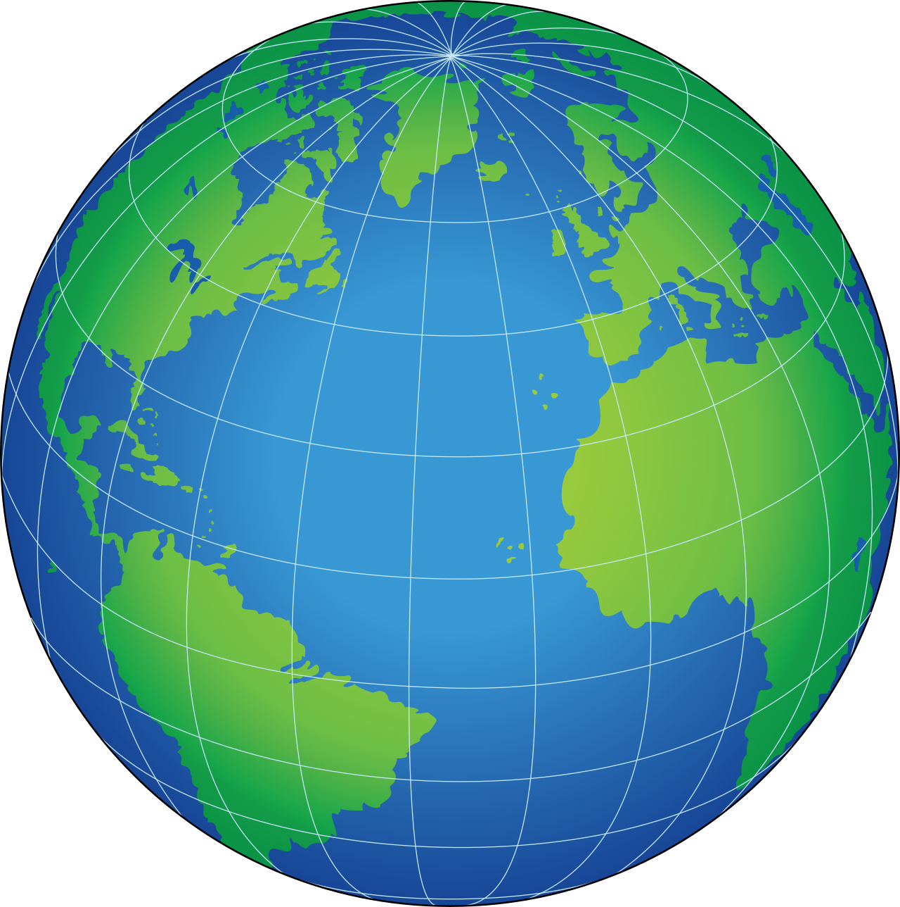

U.S. Government — Extracted from the PDF version of the
<a href="http://www.disam.dsca.mil/pubs/archives.htm" target="_blank" rel="noopener noreferrer"><em>Vol 26-4 2004 DISAM Journal</em></a>
(direct PDF <a href="http://www.disam.dsca.mil/pubs/Archives/Web%20Journal%2026-4.pdf" target="_blank" rel="noopener noreferrer">[1]</a>),
via <a href="https://commons.wikimedia.org/wiki/File:Globe_Atlantic.svg" target="_blank" rel="noopener noreferrer">Wikipedia</a>.

---

# Coordinates and Location

<blockquote>
How many coordinates do we need to uniquely define a spatio-temporal location?
</blockquote>

<h3>3 spatial dimensions</h3>

Cartesian (x, y, z) or  Spherical/Ellipsoidal (λ, φ, r) or or UTM Projections (Easting, Northing, Height)

Where is it in space?

<h3>1 temporal dimension</h3>

t

When does it occur?

---

# Cartesian Coordinates x,y,z

###

A location can be represented by three orthogonal coordinates $\mathbf{p} = (x, y, z)$ in an <a href="https://en.wikipedia.org/wiki/Earth-centered,_Earth-fixed_coordinate_system">Earth-Centered, Earth-Fixed (ECEF)</a> coordinate system

  

---

# Spherical Coordinates

###

Expressing location on the surface of Earth is often more practical than working directly in 3D Cartesian coordinates
$
x,y,z \mapsto \lambda, \varphi, r
$
of longitude $\lambda$, latitude $\varphi$, and constant radius $r$

Spherical to Cartesian

$$
x = r \cos\varphi \cos\lambda
$$

$$
y = r \cos\varphi \sin\lambda
$$

$$
z = r \sin\varphi
$$

Cartesian to spherical

$$
r = \sqrt{x^2 + y^2 + z^2}
$$

$$
\lambda = \operatorname{atan2}(y, x)
$$

$$
\varphi = \arcsin\left(\frac{z}{r}\right)
$$

  

---

# Ellipsoidal Coordinates

###

But the Earth is not a sphere: It is an ellipsoid.

Geodetic to Cartesian

$$
\begin{aligned}
x &= (N(\varphi) + h)\cos\varphi\cos\lambda \\
y &= (N(\varphi) + h)\cos\varphi\sin\lambda \\
z &= \left((1-e^2)N(\varphi) + h\right)\sin\varphi
\end{aligned}
$$

$$
\begin{aligned}
N(\varphi) &= \frac{a}{\sqrt{1-e^2\sin^2\varphi}} \\
e^2 &= \frac{a^2-b^2}{a^2}
\end{aligned}
$$

Cartesian to Geodetic

The inverse is usually computed iteratively. See
<a href="https://en.wikipedia.org/wiki/Geographic_coordinate_conversion#From_ECEF_to_geodetic_coordinates" target="_blank" rel="noopener noreferrer">
Wikipedia
</a>.

  

---

# World Geodetic System 1984 (WGS 84)

###

WGS 84 is the global reference system used by GPS and most web mapping workflows.

  

  

  

---

# Cylindrical Map Projections and Web Mercator

### Cylindrical projections - Mercator

A cylinder touches or cuts the globe along a line or lines. The classic case is a cylinder around the equator.

  

<blockquote style="margin-top: auto; min-height: 3.1rem;">
Cylindrical projections minimize distortion along their standard line(s).
</blockquote>

### Web Mercator

Web Mercator is the projection used by many web maps. It is a cylindrical, conformal projection: local shapes are preserved, but areas grow strongly toward the poles.

<blockquote style="margin-top: auto; min-height: 3.1rem;">
Web maps trade area accuracy for visually stable local shapes and simple tiled rendering.
</blockquote>

---

# Cylindrical Map Projections and UTM

### Cylindrical projections - UTM

The Universal Transverse Mercator system rotates the cylinder: each zone uses a transverse cylinder around a local central meridian.

  

<blockquote style="margin-top: auto; min-height: 3.1rem;">
UTM turns longitude/latitude into local metric coordinates: easting and northing.
</blockquote>

### Universal Transverse Mercator (UTM)

Pre-defined UTM zones give geodata local coordinate systems with comparatively low distortion inside each zone.

  

<blockquote style="margin-top: auto; min-height: 3.1rem;">
UTM uses different cylinders to avoid local distortions.
</blockquote>

---

# Radius: Atmosphere and Ocean

Geospatial fields are not only horizontal.

They also vary vertically:

- wind fields change across atmospheric columns
- ocean currents differ at the surface and at depth
- temperature, humidity, pressure, and salinity depend on height or depth
- many Earth-system processes require a vertical coordinate

<blockquote>
Location often means latitude, longitude, and height or depth.
</blockquote>

  

  
  

  

  Figure: University of Exeter, <a href="https://commons.wikimedia.org/wiki/File:Fig_1.4.1_Atmospheric_circulation_cells,_dominant_wind_directions.png" target="_blank" rel="noopener noreferrer"><em>Atmospheric circulation cells, dominant wind directions, key ocean basins, surface currents and deep water formation sites</em></a>. Licensed under CC-BY-SA: Creative Commons Attribution-Share Alike 4.0 International. The rest of this slide deck remains CC-BY-NC.
  

---

# Time: The Earth is Dynamic

  
  

  Figure: NASA Science, <a href="https://science.nasa.gov/earth/explore/earth-indicators/carbon-dioxide/" target="_blank" rel="noopener noreferrer">Carbon Dioxide</a>.
  

  
  

  Figure: Google Earth Engine, <a href="https://developers.google.com/earth-engine/tutorials/community/modis-ndvi-time-series-animation" target="_blank" rel="noopener noreferrer">MODIS NDVI time series animation</a>. Licensed under CC-BY.
  

---

# Time: Common Frequencies

###

Earth observations contain processes at many characteristic temporal frequencies.

| Time scale | Frequency | Examples |
|---|---|---|
| Seconds to minutes | High frequency | Wind gusts, turbulence, lightning, traffic, waves, sensor noise |
| Minutes to hours | Sub-daily | Cloud motion, precipitation cells, tides, urban mobility, river discharge |
| ~12 hours | Semi-diurnal | Ocean tides, coastal water levels |
| 24 hours | Daily / diurnal | Temperature cycle, solar radiation, human activity, vegetation |
| Several days | Weather | Storms, pressure systems, cloud regimes, heatwaves, cold fronts |
| Weekly | Anthropogenic | Commuting, energy use, shipping patterns, some air pollution signals |
| Monthly / ~29.5 days | Lunar | Spring-neap tide cycle, moon-related illumination effects |
| Seasonal / annual | Yearly | Phenology, crop cycles, snow cover, monsoon, sea ice, temperature |
| Interannual | 2-7 years | ENSO / El Nino, drought cycles, vegetation anomalies |
| Decadal | 10+ years | Climate variability, land-use change, glacier retreat, urban expansion |
| Multi-decadal to centennial | Long-term trend | Climate change, sea-level rise, ecosystem shifts |

---
layout: bonn-section
sectionColor: "#4f50ba"
section: remote-sensing
sectionTitle: Remote Sensing
---

# Remote Sensing

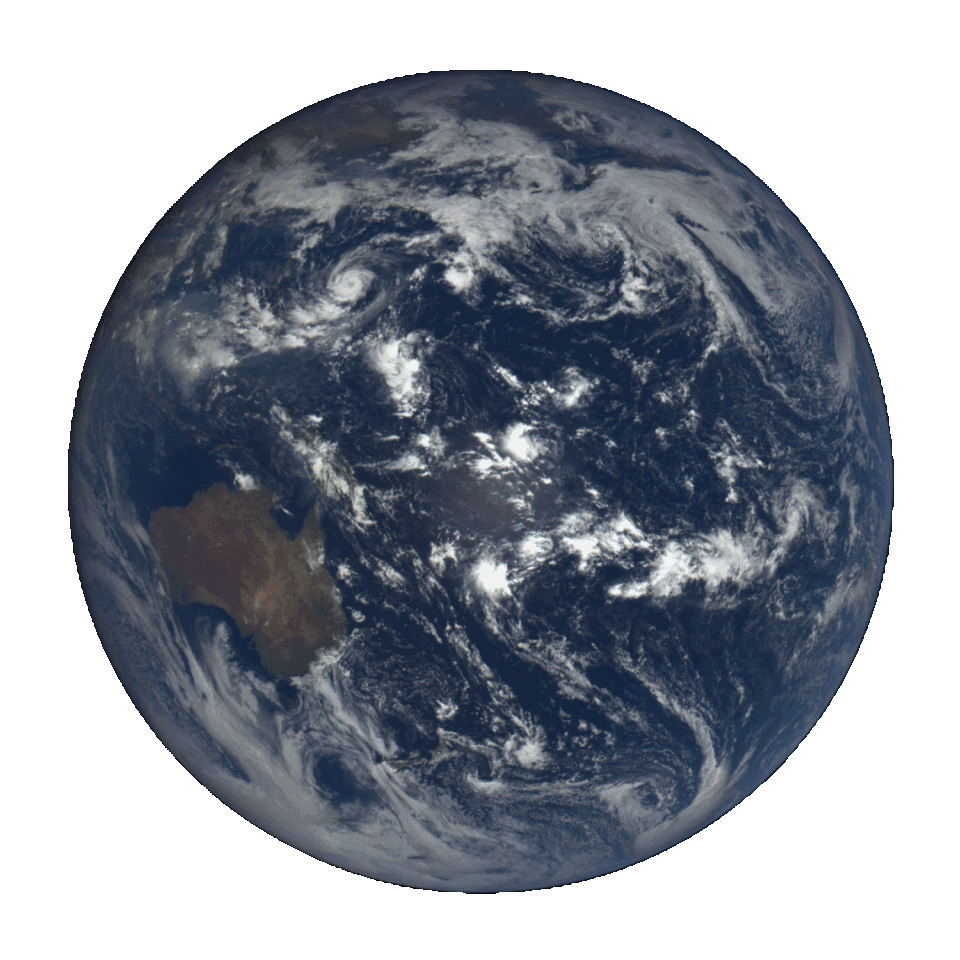

<a href="https://saylordotorg.github.io/text_essentials-of-geographic-information-systems/s05-03-geographic-information-systems.html" target="_blank" rel="noopener noreferrer">
Campbell &amp; Shin (2011), Figure 1.8.
</a>

---
section: remote-sensing
sectionTitle: Remote Sensing
---

# Overview Section - Data Sources

  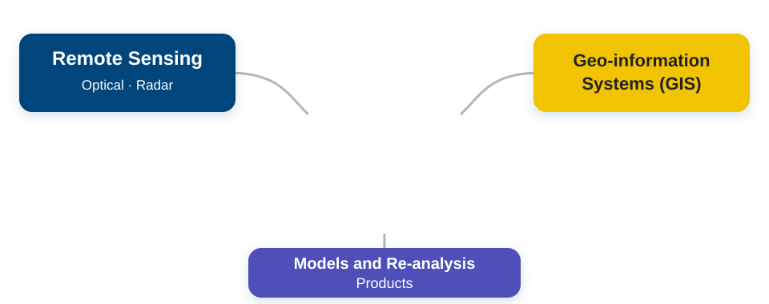
  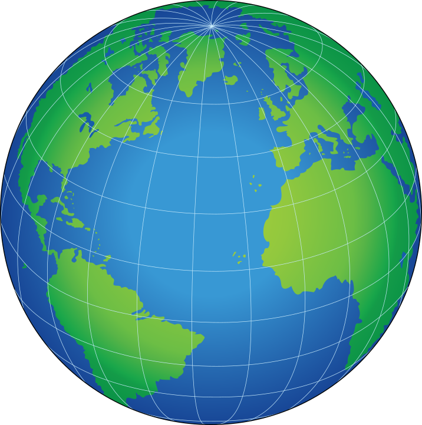

---
section: remote-sensing
sectionTitle: Remote Sensing
---

# Overview Section - Data Formats

  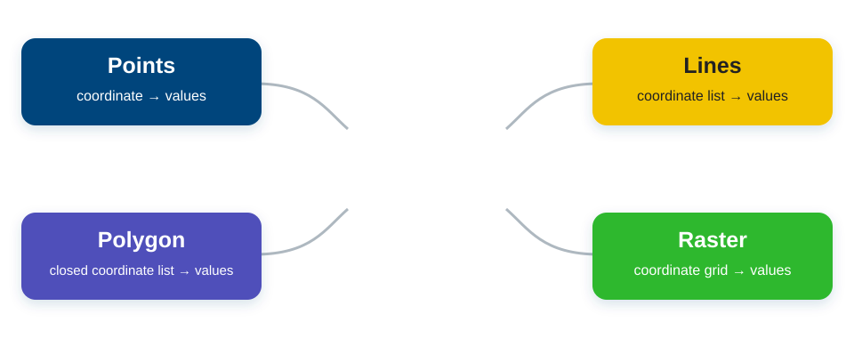
  

---
section: remote-sensing
sectionTitle: Remote Sensing
---

# Active and Passive Remote Sensing

## Passive Remote Sensing

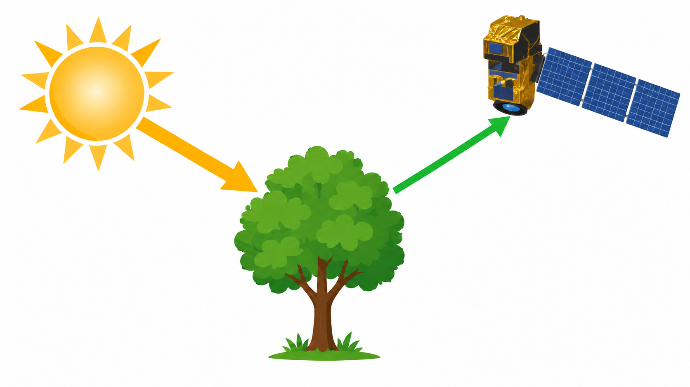

Sunlight → reflected → sensed by the satellite

<strong class="text-blue-800">Example:</strong> optical satellites

## Active Remote Sensing

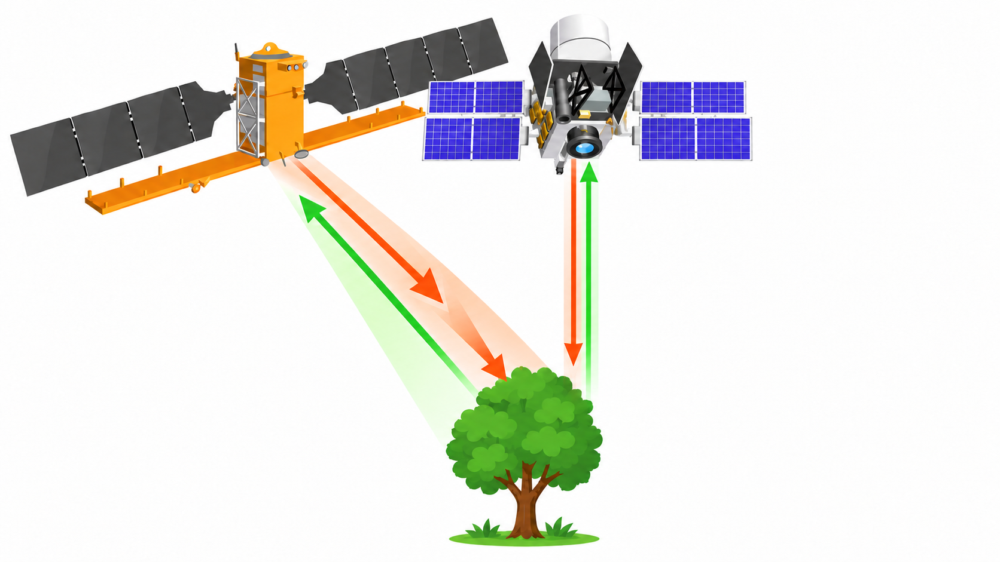

Satellite emits energy → reflected → sensed

<strong class="text-blue-800">Examples:</strong> nadir lidar and side-looking radar

<!--
Contrast passive sensors, which use sunlight, with active sensors, which emit their own signal. Use the examples to introduce optical, lidar, and radar observations.
-->

---
section: remote-sensing
sectionTitle: Remote Sensing
---

# Earth Observation Satellites

## Passive Remote Sensing - Examples from 07.02.2020

  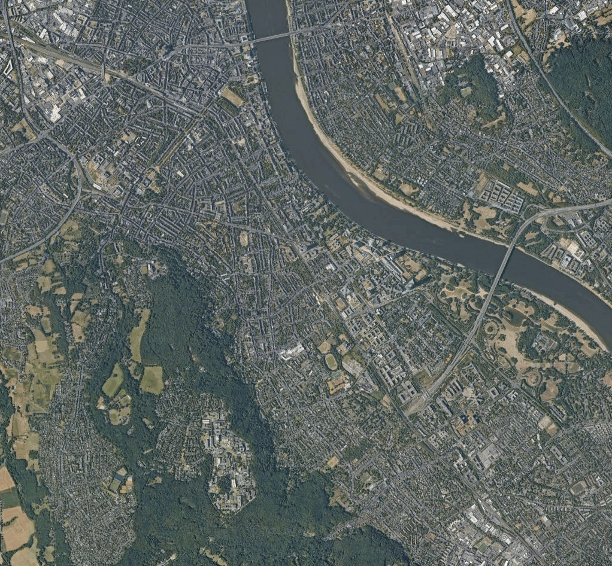
  <h3 class="mt-3">High Resolution</h3>
  
e.g., WorldView-3, PlanetScope, &lt; 10 m

  
  <h3 class="mt-3">Medium Resolution 10m-30m</h3>
  
Sentinel-2, 13-band multispectral

  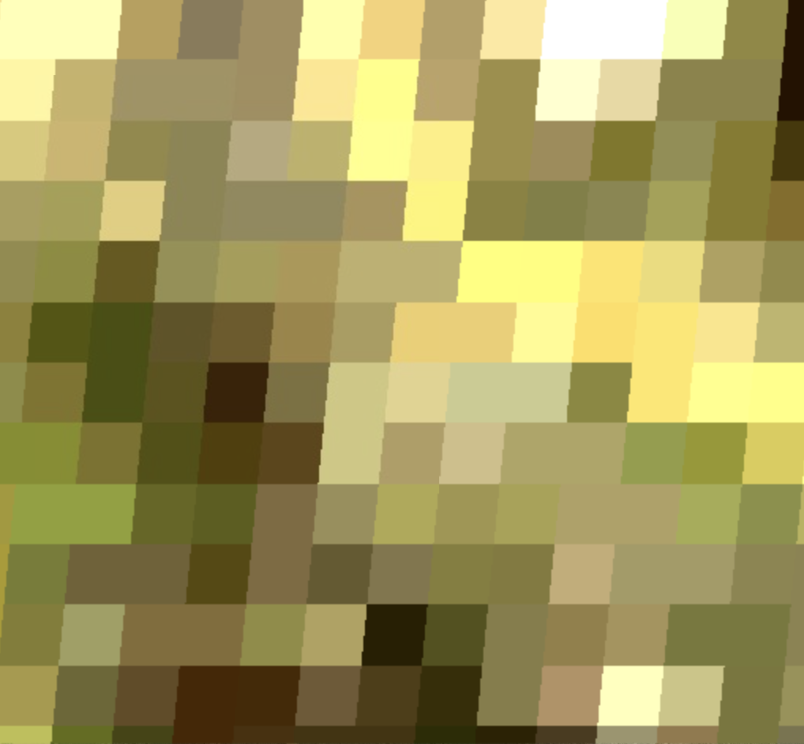
  <h3 class="mt-3">Low Resolution</h3>
  
MODIS, 250m - 1km, 36-band multispectral

---
section: remote-sensing
sectionTitle: Remote Sensing
---

# Weather and Meteorological Satellites

## Passive Remote Sensing

  

    
METEOSAT — Geostationary Orbit (~36 000 km)

    

      📍 Fixed view over Europe &amp; Africa
      🔭 500 m – 2 km
      🕐 Every 10 min
    

    <a
      href="https://zoom.earth/maps/satellite/#view=50.7,7.1,3.63z"
      target="_blank"
      rel="noopener noreferrer"
      title="Open the live Zoom Earth satellite view"
    >
      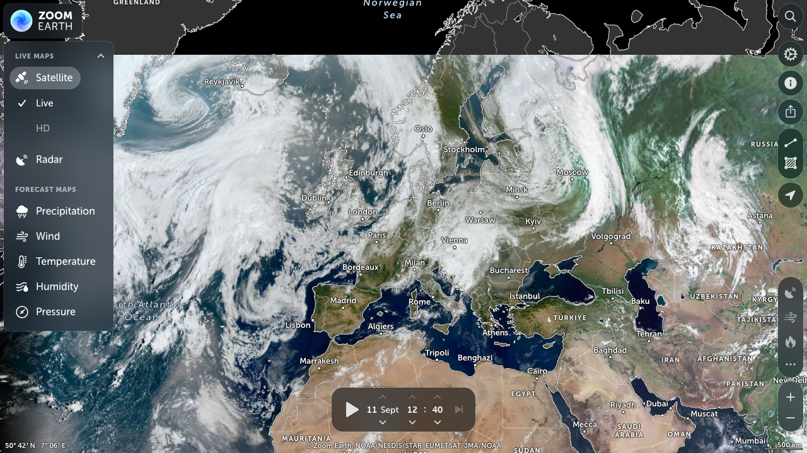
    </a>
    

      Click to open the live satellite view. Source: <a href="https://zoom.earth/maps/satellite/#view=50.7,7.1,3.63z" target="_blank" rel="noopener noreferrer">Zoom Earth</a>.
    

  

  

    
DSCOVR EPIC — L1 Lagrange Point (~1.5M km)

    

      📍 Full sunlit Earth in every image
      🔭 8 – 20 km &nbsp;·&nbsp; 🕐 Every ~2 h
    

    
    

      DSCOVR EPIC — NASA / Wikimedia Commons. Public domain.
    

  

<!--
Use the live satellite view to introduce weather satellites and broad, frequently updated coverage. Point out large-scale cloud systems and revisit the role of thermal observations.
-->

---
section: remote-sensing
sectionTitle: Remote Sensing
---

# Takeaways --- Passive Remote Sensing

Sunlight → reflected → sensed by the satellite

<strong class="text-blue-800">Example:</strong> optical satellites

<ul class="mt-2 space-y-2 text-left">
  <li>Uses reflected sunlight by day or emitted thermal radiation day and night.</li>
  <li>Clouds and the atmosphere can obscure optical observations.</li>
  <li>Resolution trade-offs span space, spectrum, time, and radiometry.</li>
  <li>Higher spatial resolution does not inherently mean fewer bands.</li>
  <li>Very-high-resolution imagery is often commercial; coarser data are often open.</li>
  <li>Coarser sensors usually cover wider areas more frequently.</li>
  <li>Illumination and viewing geometry affect the signal.</li>
  <li>Natural-colour imagery is intuitive; reflectance requires atmospheric correction.</li>
</ul>

---
section: remote-sensing
sectionTitle: Remote Sensing
---

# Active Remote Sensing - RADAR and LIDAR

  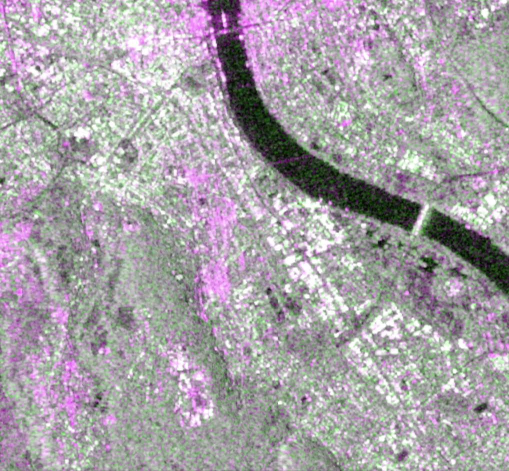
  <h3 class="mt-3">Sentinel-1 SAR Raster</h3>
  
Side-looking radar processed as a pixel grid

  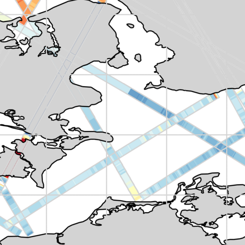
  <h3 class="mt-3">Radar Altimetry Tracks</h3>
  
Nadir measurements along point tracks

  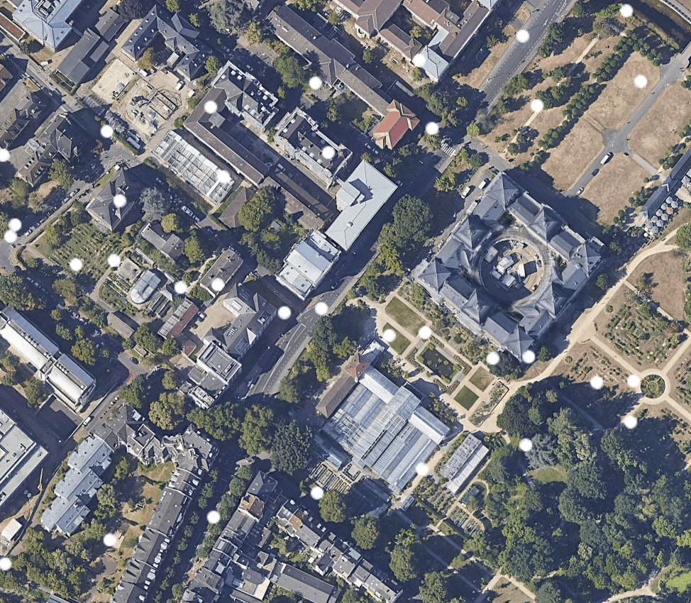
  <h3 class="mt-3">GEDI Lidar Footprints</h3>
  
Nadir samples along point tracks

<!--
Contrast Sentinel-1 imagery processed as a raster with the point tracks produced by nadir radar altimetry and GEDI lidar. Emphasize that active sensing can produce different spatial data formats.
-->

---
section: remote-sensing
sectionTitle: Remote Sensing
---

# Geometry of side-looking RADAR 

  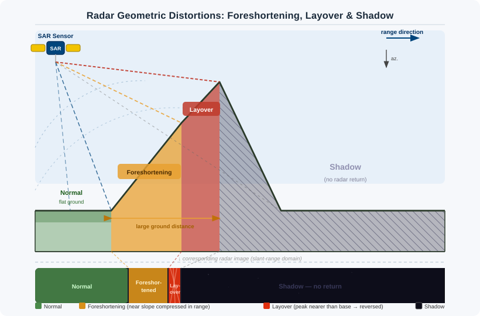

## Example: TerraSAR-X

  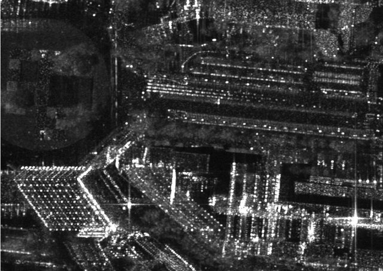

  

    Figure uploaded by
    <a href="https://www.researchgate.net/profile/Richard-Bamler" target="_blank" rel="noopener noreferrer">Richard Bamler</a>.
  

---
section: remote-sensing
sectionTitle: Remote Sensing
---

# LIDAR Backscatter for Vegetation Canopy

## Sampling Geometry

  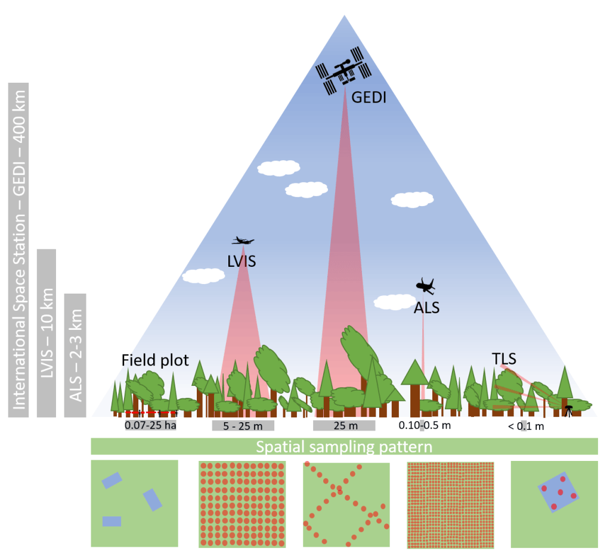

  

    Figures in both panels: NASA and University of Maryland.
  

## Canopy Structure

  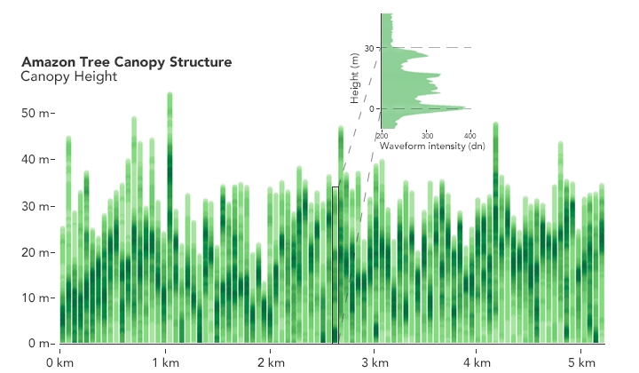

<!--
Introduce GEDI's footprint and sampling geometry before showing the resulting canopy-height profile. Connect the lidar return waveform to vertical vegetation structure.
-->

---
section: remote-sensing
sectionTitle: Remote Sensing
---

# Gravity Measurements from Two Satellites

## GRACE Follow-On

  

    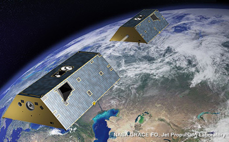
  

  

    Figure: <a href="https://grace.jpl.nasa.gov/rails/active_storage/blobs/redirect/eyJfcmFpbHMiOnsibWVzc2FnZSI6IkJBaHBBbk1EIiwiZXhwIjpudWxsLCJwdXIiOiJibG9iX2lkIn19--d3a40f736a59795797a54a45b9897b80606fc0f3/grace-fo-satellite_768p.jpg?disposition=inline" target="_blank" rel="noopener noreferrer">NASA/JPL</a>.
  

## Ground Track

  

    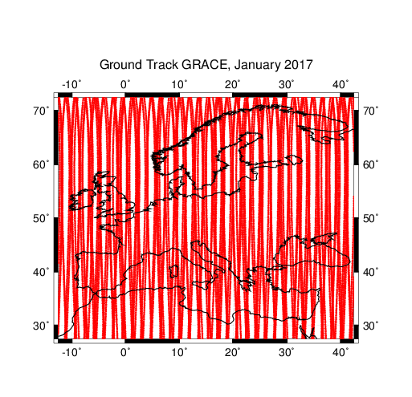
  

  

    Ground Track GRACE, January 2017. Credit: Ch. Dahle, GFZ.
  

## GRACE Geoid

  

    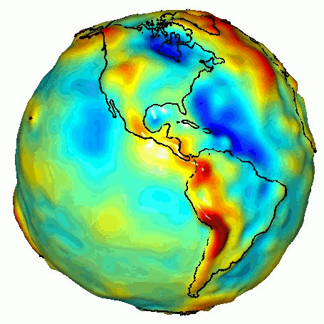
  

  

    Animation: <a href="https://upload.wikimedia.org/wikipedia/commons/7/78/GRACE_globe_animation.gif" target="_blank" rel="noopener noreferrer">Wikipedia</a>; NASA/JPL/University of Texas Center for Space Research.
  

<!--
Introduce GRACE as an active measurement system that infers Earth's changing gravity field from two satellites flying in formation. Use the rotating geoid to show the resulting global representation.
-->

---
section: remote-sensing
sectionTitle: Remote Sensing
---

# Takeaways --- Active Remote Sensing

Sensor emits signal → return measured

<strong class="text-blue-800">Examples:</strong> SAR, LiDAR, radar altimetry

<ul class="mt-2 space-y-2 text-left">
  <li>Carries its own illumination — <strong>independent of sunlight</strong>, enabling imaging at night and in polar winter.</li>
  <li><strong>Penetrates clouds</strong> and light rain (radar), overcoming a key limitation of optical sensors.</li>
  <li>Measures <strong>physical surface properties</strong> directly: backscatter, elevation, distance, or canopy structure.</li>
  <li>SAR captures <strong>surface roughness, moisture, and deformation</strong> through phase and amplitude.</li>
  <li>Radar altimetry delivers precise <strong>surface height</strong> along nadir tracks — not a full 2D image.</li>
  <li>LiDAR records <strong>3D point clouds</strong>: tree height, building geometry, terrain beneath vegetation.</li>
  <li>Shorter wavelengths (LiDAR) give finer detail; longer wavelengths (L-band radar) penetrate canopy and soil.</li>
</ul>

<!--
Contrast with passive sensing: active sensors are self-illuminating, all-weather capable, and measure geometry and physical properties rather than reflected radiance. Emphasise night/cloud capability and the variety of active modalities: SAR, altimetry, LiDAR.
-->

---
layout: bonn-section
sectionColor: "#4f50ba"
section: geo-information-science
sectionTitle: Geo-information Science
---

# Geo-information Science Data

<a href="https://saylordotorg.github.io/text_essentials-of-geographic-information-systems/s05-03-geographic-information-systems.html" target="_blank" rel="noopener noreferrer">
Campbell &amp; Shin (2011), Figure 1.8.
</a>

---
section: geo-information-science
sectionTitle: Geo-information Science
---

# Geo-information Science

  
  
Campbell &amp; Shin (2011), Fig. 1.8

GIS organises geographic information as **stacked, queryable layers** — each layer aligns to the same coordinate reference system and carries thematic information about the world.

  

    
Vector layers

    
Points, lines, polygons + attribute table

  

  

    
Raster layers

    
Grids of continuous values: elevation, imagery

  

<strong class="text-gray-800">Key data sources:</strong> OpenStreetMap, administrative databases, land use / land cover classifications, cadastral records, sensor networks.

<!--
GIS organises thematic information in layers that can be overlaid, queried, and analysed spatially. Each layer is either a vector dataset (geometry + attributes) or a raster grid. Combining layers from different sources — roads, parcels, land cover, elevation — is the core power of GIS.
-->

---
section: geo-information-science
sectionTitle: Geo-information Science
---

# Vector Data — Geometry + Attributes

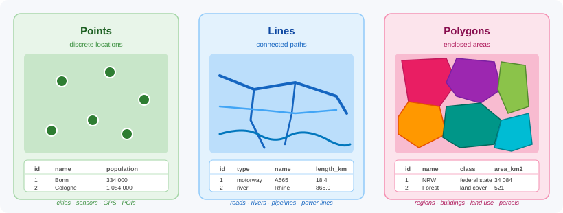

  

    
🟢 Points

    
Zero-dimensional locations: weather stations, cities, GPS waypoints, species occurrence records.

  

  

    
🔵 Lines

    
Ordered vertex sequences: roads, rivers, coastlines, pipelines, power lines, flight paths.

  

  

    
🔴 Polygons

    
Closed rings enclosing area: administrative units, building footprints, land-use patches, parcels.

  

<!--
Every feature in a vector dataset combines geometry (where?) with an attribute table (what?). Spatial queries join geometry and attributes: "find all farms within 10 km of a river that are larger than 50 ha." The power of GIS lies in these combined spatial + semantic queries across multiple layers.
-->

---
section: geo-information-science
sectionTitle: Geo-information Science
---

# OpenStreetMap --- the Wikipedia of geodata

## OSM Database

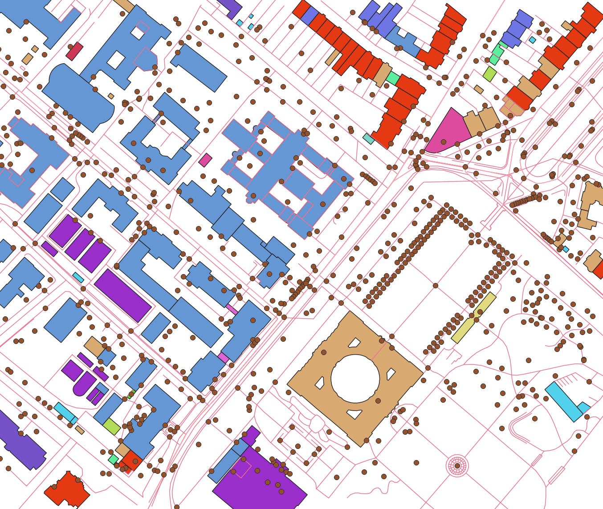

Points, lines, and polygons

  
Style and rasterize

  
→

## OSM Background Map

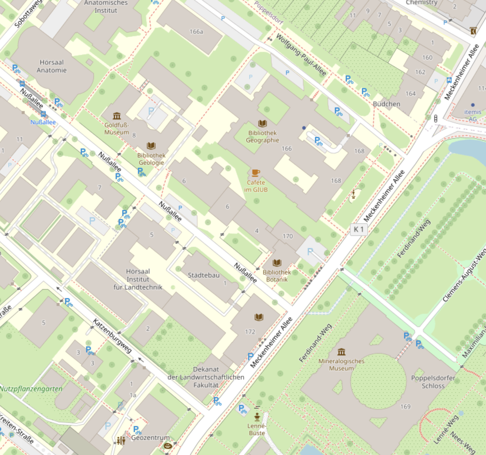

Rendered raster tiles

Map data © OpenStreetMap contributors.

<!--
OpenStreetMap stores tagged vector features rather than a fixed map image. Styling and rasterization transform the database into familiar background-map tiles.
-->

---
section: geo-information-science
sectionTitle: Geo-information Science
---

# Web Mapping Service (WMS) API

The <strong class="text-blue-800">bounding box (BBOX)</strong> controls the geographic area shown in the returned raster image.

<form class="mt-2 flex gap-2" @submit.prevent="loadWmsMap">
  <input
    v-model="wmsUrlInput"
    type="text"
    spellcheck="false"
    aria-label="WMS GetMap URL"
    class="min-w-0 flex-1 rounded-lg border-2 border-blue-700 bg-white px-3 py-2 font-mono text-[0.82rem] leading-tight text-gray-800 shadow-sm outline-none focus:border-yellow-500 focus:ring-2 focus:ring-yellow-200"
  />
  <button
    type="submit"
    class="shrink-0 rounded-lg bg-blue-800 px-5 py-2 text-[0.92rem] font-semibold text-white shadow-sm hover:bg-blue-700 focus:outline-none focus:ring-2 focus:ring-yellow-400"
  >
    Load map
  </button>
</form>

  

    BBOX = WEST, SOUTH, EAST, NORTH
  

  

    Change both longitudes to move east or west and both latitudes to move north or south. Narrower coordinate ranges zoom in.
  

  
  

    {{ wmsError }}
  

© OpenStreetMap contributors · WMS provided by terrestris

<!--
Edit only the BBOX values first. The URL remains an ordinary image source: the browser requests the WMS response when Load map is selected or Enter is pressed.
-->

---
section: geo-information-science
sectionTitle: Geo-information Science
---

# Land Use / Land Cover (LULC) Databases

<strong>Land use</strong> describes human activity (agriculture, urban, forestry). <strong>Land cover</strong> describes the physical surface (vegetation, bare soil, water).

  

    

ESA WorldCover

2020–2021

    
10 m global · 11 classes · Sentinel-1 &amp; -2

  

  

    

CORINE Land Cover (CLC)

EU, since 1990

    
100 m · 44 classes · updated every 6 years

  

  

    

GlobeLand30

Global

    
30 m · 10 classes · 2000 / 2010 / 2020 epochs

  

  

    

Dynamic World (Google)

Near-real-time

    
10 m · 9 classes · probabilistic per-scene output

  

  

    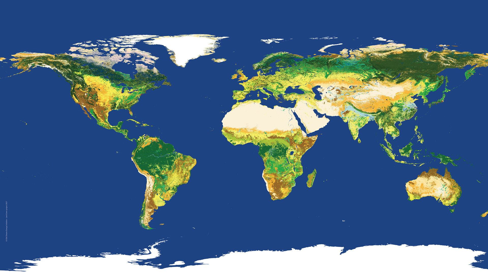
    
Global land cover map 2015 · © ESA / ESA Climate Change Initiative

  

  

    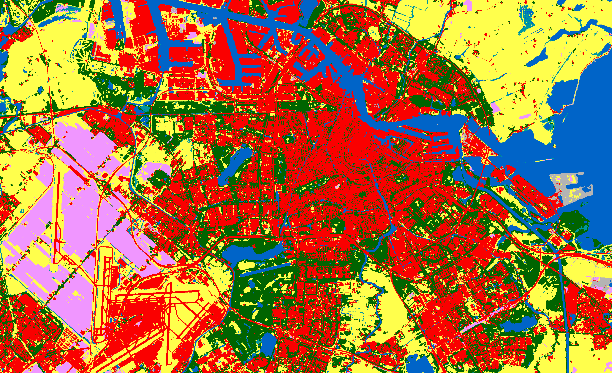
    
ESA WorldCover 10 m — Amsterdam · © Copernicus / ESA

  

<!--
LULC datasets are among the most widely used geospatial data sources for environmental science and remote sensing. They combine satellite imagery with ground truth labels to produce thematic maps at regional to global scale. The distinction between land use and land cover matters: two fields with the same surface cover (bare soil) can have different uses (fallow vs. construction). The two images illustrate scale: the top shows a global-scale product from ESA's Climate Change Initiative, the bottom shows the 10 m WorldCover product zoomed into Amsterdam — notice how fine-grained urban, water, and vegetation classes become visible at local scale.
-->

---
section: geo-information-science
sectionTitle: Geo-information Science
---

# Administrative Boundaries

  
GADM — Global Administrative Areas

  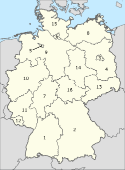
  
Germany · 6 nesting levels · global coverage

  
Freely available polygons for every country; widely used in ecological &amp; socioeconomic modelling.

  
Gringer / Wikipedia · CC BY-SA

  
NUTS — EU Territorial Statistics Units

  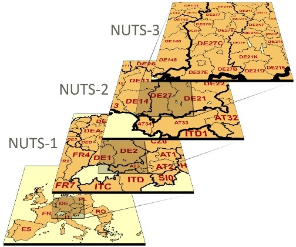
  
NUTS-1 → NUTS-2 → NUTS-3 · three nesting levels

  
EU standard: NUTS-1 (federal states), NUTS-2 (Regierungsbezirke), NUTS-3 (districts). Reference frame for Eurostat statistics.

  
© Eurostat · ec.europa.eu/eurostat

<!--
Administrative boundaries connect geographic data to the socioeconomic and political context used for statistics and policy. GADM covers the entire globe and is the default choice for global modelling studies. NUTS is EU-specific but provides strict hierarchical nesting that makes multi-scale analysis consistent. Note that boundaries change over time — NUTS was revised in 2016 and 2021, so always verify the vintage of your boundary file when doing time-series analysis.
-->

---
section: geo-information-science
sectionTitle: Geo-information Science
---

# Takeaways

## Geo-information Science

Real world → thematic layers → analysis

<strong class="text-blue-800">Examples:</strong> OSM, CORINE, GADM, cadastres

<ul class="mt-2 space-y-1.5 text-left">
  <li>GIS organises the world as <strong>thematic layers</strong> aligned to a shared coordinate reference system.</li>
  <li>Vector data combines <strong>geometry</strong> (points, lines, polygons) with an <strong>attribute table</strong> — enabling spatial and semantic queries.</li>
  <li>OpenStreetMap is the world's largest <strong>open vector database</strong>: roads, buildings, land use, and POIs contributed by millions.</li>
  <li>LULC databases (<strong>ESA WorldCover, CORINE</strong>) map land cover classes globally using satellite imagery — raster products with thematic labels.</li>
  <li>Administrative boundaries (<strong>GADM, NUTS</strong>) are the standard aggregation frame for statistics, policy, and spatial cross-validation.</li>
  <li><strong>Spatial joins</strong> link vector layers: assign points to regions, aggregate raster values within polygons.</li>
</ul>

<!--
GIS data is the primary source for human-shaped geography: maps, boundaries, infrastructure, and land use. Unlike remote sensing, which derives data from sensor measurements, GIS data is often directly digitised, crowd-sourced, or statistically derived. For GRL: OSM and LULC products provide rich training labels; administrative boundaries define spatial evaluation regions.
-->

---
section: geo-information-science
sectionTitle: Geo-information Science
---

# A Grid Turns Space into Values

  
<h3>Location</h3>
row · column · cell

  
→

  
<h3>Measurement</h3>
one or many values

<blockquote class="mt-10">
The grid defines where measurements are stored—and what spatial detail can be represented.
</blockquote>

<!--
Prepare the core raster concepts of cells, values, extent, and resolution. Detailed definitions and examples will be added later.
-->

---
section: geo-information-science
sectionTitle: Geo-information Science
---

# Spatial Resolution Changes What We See

  

<h3 class="mt-4">Coarse</h3>

  

<h3 class="mt-4">Medium</h3>

  

<h3 class="mt-4">Fine</h3>

<!--
Reserve space to develop spatial resolution and scale. Later examples should show that resolution changes both visible detail and suitable tasks.
-->

---
section: geo-information-science
sectionTitle: Geo-information Science
---

# Optical Imagery — Seeing Earth's Surface

Aerial and satellite views across scales and wavelengths

<!--
Introduce optical imagery as one important family of raster observations. Later slides can distinguish platforms, spatial resolution, and spectral information.
-->

---
section: geo-information-science
sectionTitle: Geo-information Science
---

# More Than a Color Photograph

  
<h3>Platform</h3>
airborne ↔ spaceborne

  
<h3>Scale</h3>
local ↔ global

  
<h3>Spectrum</h3>
visible ↔ beyond visible

<!--
Mark the three dimensions along which the optical-imagery material can later expand. Keep the emphasis on imagery as measurements rather than ordinary photographs.
-->

---
section: geo-information-science
sectionTitle: Geo-information Science
---

# Satellite Time Series — Watching Earth Change

The same place, observed again and again

<!--
Move from individual images to repeated observations. This section will later develop cadence, seasonality, change, and missing acquisitions.
-->

---
section: geo-information-science
sectionTitle: Geo-information Science
---

# A Stack of Images Becomes a Time Series

  
t₁

  
→

  
t₂

  
→

  
t₃

<blockquote class="mt-10">
Time reveals processes that a single snapshot cannot.
</blockquote>

<!--
Reserve a bridge from spatial imagery to temporal signals. Later content can compare image stacks, per-pixel series, and derived change products.
-->

---
section: geo-information-science
sectionTitle: Geo-information Science
---

# Radar — Measuring Earth Differently

Active sensing with a different view of the surface

<!--
Introduce radar and SAR as a distinct Earth-observation modality. Later material should contrast what radar measures with optical reflectance.
-->

---
section: geo-information-science
sectionTitle: Geo-information Science
---

# Different Sensors Reveal Different Properties

  
<h3>Optical</h3>
Energy reflected or emitted by the surface

  
<h3>Radar</h3>
A transmitted signal and its return

<!--
Create a placeholder for the conceptual optical–radar comparison. Acquisition geometry, wavelength, and interpretation belong in later detailed slides.
-->

---
section: geo-information-science
sectionTitle: Geo-information Science
---

# Point Observations — Sampling Earth

Measurements at irregular locations and footprints

<!--
Shift from regular grids to irregularly located samples. Leave room for both in-situ sensors and satellite-derived footprints.
-->

---
section: geo-information-science
sectionTitle: Geo-information Science
---

# Samples Are Not the Whole Field

  
<h3>Where was Earth sampled?</h3>
Locations, paths, and footprints

  
<h3>What lies between samples?</h3>
Coverage, gaps, and inference

<!--
Introduce sampling geometry and incomplete coverage as defining properties of point observations. Detailed treatment of interpolation and sampling bias is intentionally deferred.
-->

---
section: geo-information-science
sectionTitle: Geo-information Science
---

# 3D Data — Point Clouds and Elevation

Height, depth, and the structure above the surface

<!--
Extend geospatial observations into the vertical dimension. Later examples can distinguish elevation surfaces, point clouds, and volumetric measurements.
-->

---
section: geo-information-science
sectionTitle: Geo-information Science
---

# The Vertical Dimension Has Many Representations

  
<h3>Surface</h3>
elevation

  
<h3>Points</h3>
3D structure

  
<h3>Volume</h3>
layers and depth

<!--
Provide a placeholder taxonomy for vertical data. The later teaching pass can add terrain, LiDAR, bathymetry, and atmospheric or ocean profiles.
-->

---
section: geo-information-science
sectionTitle: Geo-information Science
---

# Lines and Networks — Representing Connections

Paths, flows, and connected systems

<!--
Introduce linear geometries and the additional relationships encoded by networks. Concrete examples such as roads, rivers, and trajectories will be developed later.
-->

---
section: geo-information-science
sectionTitle: Geo-information Science
---

# Geometry and Connectivity Tell Different Stories

  
<h3>Line geometry</h3>
Where does it go?

  
<h3>Network structure</h3>
What connects to what?

<!--
Reserve the distinction between the shape of a line and the topology of a network. This later supports graph-based geospatial representations.
-->

---
section: geo-information-science
sectionTitle: Geo-information Science
---

# Polygons and Regions — Representing Objects

Boundaries turn space into discrete regions

<!--
Introduce polygons as bounded spatial objects or areas. Later examples can cover parcels, buildings, administrative units, and land-use regions.
-->

---
section: geo-information-science
sectionTitle: Geo-information Science
---

# Boundaries Depend on Purpose

  
<h3>Physical boundaries</h3>
Observed or delineated

  
<h3>Conceptual boundaries</h3>
Defined for a task or institution

<!--
Flag that regions are not always inherent objects in the world. Later content can develop boundary uncertainty, scale, and aggregation.
-->

---
section: geo-information-science
sectionTitle: Geo-information Science
---

# Models and Reanalysis — Filling the Gaps

Spatial fields generated, estimated, or simulated by models

<!--
Introduce model outputs and reanalysis as a different route to spatial fields. Prepare the distinction between direct observations and model-informed estimates.
-->

---
section: geo-information-science
sectionTitle: Geo-information Science
---

# Observation and Model Are Not Opposites

  
<h3>Observations</h3>

  
+

  
<h3>Models</h3>

  
→

  
<h3>Spatial fields</h3>

<blockquote class="mt-10">
Model-based products combine assumptions, dynamics, and measurements.
</blockquote>

<!--
Create a placeholder for data assimilation, modeled fields, and reanalysis products such as ERA5. Detailed workflows and uncertainty belong in the later content pass.
-->

---
section: geo-information-science
sectionTitle: Geo-information Science
---

# One Location, Many Measurements

There is no single representation of a place

<!--
Synthesize the block around the central idea that one location supports many representations. This sets up the learning problem created by heterogeneous geospatial data.
-->

---
section: geo-information-science
sectionTitle: Geo-information Science
---

# One Place, Many Views

  
<h3>Imagery</h3>

  
<h3>Time series</h3>

  
<h3>Radar</h3>

  
<h3>Elevation</h3>

  
<h3>Weather</h3>

  
<h3>Regions</h3>

  
<h3>Networks</h3>

  
<h3>Model fields</h3>

<blockquote class="mt-8">
How can we represent—and learn from—all of these views together?
</blockquote>

<!--
Close Block 2 by gathering its modalities around one place. Use the final question to motivate the rest of the geospatial representation learning course.
-->
