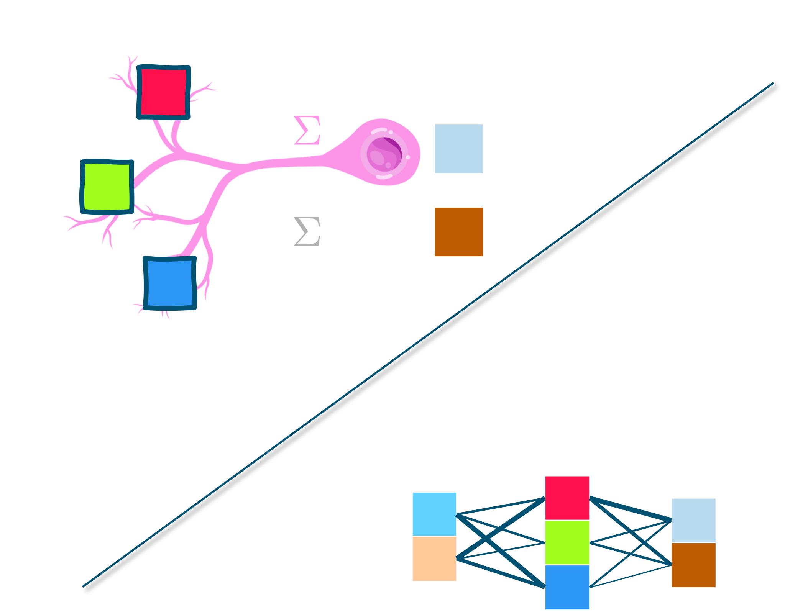
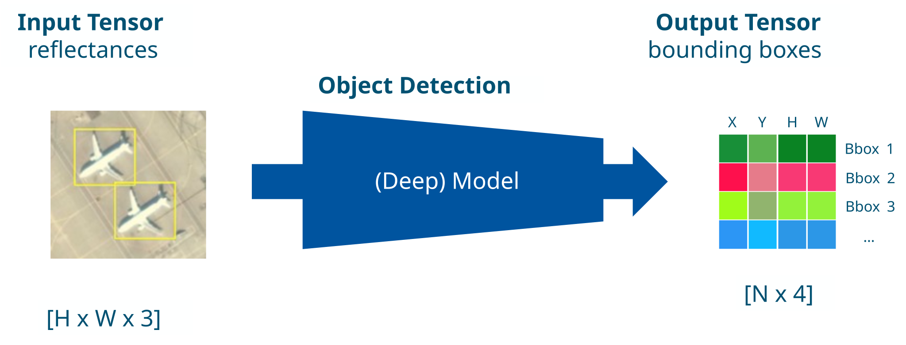
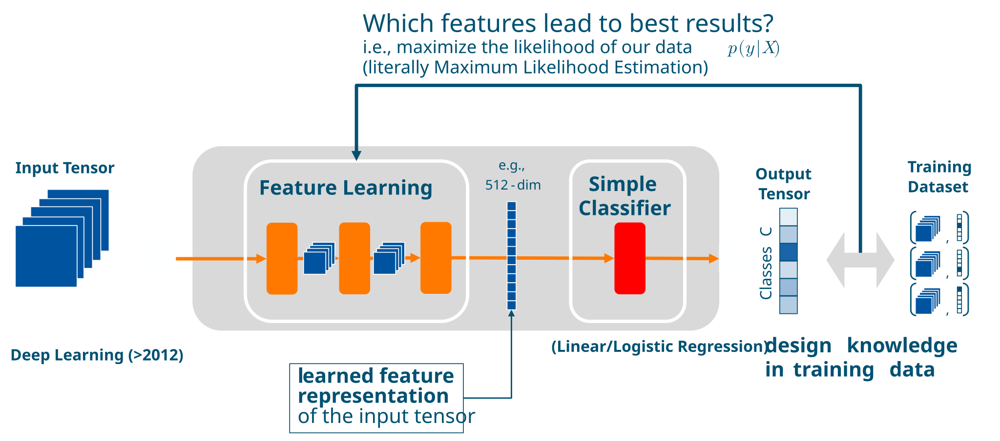
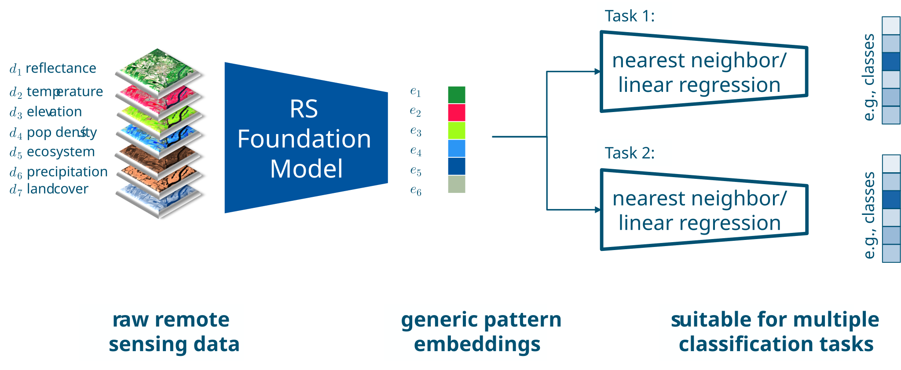
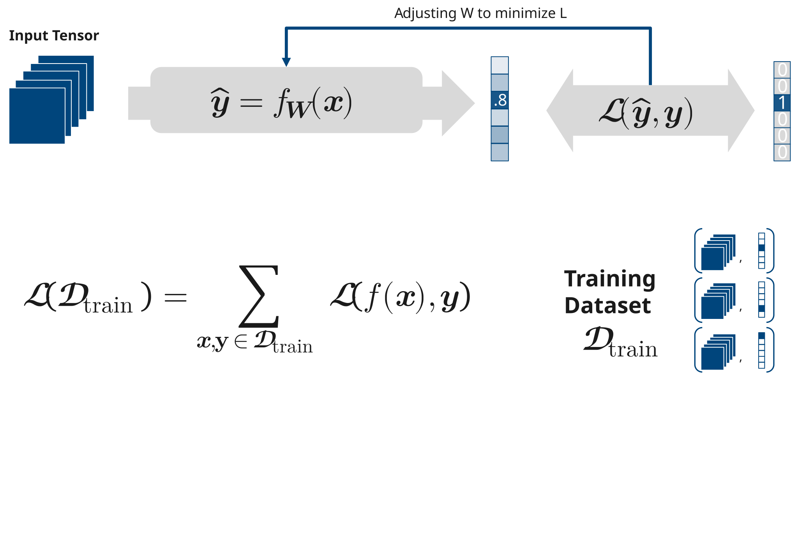
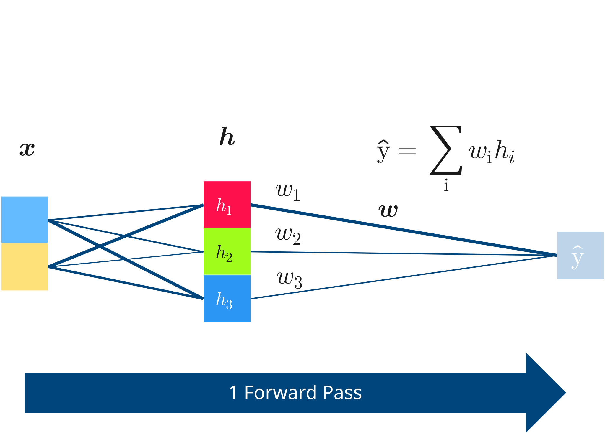
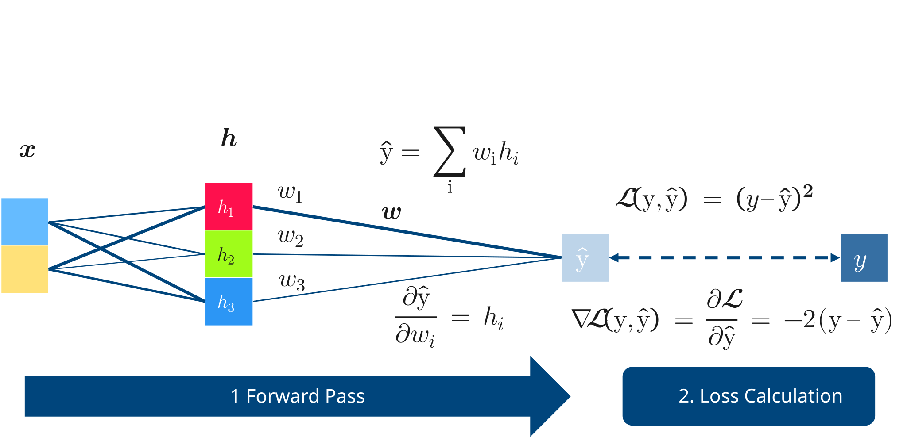
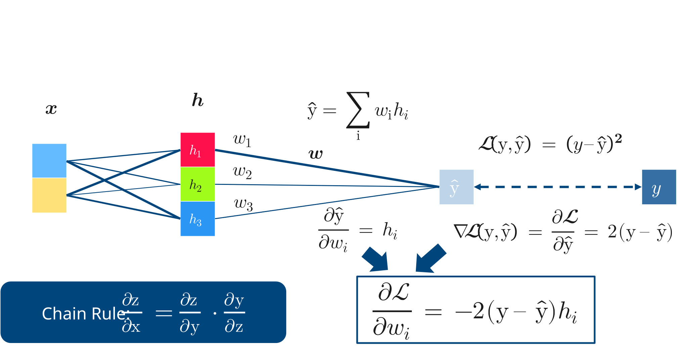
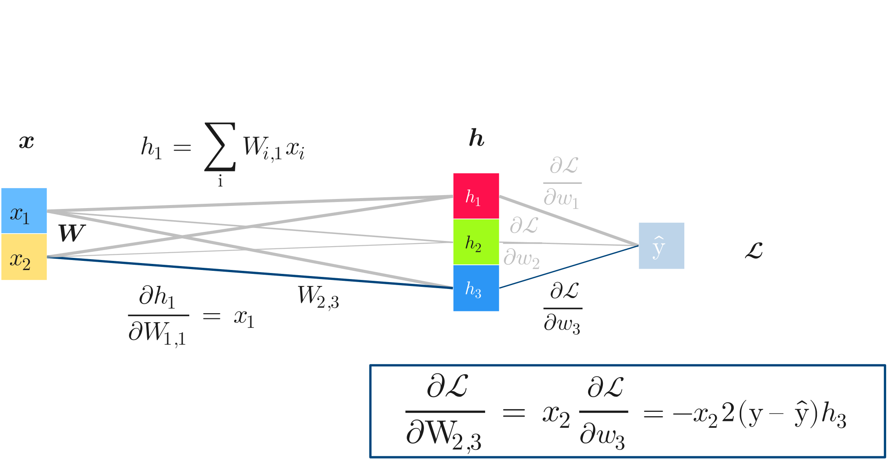
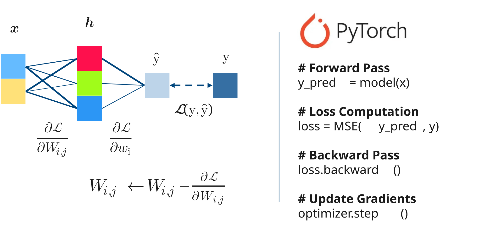

---
addons:
  - "../"
defaults:
  layout: bonn-content
layout: bonn-cover
subhead: Lecture 3
home: ../
---

# Deep Learning I

## What is Learning?

<!--
This lecture formalizes supervised learning on structured inputs before introducing deep learning on raw data.
-->

---

# In this lecture

  

    
Model

    <ul class="text-[.8rem] leading-7">
      <li>Deep learning architectures (MLP, CNN, Transformer)</li>
      <li>Tasks: classification &amp; segmentation</li>
      <li>Representations and feature learning</li>
    </ul>
  

  

    
Training

    <ul class="text-[.8rem] leading-7">
      <li>Loss surfaces and gradient descent</li>
      <li>Forward pass, backpropagation, parameter updates</li>
    </ul>
  

<!--
Two blocks today: first the model (architecture and representations), then training (loss, gradients, backprop).
-->

---

---
layout: bonn-section
sectionColor: "#00457c"
section: overview
sectionTitle: Overview
---

# The Aspects of Learning

  <iframe
    src="https://giphy.com/embed/MmozymbZc0RdC"
    width="300"
    height="300"
    class="rounded-xl shadow"
    frameBorder="0"
    allowFullScreen>
  </iframe>
  

    via
    <a href="https://giphy.com/gifs/MmozymbZc0RdC" target="_blank" rel="noopener noreferrer" class="underline">GIPHY</a>,
    original source
    <a href="https://imgur.com/gallery/FBMm2DO" target="_blank" rel="noopener noreferrer" class="underline">imgur.com/gallery/FBMm2DO</a>
  

---
section: overview
---

# What Does a System Need to Learn?

<AspectsOfLearningDiagram />

<!--
Brainstorm live with the class, one question at a time, clicking to reveal each answer:

1. What does a system need in order to learn? (opening prompt in the slide title)
2. What is doing the learning? -> reveal Learnable model (click 1)
   Expected: it needs adjustable parameters and enough capacity to represent the task.
3. What can it learn from? -> reveal Experiences (click 2)
   Expected: experiences supply the information the model learns from (already covered in Lecture 2 as data).
4. What turns experience into changes in the model? -> reveal Learning algorithm (click 3)
   Expected: the learning algorithm determines how experience changes the model's parameters.
5. How do we know it learned rather than memorized? -> reveal Generalization (click 4)
   Land the distinction: experiences, model, and algorithm are the ingredients for learning;
   generalization to unseen situations is the success criterion.
-->

---
section: overview
---

# Two Questions for Lectures 3–4

  

    
Lecture 3

    
How does a neural network learn?

  

  

    
Lecture 4

    
Why should what it learns work beyond the training data?

  

<!--
Set up a two-lecture arc before technical details.
Lecture 3 focuses on learning mechanics; Lecture 4 focuses on generalization.
-->

---
layout: bonn-section
sectionColor: "#00457c"
section: overview
sectionTitle: Overview
---

# Learning Outcomes Roadmap

| Status | Learning outcome | Lecture | Block |
| --- | --- | --- | --- |
| ⬜ | Explain how networks turn inputs into representations that simplify tasks. | Lecture 3 | Model |
| ⬜ | Explain layers, parameters, biases, and nonlinear activations in an MLP. | Lecture 3 | Model |
| ⬜ | Explain forward pass, loss, gradients, backpropagation, and parameter updates. | Lecture 3 | Training |
| ⬜ | Explain inductive biases in CNNs, RNNs, GNNs, Transformers, and common losses. | Lab 3 | Expert Jigsaw |
| ⬜ | Explain finite datasets vs. samples from an underlying data distribution. | Lecture 4 | Samples and Distributions |
| ⬜ | Explain generalization, overfitting, bias–variance, and train/validation/test evaluation. | Lecture 4 | Classical Generalization |
| ⬜ | Explain how interpolation threshold, double descent, and overparameterization revise the classical view. | Lecture 4 | Modern Generalization |

<!--
This table is a reusable map.
We will revisit it later in Lecture 3 and again at the start of Lecture 4.
-->

---
section: overview
---

# Today: How Networks Learn Useful Representations

Today’s focus: representations, MLP building blocks, and learning + optimization.

  

    
Block 1 — Model

    <ul class="leading-7 text-[.75rem]">
      <li>representations</li>
      <li>MLPs</li>
      <li>hidden spaces</li>
      <li>nonlinearities</li>
    </ul>
  

  

    
Block 2 — Training

    <ul class="leading-7 text-[.75rem]">
      <li>forward pass</li>
      <li>loss</li>
      <li>gradients</li>
      <li>backpropagation</li>
      <li>parameter updates</li>
    </ul>
  

Next: start with representations, models, and what can be learned from data.

<!--
Zoom in on the Lecture 3 goals so students know what to track today.
Use this as the transition into the existing model/representation content.
-->

---
section: overview
---

# Two Core Topics in This Lecture

  

    
Deep Learning Model

    <ol class="text-[.8rem] leading-8 mb-4">
      <li><strong>Architectures</strong> — MLP, CNN, Transformer</li>
      <li><strong>Tasks</strong> — Classification &amp; Segmentation</li>
    </ol>
    
  

  

    
Model Training

    <ol class="text-[.8rem] leading-8 mb-4">
      <li><strong>Loss surfaces</strong> and gradient descent</li>
      <li>Forward pass → Loss → Backprop → Update</li>
    </ol>
    
  

<!--
Transition slide before diving into Block 1.
Left side previews the model block (architectures, tasks, MLPs).
Right side previews the training block (loss, gradient descent, backprop).
-->

---
layout: bonn-section
sectionColor: "#00457c"
section: model
sectionTitle: Model
---

# Data and Experience

<figure class="bonn-section-image" style="display: flex; flex-direction: column; align-items: center; justify-self: center; width: calc(100% - 80px); max-height: 500px; margin: 0;">
  
  <figcaption style="max-width: 440px; margin-top: 10px; color: var(--bonn-text); font-size: .68rem; line-height: 1.3; text-align: center;">
    Data is the window through which a learner experiences the world.
    
      Shalev-Shwartz, S., &amp; Ben-David, S. (2014). <em>Understanding Machine Learning: From Theory to Algorithms</em>.
    
  </figcaption>
</figure>

  Photo by <a href="https://www.pexels.com/@d-ng-nhan-324384/" target="_blank" rel="noopener noreferrer">Dương Nhân</a> on <a href="https://www.pexels.com/photo/a-pillows-on-the-couch-near-the-glass-window-with-a-city-view-4389953/" target="_blank" rel="noopener noreferrer">Pexels</a>

---
layout: bonn-section
sectionColor: "#00457c"
section: model
sectionTitle: Model
---

# The Learnable Model

  Photo by <a href="https://www.pexels.com/@silverkblack/" target="_blank" rel="noopener noreferrer">Vitaly Gariev</a> on <a href="https://www.pexels.com/photo/mother-and-son-lying-down-on-carpet-with-book-23224850/" target="_blank" rel="noopener noreferrer">Pexels</a>

---
section: model
---

# Our Learned Understanding

  

    
Chinese

    
我们的心智已经学会理解这个句子。

  

  

    
Arabic

    
لقد تعلّم عقلنا أن يفهم هذه الجملة.

  

  

    
Hebrew

    
המוח שלנו למד להבין את המשפט הזה.

  

  

    
Korean

    
우리의 마음은 이 문장을 이해하는 법을 배웠습니다.

  

  

    
Latin

    
Our mind has learned to understand this sentence.

  

---
section: model
---

# Deep Learning Model

---
section: model
---

# Sentinel-2 as an Image Tensor

---
section: model
---

# Image Classification

---
section: model
---

# Image Segmentation

---
section: model
---

# Object Detection

---
section: model
---

# Time Series Classification

---
layout: bonn-section
sectionColor: "#00457c"
section: model
sectionTitle: Model
---

# The Multi-Layer Perceptron (MLP) Model

---
section: model
---

# Linear Transformation

---
section: model
---

# Linear Transformation with a Bias Term

---
section: model
---

# Weighted Connections

---
section: model
---

# How an MLP transforms feature space

<MlpFeatureSpaceDemo />

Inspired by Andrej Karpathy's <a href="https://cs.stanford.edu/people/karpathy/convnetjs/demo/classify2d.html" target="_blank" rel="noopener noreferrer">ConvNetJS Classify2D</a> demo. Implemented with Claude and Codex.

---
section: model
---

# Machine Learning and Deep Learning

---
section: model
---

# Feature Learning

---
section: model
---

# Foundation Models

---
section: training
sectionTitle: Training
---

# Training: Adjusting Weights to Minimize Loss

---
section: training
---

# The Learning Objective: argmin

---
section: training
---

# Loss Function: Mean Squared Error

---
section: training
---

# Loss Function: Cross-Entropy

---
section: training
---

# Loss Surfaces

---
section: training
---

# Gradient Descent

---
section: training
---

# Backpropagation

---
section: training
---

# Backpropagation

---
section: training
---

# Backpropagation

---
section: training
---

# Backpropagation

---
section: training
---

# Backpropagation

---
section: training
---

# Backpropagation

---
section: training
---

# Backpropagation

