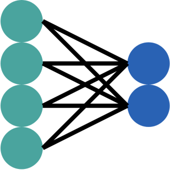
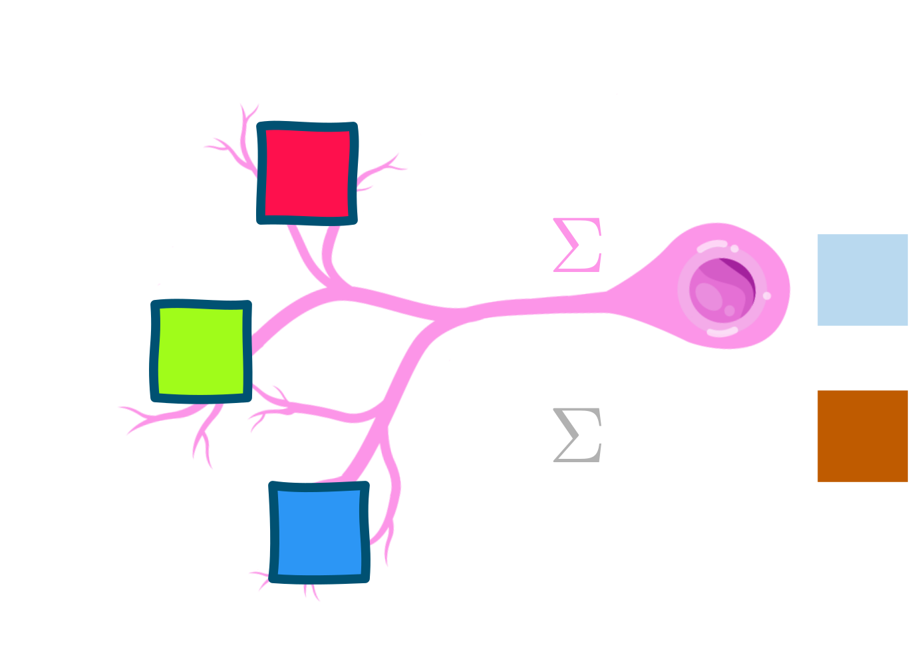
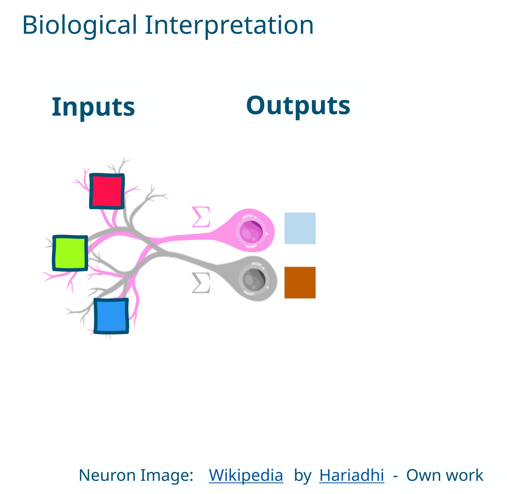

---
addons:
  - "../"
defaults:
  layout: bonn-content
layout: bonn-cover
subhead: Lecture 3
home: ../
---

# Deep Learning I

## What is Learning?

<!--
This lecture formalizes supervised learning on structured inputs before introducing deep learning on raw data.
-->

---

# In this lecture

- Inputs, targets, and supervised learning
- Classification and regression
- Train / validation / test splits
- Decision trees and ensemble methods
- Random forests as the main model

<!--
This lecture defines what learning means operationally and sets up the contrast to supervised deep learning in Lecture 4.
-->

---
section: model
sectionTitle: Model
---

# Model

---
section: model
---

# Tensors

---
section: model
---

# Sentinel-2 as an Image Tensor

---
section: model
---

# Image Classification

---
section: model
---

# Image Segmentation

---
section: model
---

# Object Detection

---
section: model
---

# Time Series Classification

---
section: model
---

# Multilayer Perceptron

---
section: model
---

# Biological Interpretation

---
section: model
---

# Neuron Inputs and Outputs

---
section: model
---

# Weighted Connections

---
section: model
---

# Machine Learning and Deep Learning

---
section: model
---

# Feature Learning

---
section: model
---

# Foundation Models

