---
addons:
  - "../"
defaults:
  layout: bonn-content
layout: bonn-cover
subhead: Lecture 3
home: ../
---

# Machine Learning on Data Representations

## Learning on fixed representations

<!--
Connect the heterogeneous data collected in Lecture 2 to classical machine learning.
Frame the lecture question: how can many data sources become one representation for prediction?
-->

---

# Learning Outcome Roadmap

| | Learning outcome | Lecture | Block |
|---|---|---|---|
| ⬜ | Explain how heterogeneous datasets align to a common coordinate support and form a geospatial data cube. | Lecture 3 | Geospatial Data Cubes |
| ⬜ | Represent locations as fixed feature vectors extracted from a geospatial data cube. | Lecture 3 | Geospatial Data Cubes |
| ⬜ | Explain how linear regression maps a fixed representation to a continuous target. | Lecture 3 | Linear Models |
| ⬜ | Explain how logistic regression maps a fixed representation to categories with a linear decision boundary. | Lecture 3 | Linear Models |
| ⬜ | Explain how decision trees partition a fixed representation space into nonlinear decision regions. | Lecture 3 | Decision Trees &amp; Random Forests |
| ⬜ | Explain how random forests combine trees for robust predictions from fixed representations. | Lecture 3 | Decision Trees &amp; Random Forests |

<!--
Establish the three-block route from heterogeneous data to robust nonlinear prediction.
Emphasize that every model in this lecture learns on a representation that we construct first.
-->

---
layout: bonn-section
sectionColor: "#00457c"
section: geospatial-data-cubes
sectionTitle: Geospatial Data Cubes
---

# Geospatial Data Cubes

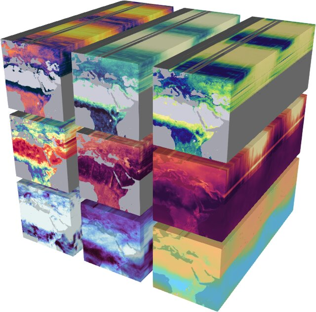

Image by <a href="https://www.researchgate.net/profile/Miguel-Mahecha-2?_tp=eyJjb250ZXh0Ijp7ImZpcnN0UGFnZSI6Il9kaXJlY3QiLCJwYWdlIjoicHVibGljYXRpb24ifX0" target="_blank" rel="noopener noreferrer">Miguel D. Mahecha</a>

<!--
Begin with the heterogeneous layers from Lecture 2.
This section will establish common coordinate support, stacking, and fixed feature extraction.
-->

---
section: geospatial-data-cubes
---

# Recap: Geospatial Data

- satellite imagery
- thematic rasters such as land cover
- vector geometries and attributes
- model and reanalysis fields
- observations collected at different times and scales

<blockquote class="blockquote3">
Each source describes locations on its own spatial and temporal support.
</blockquote>

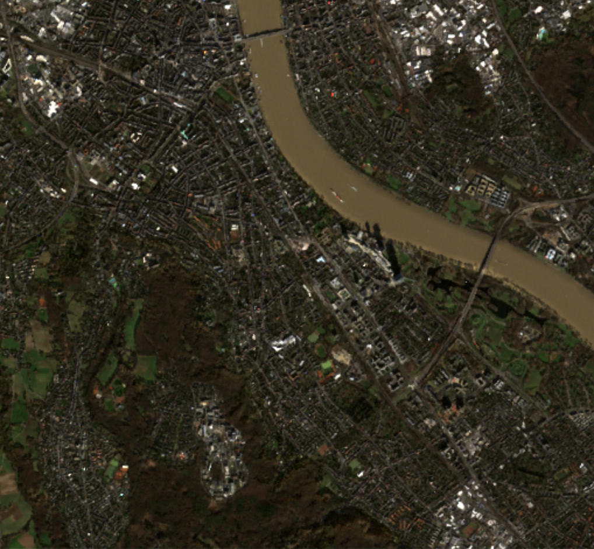

Satellite imagery (Bonn, Sentinel-2)

Thematic raster (land cover, Amsterdam)

Vector geometries (OpenStreetMap)

Model / reanalysis field (population density)

<!--
Presenter note: Activate prior knowledge from Lecture 2 without repeating its details. Ask students what spatial and temporal support each source uses.
-->

---
section: geospatial-data-cubes
---

# Datacubes align Data Spatially and Temporally

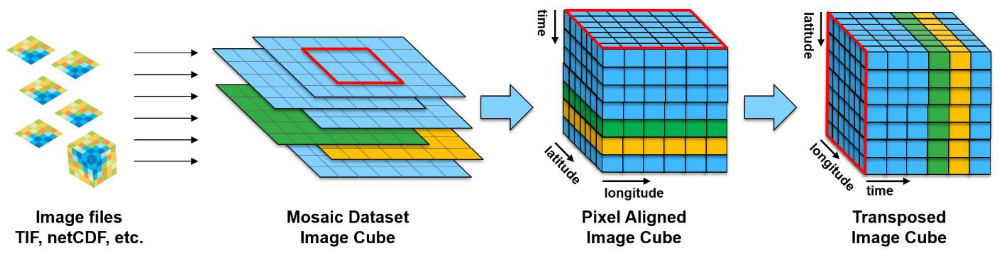

Source: Kopp et al. (2019), <a href="https://www.mdpi.com/2306-5729/4/3/94" target="_blank" rel="noopener noreferrer"><em>Achieving the Full Vision of Earth Observation Data Cubes</em></a>, <em>Data</em> 4(3), 94.

---
section: geospatial-data-cubes
---

# Rasterization and Interpolation

Rasterization

<RasterizationDiagram />

Open-source tools: 
<code class="font-mono text-[.6rem] bg-gray-100 text-gray-700 rounded px-1">gdal_rasterize</code> (CLI) 
<code class="font-mono text-[.6rem] bg-gray-100 text-gray-700 rounded px-1">rasterio.features.rasterize</code> (Python)

Interpolation

<InterpolationDiagram />

Bilinear

2&times;2 neighborhood

$$
\hat{z} = \frac{\sum_{i=1}^{4} z_i / d_i}{\sum_{i=1}^{4} 1 / d_i}
$$

Cubic

4&times;4 neighborhood

$$
\hat{z} = \frac{\sum_{i=1}^{16} z_i / d_i^{3}}{\sum_{i=1}^{16} 1 / d_i^{3}}
$$

Open-source tools: 
<code class="font-mono text-[.6rem] bg-gray-100 text-gray-700 rounded px-1">gdalwarp</code> /
<code class="font-mono text-[.6rem] bg-gray-100 text-gray-700 rounded px-1">gdal_translate</code> (CLI) 
<code class="font-mono text-[.6rem] bg-gray-100 text-gray-700 rounded px-1">rasterio.warp.reproject</code> (Python)

<!--
Presenter note: Rasterization converts vector geometries to grid cells using a majority-area rule.
Interpolation resamples values between misaligned grids using distance-weighted (linear) interpolation.
-->

---
section: geospatial-data-cubes
---

# From Data Cube to Feature Vector

  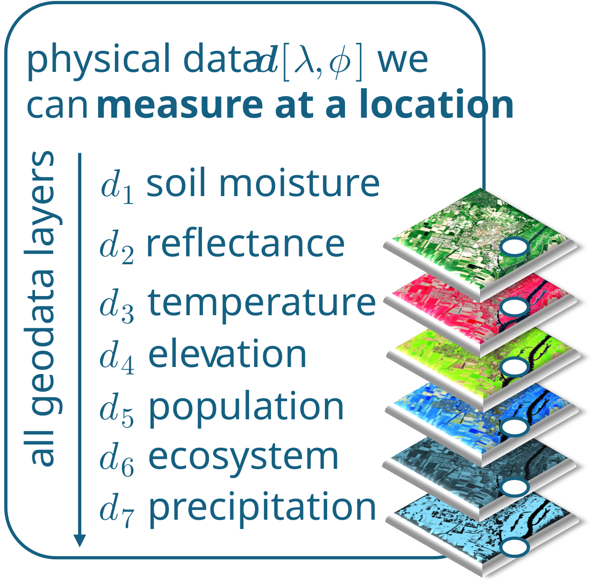

Sampling all $p$ variables at location $i$ produces a fixed feature vector:

$$
\mathbf{x}_i = [x_{i1}, x_{i2}, \ldots, x_{ip}]
$$

For example:

$$
\begin{aligned}
\mathbf{x}_i = [&\text{elevation},\ \text{slope},\ \text{spectral bands},\\
                 &\text{temperature},\ \text{building density}]
\end{aligned}
$$

Repeating the extraction at $n$ locations creates a feature matrix:

$$
\mathbf{X} \in \mathbb{R}^{n \times p}
$$

  features xᵢ
  &rarr;
  machine-learning model
  &rarr;
  prediction ŷᵢ

Training target yᵢ: kept separate from the input features.

<!--
Presenter note: A time-dependent cube yields fixed-length vectors only after selecting a time, a fixed window, or temporal summary statistics.
TODO: Replace the placeholder with a cube-to-vector illustration and add a provisional prediction task.
-->

---
section: geospatial-data-cubes
---

# Dataset

Input X (e.g., Sentinel-2 pixel reflectances)

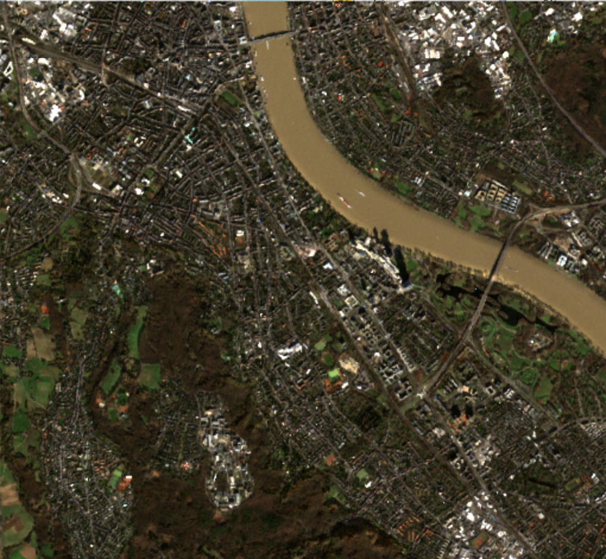
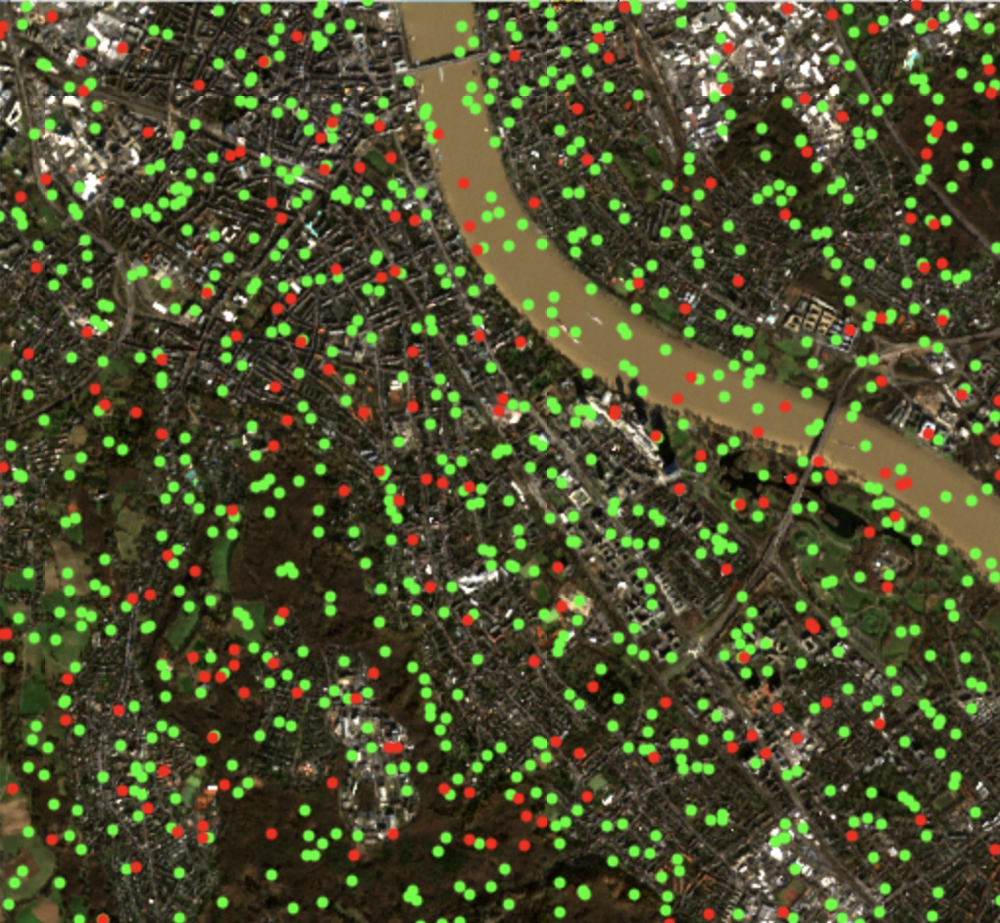

| Pt | Red | Green | Blue | NIR |
|---|---|---|---|---|
| Pt1 | 0.08 | 0.11 | 0.09 | 0.42 |
| Pt2 | 0.21 | 0.19 | 0.15 | 0.05 |
| &vellip; | &vellip; | &vellip; | &vellip; | &vellip; |

Target y (e.g., land cover labels)

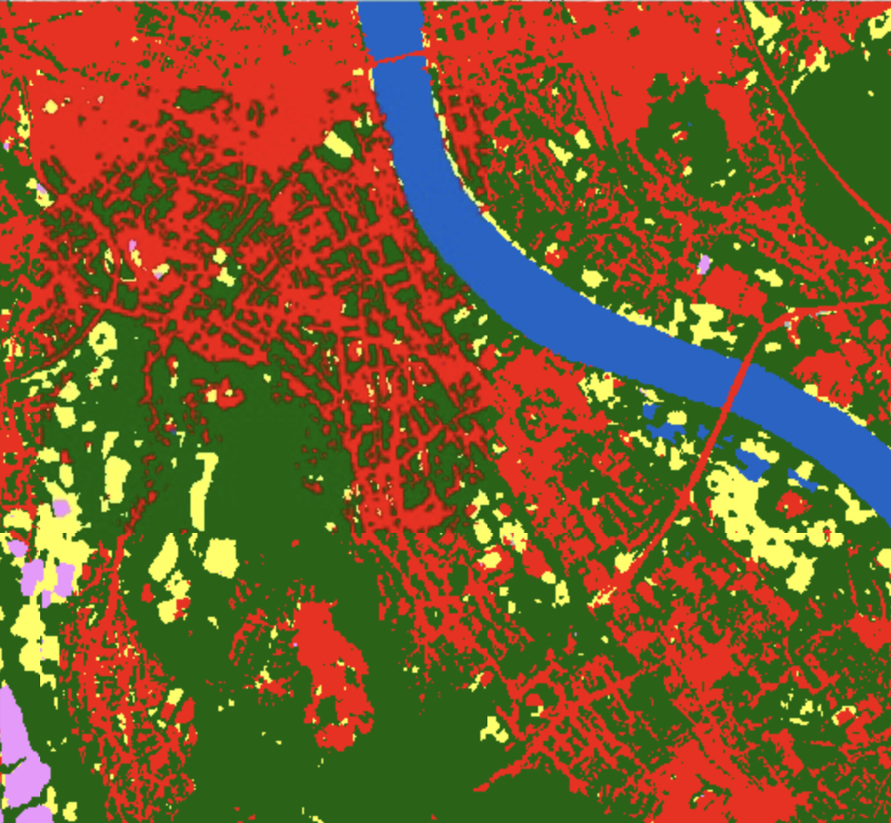
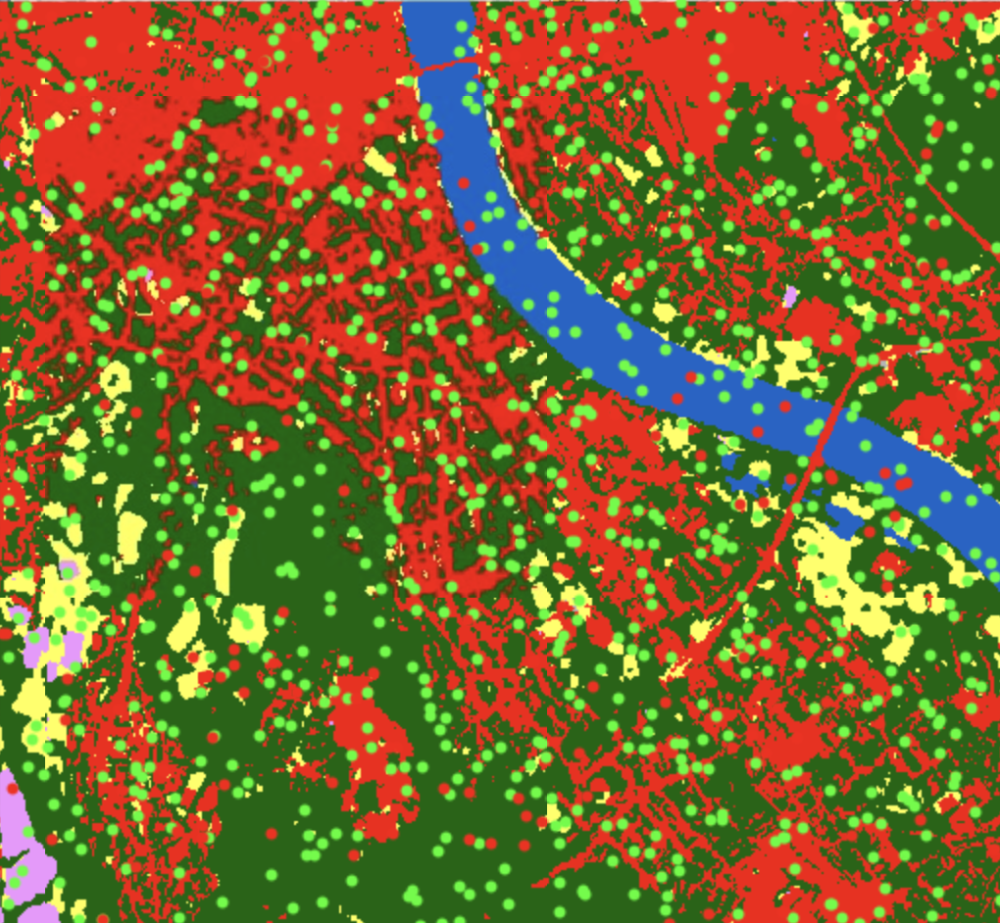

| Pt | Land Cover |
|---|---|
| Pt1 | Vegetation |
| Pt2 | Built-up |
| &vellip; | &vellip; |

Raw bands

| Pt | Red | Green | Blue | NIR | Land Cover |
|---|---|---|---|---|---|
| Pt1 | 0.08 | 0.11 | 0.09 | 0.42 | **Vegetation** |
| Pt2 | 0.21 | 0.19 | 0.15 | 0.05 | **Built-up** |
| &vellip; | &vellip; | &vellip; | &vellip; | &vellip; | &vellip; |

<PlotlyHistogram dataset="green" x-label="Green reflectance" />

Engineered feature

$$
\text{NDVI} = \frac{\text{NIR} - \text{Red}}{\text{NIR} + \text{Red}}
$$

| Pt | NDVI | Land Cover |
|---|---|---|
| Pt1 | 0.68 | **Vegetation** |
| Pt2 | -0.62 | **Built-up** |
| &vellip; | &vellip; | &vellip; |

<PlotlyHistogram dataset="ndvi" x-label="NDVI" :show-legend="false" />

<!--
Presenter note: This slide is the bridge from geospatial images to tabular ML data.
Click 1: sample points on both the input image and the target map.
Click 2: collapse both into one tabular dataset, X columns plus y column, one row per point &mdash; the format every classic ML model in this lecture consumes.
-->

---
section: geospatial-data-cubes
---

# Classic Machine Learning Pipeline

Good, hand-selected features combined with a suitable model determine the quality of the result.

Section 1 &middot; Geospatial Data Cubes

Sections 2&ndash;3 &middot; Linear Models &amp; Random Forests

<!--
Presenter note: This slide is the lecture map. Feature design (orange) is Section 1; the model (red) is what Sections 2-3 build, first as a linear model, then as a decision tree / random forest.
-->

---
layout: bonn-section
sectionColor: "#00457c"
section: linear-models
sectionTitle: Linear Models
---

# Linear Regression

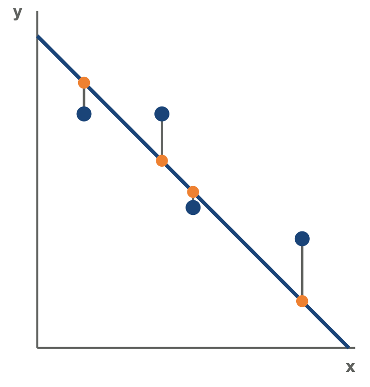

Figure: M. Rußwurm &amp; D. Tuia, <em>Linear Regression</em>, ENV-408 course materials, EPFL, 2023.

<!--
Move from constructed feature vectors to prediction.
This section will progress from continuous targets to categorical predictions and linear boundaries.
-->

---

# Why Linear Regression?

<ul>
<li>a simple, classical approach to supervised learning</li>
<li v-click>predicts a <strong>continuous</strong> response from one or more predictors</li>
<li v-click>around for a long time, yet still one of the most used tools in science</li>
<li v-click>a strong, interpretable baseline &mdash; and a stepping stone to more complex models</li>
</ul>

<blockquote v-click class="blockquote3 mt-4">
Learning linear regression helps understand more complex methods, and it is practically useful and easy to implement for many real-world problems.
</blockquote>

---

# Measuring Relationships Between Variables

Classic example

<FeatureTargetDiagram
  :features="[
    { label: 'TV ads', symbol: 'x₁', width: 5 },
    { label: 'radio ads', symbol: 'x₂', width: 4 },
    { label: 'newspaper ads', symbol: 'x₃', width: 2.5 },
  ]"
  target="sales"
  target-symbol="y"
/>

Geospatial example

<FeatureTargetDiagram
  :features="[
    { label: 'elevation', symbol: 'x₁', width: 5 },
    { label: 'slope', symbol: 'x₂', width: 4 },
    { label: 'aspect', symbol: 'x₃', width: 2.5 },
  ]"
  target="surface temperature"
  target-symbol="y"
/>

Linear regression models how one or more predictor variables (features) relate to a continuous target &mdash; exactly the fixed representations built in the previous section.

---

# A Closer Look at the Data

$\mathcal{D} = \{((x_{1,i}, x_{2,i}, x_{3,i}), y_i)\}_{i=1}^N$

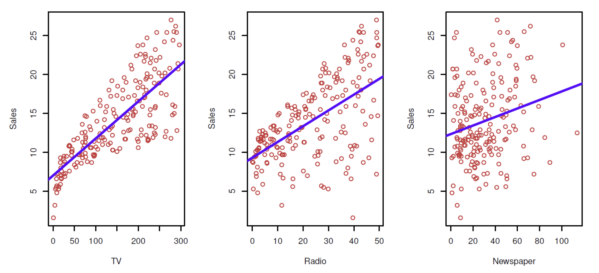

$x_1 \mapsto y$ (TV &rarr; sales)

$x_2 \mapsto y$ (radio &rarr; sales)

$x_3 \mapsto y$ (newspaper &rarr; sales)

Figure: James, Witten, Hastie &amp; Tibshirani, <a href="https://www.statlearning.com/" target="_blank" rel="noopener noreferrer"><em>An Introduction to Statistical Learning</em></a>, Advertising dataset.

---

# Linear Regression Answers Important Questions

<ul>
<li>is there a relationship between advertising budget and sales?</li>
<li v-click>how strong is the relationship?</li>
<li v-click>is there synergy among the advertising media?</li>
</ul>

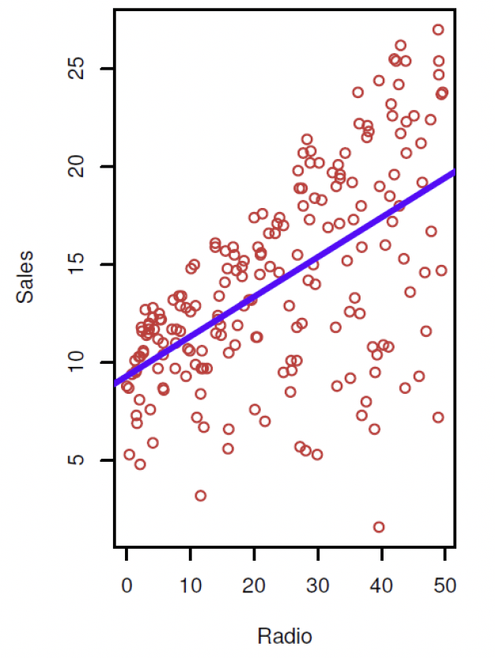

The same questions apply to our geospatial example: is there a relationship between elevation and surface temperature &mdash; and how strong is it?

---

# Univariate Linear Regression

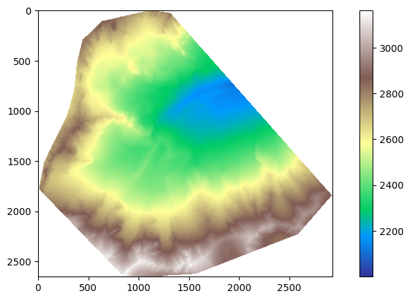

&rarr;

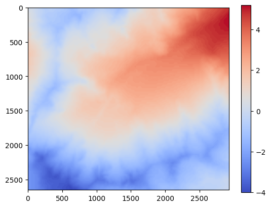

A simple (but powerful) linear model

$$
\hat{y} = f(x;\beta_0,\beta_1) = \beta_0 + x\beta_1
$$

maps an elevation $x$ to an estimated temperature $\hat{y}$, with $\beta_0$ the y-intercept and $\beta_1$ the slope.

Figure: M. Rußwurm &amp; D. Tuia, <em>Linear Regression</em>, ENV-408 course materials, EPFL, 2023.

---

# The Problem: Finding $\hat{\boldsymbol{\beta}}$

<RegressionScatterDemo variant="points" x-label="elevation x" y-label="temperature y" :clicks="$clicks" />

We have a dataset of data samples $(x_i, y_i)$.

<blockquote v-click class="blockquote3 mt-4">

<strong>Problem:</strong> how do we find good model parameters $\hat{\boldsymbol{\beta}} = (\hat{\beta}_0, \hat{\beta}_1)$ for our linear model $f(x;\hat{\boldsymbol{\beta}}) = \hat{\beta}_0 + x\hat{\beta}_1$?

</blockquote>

---

# What Is a Good Model &mdash; Formally?

<RegressionScatterDemo variant="error-band" x-label="elevation x" y-label="temperature y" />

$$
\begin{aligned}
y_i &= f(x_i;\hat{\boldsymbol{\beta}}) \pm \overbrace{\varepsilon}^{\text{error}} \\
\hat{y}_i &= f(x_i;\hat{\boldsymbol{\beta}})
\end{aligned}
$$

with the error $\varepsilon$ as a random variable &mdash; the model never fits the data perfectly.

---

# Residuals

<RegressionScatterDemo variant="residual-segments" x-label="elevation x" y-label="temperature y" :clicks="$clicks" />

Concretely, the error &mdash; the "residual" $\varepsilon_i$ &mdash; for each sample $i$:

$$
\vert \hat{y}_i - y_i \vert = \varepsilon_i
$$

We want to minimize the residuals over the whole dataset

$$
\min \frac{1}{N} \sum_{i=1}^N \varepsilon_i
$$

---

# Mean Absolute Error (MAE)

<RegressionScatterDemo variant="residual-segments" x-label="x" y-label="y" />

$$
\text{MAE}(\mathcal{D}, \boldsymbol{\beta}) = \frac{1}{N} \sum_{i=1}^N \vert \hat{y}_i - y_i \vert
$$

over model $\boldsymbol{\beta}$ with $\hat{y}_i = f(x_i;\boldsymbol{\beta})$ and dataset $\mathcal{D} = \{x_i, y_i\}_{i=1}^N$

<blockquote class="blockquote1 mt-3">
Very intuitive &mdash; but does not punish large errors.
</blockquote>

---

# Mean Squared Error (MSE)

<RegressionScatterDemo variant="residual-squares" x-label="x" y-label="y" />

$$
\text{MSE}(\mathcal{D}, \boldsymbol{\beta}) = \frac{1}{2N} \sum_{i=1}^N (\hat{y}_i - y_i)^2
$$

Punishes large errors with a square penalty.

<blockquote class="blockquote2 mt-3">
<strong>Geometric intuition:</strong> find a model that minimizes the total area of these squares.
</blockquote>

---
layout: bonn-two-cols-header
---

# Vertical vs. Perpendicular Error Offsets

Both measure a residual &mdash; but they disagree on what "error" means for a spatial variable.

::left::

Vertical offsets

<RegressionScatterDemo variant="offsets-vertical" x-label="x" y-label="y" :clicks="$clicks" />

$$
\min \frac{1}{N}\sum_i \vert (\beta_0+x_i\beta_1) - y_i\vert
$$

$$
\min \frac{1}{2N}\sum_i \left((\beta_0+x_i\beta_1) - y_i\right)^2
$$

- simple, and often sufficient (e.g. temperature vs. elevation)
- **but:** the error changes with how the axes are chosen

::right::

Perpendicular offsets

<RegressionScatterDemo variant="offsets-perpendicular" x-label="x" y-label="y" :clicks="$clicks" />

$$
\min \frac{1}{N}\sum_i \frac{\vert (\beta_0+x_i\beta_1) - y_i\vert}{\sqrt{1+\beta_1^2}}
$$

$$
\min \frac{1}{2N}\sum_i \frac{\left((\beta_0+x_i\beta_1) - y_i\right)^2}{1+\beta_1^2}
$$

- makes the error depend only on the fitted model, not the coordinate system
- useful when both axes represent comparable spatial quantities

Ordinary least squares (next) uses vertical offsets. See <a href="https://mathworld.wolfram.com/LeastSquaresFittingPerpendicularOffsets.html" target="_blank" rel="noopener noreferrer">Least Squares Fitting &mdash; Perpendicular Offsets</a>, MathWorld.

---

# Ordinary Least Squares (OLS) &mdash; Intuition

The closed-form solution $\hat{\beta}_0, \hat{\beta}_1$ for a linear model under MSE.

<blockquote class="blockquote3 mt-6">

<strong>Task:</strong> find $\hat{\beta}_0,\hat{\beta}_1$ that minimize the Mean Squared Error

</blockquote>

$$
\hat{\beta}_0,\hat{\beta}_1 = \operatorname*{arg\,min}_{\beta_0,\beta_1} \frac{1}{2N} \sum_{i=1}^N \left(\overbrace{\beta_0 + x_i \beta_1}^{\hat{y}_i} - y_i \right)^2
$$

**Question:** how do we minimize a function with respect to its parameters?

- calculate the partial derivatives $\frac{\partial \text{MSE}}{\partial \beta_0}$ and $\frac{\partial \text{MSE}}{\partial \beta_1}$
- set the derivatives to zero: $\frac{\partial \text{MSE}}{\partial \beta_0} = 0$, $\frac{\partial \text{MSE}}{\partial \beta_1} = 0$
- solve for $\beta_0$ and $\beta_1$

---

# Ordinary Least Squares (OLS) &mdash; Solution

Model $y = \beta_0 + x\beta_1$ on a dataset $\mathcal{D} = \{x_i, y_i\}_{i=1}^N$

Ordinary Least Squares objective

$$
\hat{\beta}_0,\hat{\beta}_1 = \operatorname*{arg\,min}_{\beta_0,\beta_1} \frac{1}{2N} \sum_{i=1}^N \left(\overbrace{\beta_0 + x_i \beta_1}^{\hat{y}_i} - y_i \right)^2
$$

Closed-form solution

$$
\begin{aligned}
\hat{\beta}_0 &= \frac{1}{N}\sum_{i=1}^N y_i - \hat{\beta}_1 \frac{1}{N}\sum_{i=1}^N x_i = \bar{y} - \hat{\beta}_1 \bar{x} \\[.3em]
\hat{\beta}_1 &= \frac{\text{Cov}[x,y]}{\text{Var}[x]} = \frac{\frac{1}{N}\sum_i (x_i - \bar{x})(y_i - \bar{y})}{\frac{1}{N}\sum_i (x_i - \bar{x})^2}
\end{aligned}
$$

See <a href="https://en.wikipedia.org/wiki/Ordinary_least_squares" target="_blank" rel="noopener noreferrer">Ordinary Least Squares</a>, Wikipedia.

---
layout: bonn-two-cols-header
---

# Limits of Univariate Models

Some relationships are well-described by a single variable &mdash; most are not.

::left::

Roughly linear

&rarr;

elevation &rarr; average temperature, roughly $-0.006\frac{\text{°C}}{\text{m}}$

::right::

Clearly non-linear

?

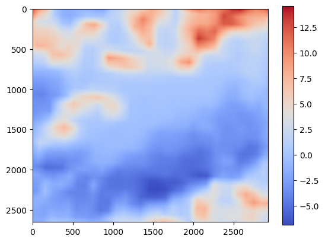

elevation &rarr; surface temperature &mdash; shading, wind, and local terrain also matter

---

# Multivariate Models: Linearize With Good Feature Design

<FeatureTargetDiagram
  :features="[
    { label: 'elevation', symbol: 'x₁' },
    { label: 'slope', symbol: 'x₂' },
    { label: 'aspect', symbol: 'x₃' },
  ]"
  target="surface temperature"
  target-symbol="y"
/>

Many non-linear relationships can be linearized with good feature design: elevation alone under-explains surface temperature, but elevation **and** slope **and** aspect together explain it much better.

Same pattern as classical feature extraction: extract informative features, then fit a simple model.

---

# From Uni- to Multivariate Linear Models

**Univariate model** $y = f(x;\beta_0,\beta_1)$ with scalar $x,y$ and two parameters

$$
y = \beta_0 + \overbrace{x_1}^{\text{e.g., elev.}}\beta_1
$$

**Multivariate linear model**

- one input sample $\mathbf{x}_i = (1, x_1, x_2, x_3, \dots, x_p)$ of $p$ features
- corresponding target $y_i$
- one weight per feature $\boldsymbol{\beta} = (\beta_0, \beta_1, \beta_2, \dots, \beta_p)$

$$
y_i = \beta_0 + \overbrace{x_1}^{\text{e.g., elev.}}\beta_1 + \overbrace{x_2}^{\text{e.g., slope}}\beta_2 + \overbrace{x_3}^{\text{e.g., aspect}}\beta_3 + \dots = \boldsymbol{\beta}^\top \mathbf{x}_i
$$

---

# Multivariate Linear Model in Matrix Form

A multivariate dataset $\mathcal{D} = \{\mathbf{x}_i, y_i\}_{i=1}^n$ as matrix $\mathbf{X}$ and target vector $\mathbf{y}$, with $n$ samples and $p$ features

$$
\mathbf{X} =
\begin{pmatrix}
1 & \overbrace{x_{11}}^{\text{elev.}} & \overbrace{x_{21}}^{\text{slope}} & \overbrace{x_{31}}^{\text{aspect}} & \dots \\
1 & x_{12} & x_{22} & x_{32} & \dots \\
\vdots & \vdots & \vdots & \vdots & \ddots \\
1 & x_{1n} & x_{2n} & x_{3n} & \dots
\end{pmatrix}\!,\;\;
\mathbf{y} = \begin{pmatrix} y_1 \\ y_2 \\ \vdots \\ y_n \end{pmatrix}
$$

And the model

$$
\mathbf{y} = \mathbf{X}\hat{\boldsymbol{\beta}} + \overbrace{\boldsymbol{\varepsilon}}^{\text{errors}}
$$

with $p{+}1$ parameters $\hat{\boldsymbol{\beta}} = (\hat{\beta}_0, \hat{\beta}_1, \dots, \hat{\beta}_p)$

$$
\boldsymbol{\varepsilon} = \overbrace{\left\Vert \mathbf{X}\hat{\boldsymbol{\beta}} - \mathbf{y} \right\Vert^2}^{\text{MSE}}
$$

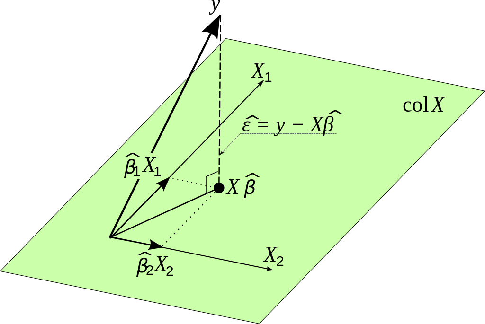

---

# Multivariate Ordinary Least Squares

$$
\hat{\boldsymbol{\beta}} = \operatorname*{arg\,min}_{\hat{\boldsymbol{\beta}}} \text{MSE}(\hat{\boldsymbol{\beta}}) = \operatorname*{arg\,min}_{\hat{\boldsymbol{\beta}}} \left\Vert \mathbf{X}\hat{\boldsymbol{\beta}} - \mathbf{y} \right\Vert^2
$$

**Question:** how do we minimize a function with respect to its parameters &mdash; now a whole vector $\hat{\boldsymbol{\beta}}$?

- calculate the partial derivatives $\frac{\partial \text{MSE}}{\partial \hat{\boldsymbol{\beta}}}$
- set the derivatives to zero: $\frac{\partial \text{MSE}}{\partial \hat{\boldsymbol{\beta}}} = 0$
- solve for $\hat{\boldsymbol{\beta}}$

---

# Multivariate OLS &mdash; Closed-form Derivation

With Mean Squared Error

$$
\text{MSE}(\hat{\boldsymbol{\beta}}) = \left\Vert \mathbf{y} - \mathbf{X}\hat{\boldsymbol{\beta}} \right\Vert^2 = \mathbf{y}^\top\mathbf{y} - 2\hat{\boldsymbol{\beta}}^\top\mathbf{X}^\top\mathbf{y} + \hat{\boldsymbol{\beta}}^\top\mathbf{X}^\top\mathbf{X}\hat{\boldsymbol{\beta}}
$$

and its derivative set to zero

$$
\begin{aligned}
\frac{\partial \text{MSE}(\hat{\boldsymbol{\beta}})}{\partial \hat{\boldsymbol{\beta}}} &= -2\mathbf{X}^\top\mathbf{y} + 2\mathbf{X}^\top\mathbf{X}\hat{\boldsymbol{\beta}} = 0 \\
\mathbf{X}^\top\mathbf{X}\hat{\boldsymbol{\beta}} &= \mathbf{X}^\top\mathbf{y} \\[.4em]
\hat{\boldsymbol{\beta}} &= \left(\mathbf{X}^\top\mathbf{X}\right)^{-1} \mathbf{X}^\top\mathbf{y}
\end{aligned}
$$

<blockquote class="blockquote2 mt-4">
This is the <strong>normal equation</strong> &mdash; a closed-form solution, no iterative optimization required.
</blockquote>

---

# Let's Appreciate the Elegance

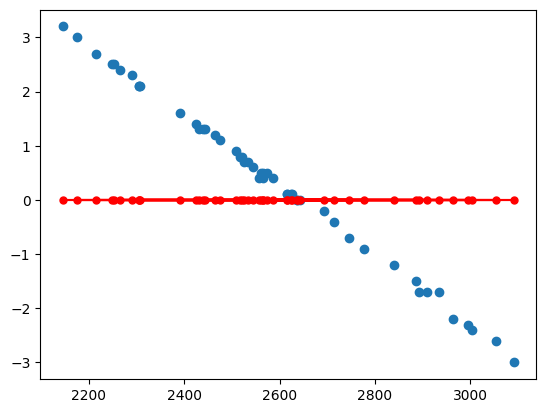

$\boldsymbol{\beta} = (0,0,0,0,\dots)$

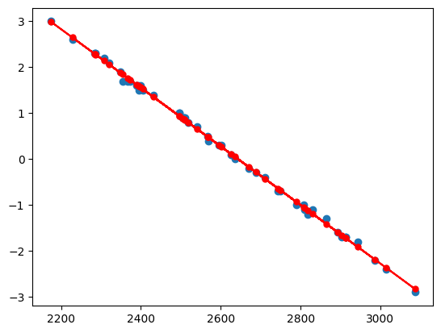

$\boldsymbol{\beta} = (-.1,.2,.5,-.5,\dots)$

<blockquote class="blockquote3 mt-6 text-center">

$\hat{\boldsymbol{\beta}} = \left(\mathbf{X}^\top\mathbf{X}\right)^{-1} \mathbf{X}^\top\mathbf{y}$ &mdash; a single line of code, and blazing fast.

</blockquote>

---

# Interpretable Coefficients

<FeatureTargetDiagram
  :features="[
    { label: 'elevation', symbol: 'x₁', width: 5 },
    { label: 'slope', symbol: 'x₂', width: 4 },
    { label: 'aspect', symbol: 'x₃', width: 2.5 },
  ]"
  target="surface temperature"
  target-symbol="y"
/>

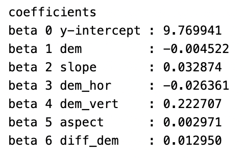

Each $\hat{\beta}_j$ tells us how $\hat{y}$ changes per unit of $x_j$, holding the other features fixed.

<blockquote class="blockquote1 mt-2">
Caveat: coefficients are only directly comparable across features when the features share units &mdash; or are normalized.
</blockquote>

Figure: M. Rußwurm &amp; D. Tuia, <em>Linear Regression</em>, ENV-408 course materials, EPFL, 2023.

---

# Model Evaluation

<RegressionScatterDemo variant="trainval-3" x-label="elevation x" y-label="temperature y" :clicks="$clicks" />

We can now fit a model $(\hat{\beta}_0, \hat{\beta}_1, \dots)$ to any set of data samples $\mathcal{D} = \{(x_i,y_i)\}_{i=1}^N$ &mdash; but different samples give different fits.

$$
Y = \beta_0 + \beta_1 X_1 + \dots + \varepsilon
$$

**Did we capture the true, underlying relationship** $(\beta_0, \beta_1, \dots)$?

<ol>

<li v-click="3">

how large is the data error $\varepsilon$? &rarr; RSE

</li>

<li v-click="4">

does our model explain the target variable well? &rarr; R²

</li>

<li v-click="5">

how close is $\hat{\beta}$ to the true $\beta$? &rarr; $\text{SE}[\hat{\beta}]$

</li>

</ol>

<blockquote v-click="6" class="blockquote3 mt-2">
&rarr; a hypothesis test tells us whether the relationship is significant given the dataset size.
</blockquote>

---

# Residual Sum of Squares (RSS)

$$
\text{RSS} = \sum_{i=1}^N (y_i - \hat{y}_i)^2
$$

RSS increases with the dataset size $N$.

<blockquote class="blockquote2 mt-3">
Idea: normalize by the number of data samples.
</blockquote>

<RegressionScatterDemo variant="residual-squares" x-label="x" y-label="y" />

---

# Residual Standard Error (RSE)

$$
\text{RSE} = \sqrt{\frac{1}{\underbrace{N-M-1}_{\text{DoF}}} \text{RSS}}
$$

- normalized by the number of samples $N$
- and the degrees of freedom (DoF): $M$ slope parameters and one y-intercept

<blockquote v-click class="blockquote3 mt-3">

The RSE estimates $\text{std}(\varepsilon)$ and is a good measure of fit.

</blockquote>

<blockquote v-click class="blockquote3 mt-2">

&rarr; but it is in the <strong>units of the target variable</strong>: what number counts as a good fit?

</blockquote>

<RegressionScatterDemo variant="error-band" x-label="x" y-label="y" />

---

# R² Metric: Coefficient of Determination

The R² is a **unitless proportion**, typically between 0 and 1: it measures how much of the variability in $Y$ is explained by $\hat{Y}$.

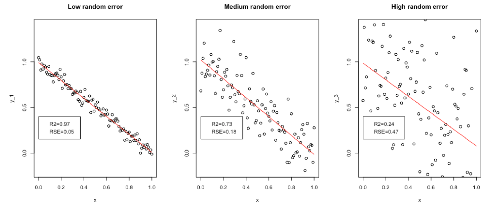

In the univariate case, R² is the square of the <strong>Pearson correlation coefficient</strong>
$r(Y,\hat{Y}) = \dfrac{\text{Cov}[Y,\hat{Y}]}{\sigma_Y \sigma_{\hat{Y}}}$.

Figure: M. Rußwurm &amp; D. Tuia, <em>Linear Regression</em>, ENV-408 course materials, EPFL, 2023. See also <a href="https://en.wikipedia.org/wiki/Coefficient_of_determination" target="_blank" rel="noopener noreferrer">Coefficient of Determination</a>, Wikipedia.

---

# R²: Comparison to an Averaging Model

How much better is our model than a simple averaging model that always predicts $\bar{y}$, no matter the input $x$?

$$
\text{R}^2 = 1 - \frac{\text{RSS}}{\text{TSS}}
$$

Residual Sum of Squares

$$
\text{RSS} = \sum_{i=1}^N (y_i-\hat{y}_i)^2
$$

Total Sum of Squares

$$
\text{TSS} = \sum_{i=1}^N (y_i-\bar{y})^2
$$

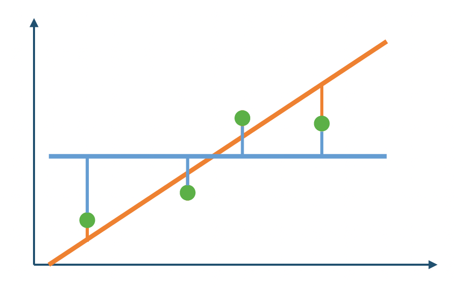

---

# Estimating the Standard Error for Coefficients

In the underlying model

$$
Y = \beta_0 + \beta_1 X_1 + \dots + \varepsilon
$$

we can estimate the residual standard error $\sigma = \text{std}(\varepsilon) = \text{RSE}$ &mdash; the better the fit, the smaller the standard deviation of $\varepsilon$.

<blockquote class="blockquote3 mt-4">

How close are the estimated coefficients $\hat{\boldsymbol{\beta}}$ to the true, underlying relationship $\boldsymbol{\beta}$?

</blockquote>

We can calculate the Standard Error (SE) for each coefficient:

$$
\text{SE}[\hat{\beta}_0] = \sigma^2\left[\frac{1}{N} + \frac{\bar{x}^2}{\sum_{i=1}^N (x_i-\bar{x})^2}\right], \qquad
\text{SE}[\hat{\beta}_1] = \frac{\sigma^2}{\sum_{i=1}^N (x_i-\bar{x})^2}
$$

---

# Student's t-test: Is Our Model Significant?

**Question:** is an estimated relationship a random artifact of the data?

Model: $Y = \beta_0 + \beta_1 X_1 + \varepsilon$

Testing the slope $\beta_1$

$$
H_0: \beta_1 = 0 \qquad H_1: \beta_1 \neq 0
$$

Test statistic

$$
t_0 = \frac{\hat{\beta}_1}{\text{SE}[\hat{\beta}_1]}
$$

<blockquote v-click="2" class="blockquote3 mt-2">

Reject $H_0$ if $t_0 < -t_{\alpha,N-2}$ or $t_0 > t_{\alpha,N-2}$

</blockquote>

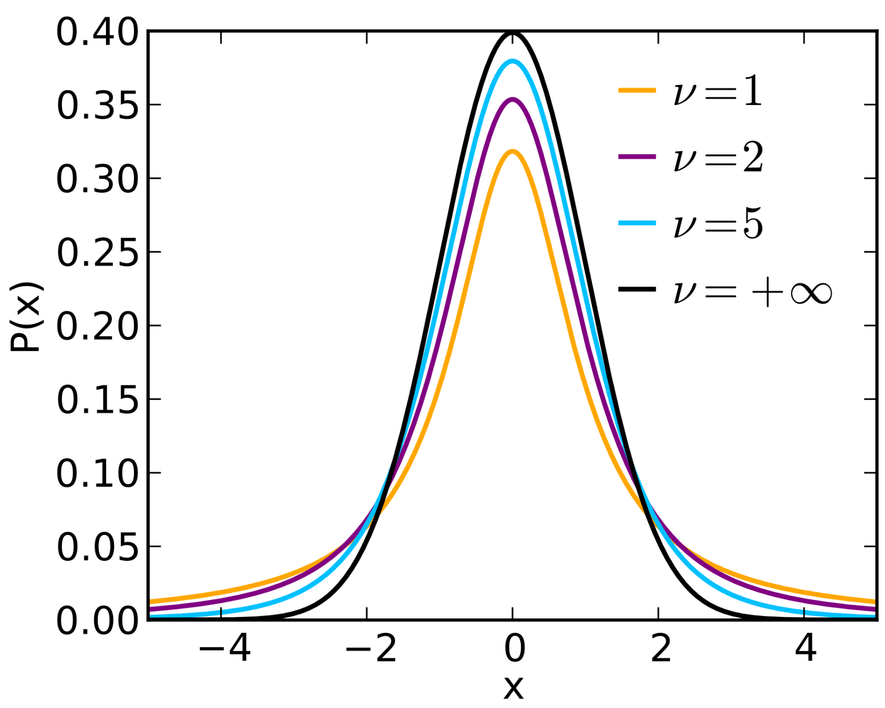

$t_{\alpha,N-2}$ comes from the Student-t distribution with $\nu = N-2$ degrees of freedom.

Figure: Wikipedia, author Skbkekas, <a href="https://en.wikipedia.org/wiki/Student%27s_t-distribution" target="_blank" rel="noopener noreferrer">Student's t-distribution</a>. CC BY-SA.

---

# P-value: The Probability of a Lucky Shot

The (two-sided) p-value integrates the Student-t distribution to $t_0$ on both sides.

high p-value &rarr; not enough data

high p-value &rarr; no relationship

<blockquote v-click class="blockquote3 mt-4">
We can use the p-value of different coefficients to select significant features.
</blockquote>

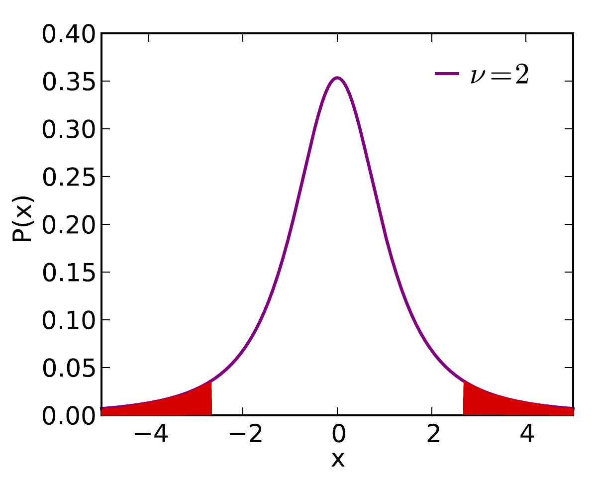

p-value shown in red

Figure modified from Wikipedia, original author Skbkekas, <a href="https://en.wikipedia.org/wiki/Student%27s_t-distribution" target="_blank" rel="noopener noreferrer">Student's t-distribution</a>. CC BY-SA.

---

# Recap: Linear Regression

This part covered how to:

<ul>
<li v-click>implement a univariate and multivariate linear model from scratch</li>
<li v-click>fit the parameters with the Ordinary Least Squares (OLS) method</li>
<li v-click>evaluate the goodness of fit with RSE and R²</li>
<li v-click>test individual parameters for significance with Student's t-test</li>
<li v-click>select features dynamically based on their significance</li>
</ul>

<blockquote v-click class="blockquote3 mt-6">
Next: logistic regression extends the same linear model to map a fixed representation to <strong>categories</strong> with a linear decision boundary.
</blockquote>

---
layout: bonn-section
sectionColor: "#00457c"
section: decision-trees-and-random-forests
sectionTitle: "Decision Trees & Random Forests"
---

# Non-linear models: Decision Trees & Random Forests

Image by Bing Image Generator

<!--
Extend the linear-model view with recursive partitions and ensembles.
This section will end with random forests as robust predictors on fixed representations.
-->

---
layout: iframe
url: https://1drv.ms/p/c/8b5d216883cce16e/IQQADh2OcmK7TqSdcc_PDpWFAaMjdo22FykU8NLcOmcTGP0?wdAr=1.7777777777777777
---
