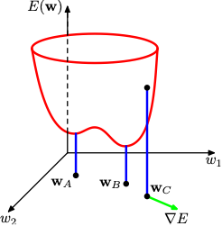
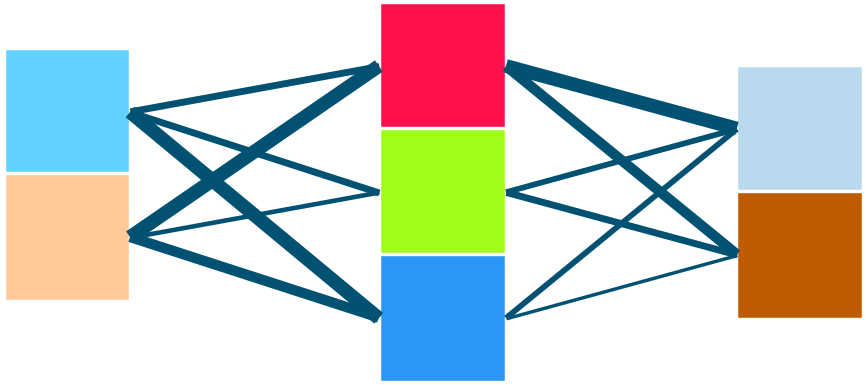
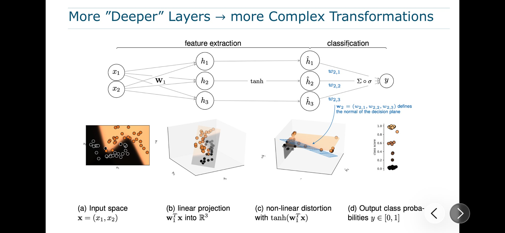
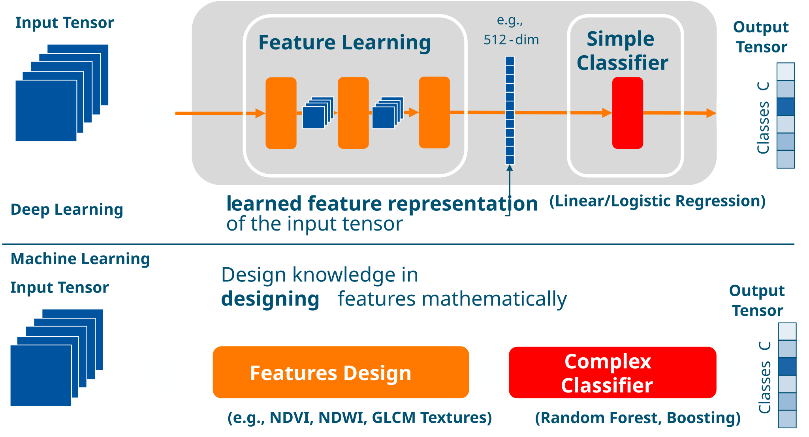
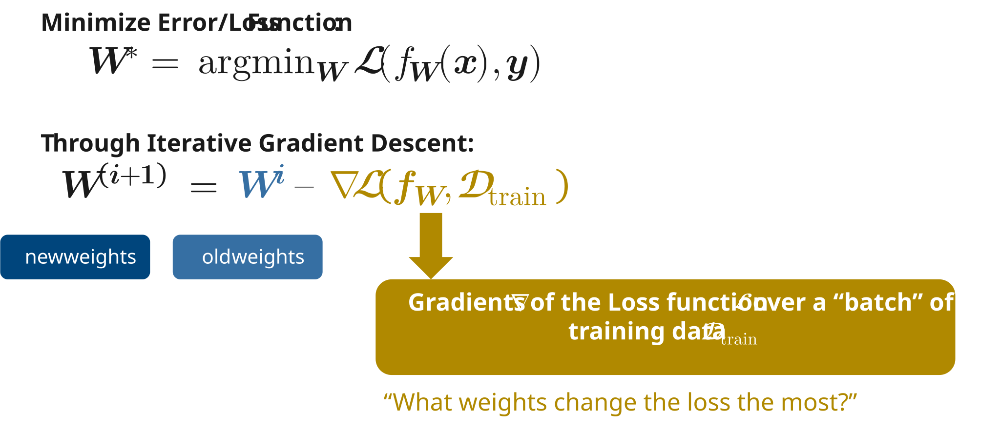

---
addons:
  - "../"
defaults:
  layout: bonn-content
layout: bonn-cover
subhead: Lecture 4
home: ../
---

# Deep Representation Learning I

## What is Learning?

<!--
This lecture formalizes supervised learning on structured inputs before introducing deep learning on raw data.
-->

---

# Two Questions for Lectures 4–5

  

    
Lecture 4

    
How does a neural network learn?

  

  

    
Lecture 5

    
Why should what it learns work beyond the training data?

  

<!--
Set up the two-lecture arc before any technical detail.
Lecture 4 is about the mechanics of learning; Lecture 5 is about why it generalises.
-->

---

# Learning Outcomes Roadmap

| | Learning outcome | Lecture | Block |
|---|---|---|---|
| ⬜ | Explain how neural networks learn representations that simplify tasks. | Lecture 4 | Models and Representations |
| ⬜ | Explain layers, parameters, biases, and nonlinear activations in an MLP. | Lecture 4 | Models and Representations |
| ⬜ | Explain forward passes, losses, gradients, backpropagation, and updates. | Lecture 4 | Learning and Optimization |
| ⬜ | Explain the inductive biases of CNNs, RNNs, GNNs, Transformers, and common losses. | Lab 4 | Expert Jigsaw |
| ⬜ | Distinguish finite datasets from samples of an underlying distribution. | Lecture 5 | Samples and Distributions |
| ⬜ | Explain generalization, overfitting, bias–variance, and train/validation/test evaluation. | Lecture 5 | Classical Generalization |
| ⬜ | Explain interpolation thresholds, double descent, and overparameterization. | Lecture 5 | Modern Generalization |

<!--
This table is the shared map for Lectures 4 and 5.
We will revisit it mid-lecture to mark what has been covered, and again at the start of Lecture 5.
The ⬜ markers can be swapped to ✅ as outcomes are reached.
-->

---

# Today: How Do Neural Networks Learn Useful Representations?

Focusing on the first three outcomes from the roadmap.

  

    
Block 1 — Models and Representations

  

  

    
Block 2 — Learning and Optimization

    
  

Next: what does learning actually mean for a system?

<!--
Zoom in on today's scope before the lecture becomes technical.
Students should track these two blocks as the lecture progresses.
-->

---
section: overview
---

# Two Core Topics in This Lecture

  

    
Deep Learning Model

    <ol class="text-[.8rem] leading-8 mb-4">
      <li><strong>Architectures</strong> — MLP, CNN, Transformer</li>
      <li><strong>Tasks</strong> — Classification &amp; Segmentation</li>
    </ol>
    
  

  

    
Model Training

    <ol class="text-[.8rem] leading-8 mb-4">
      <li><strong>Loss surfaces</strong> and gradient descent</li>
      <li>Forward pass → Loss → Backprop → Update</li>
    </ol>
    
  

<!--
Transition slide before diving into Block 1.
Left previews the model block (architectures, tasks, MLPs).
Right previews the training block (loss, gradient descent, backprop).
-->

---
layout: bonn-section
sectionColor: "#00457c"
section: overview
sectionTitle: Overview
---

# The Aspects of Learning

  <iframe
    src="https://giphy.com/embed/MmozymbZc0RdC"
    width="300"
    height="300"
    class="rounded-xl shadow"
    frameBorder="0"
    allowFullScreen>
  </iframe>
    

    via
    <a href="https://giphy.com/gifs/MmozymbZc0RdC" target="_blank" rel="noopener noreferrer" class="underline">GIPHY</a>,
    original source
    <a href="https://imgur.com/gallery/FBMm2DO" target="_blank" rel="noopener noreferrer" class="underline">imgur.com/gallery/FBMm2DO</a>
  

---
section: overview
---

# What Does a System Need to Learn?

<AspectsOfLearningDiagram />

<!--
Brainstorm live with the class, one question at a time, clicking to reveal each answer:

1. What does a system need in order to learn? (opening prompt in the slide title)
2. What is doing the learning? -> reveal Learnable model (click 1)
   Expected: it needs adjustable parameters and enough capacity to represent the task.
3. What can it learn from? -> reveal Experiences (click 2)
   Expected: experiences supply the information the model learns from (already covered in Lecture 2 as data).
4. What turns experience into changes in the model? -> reveal Learning algorithm (click 3)
   Expected: the learning algorithm determines how experience changes the model's parameters.
5. How do we know it learned rather than memorized? -> reveal Generalization (click 4)
   Land the distinction: experiences, model, and algorithm are the ingredients for learning;
   generalization to unseen situations is the success criterion.
-->

---
section: overview
---

# Timeline and Evolution of Deep Learning

  

    
&lt;2012

    
2015 onwards

    
&gt;2020 →

  

  <table class="w-full text-[.75rem] border-collapse">
    <thead>
      <tr>
        <th class="bg-[#00457c] text-white text-left px-3 py-2 font-semibold w-1/3">Classic Machine Learning</th>
        <th class="bg-[#00457c] text-white text-left px-3 py-2 font-semibold w-1/3 border-l border-white/30">Supervised Deep Learning</th>
        <th class="bg-[#00457c] text-white text-left px-3 py-2 font-semibold w-1/3 border-l border-white/30">Self-Supervised Learning</th>
      </tr>
    </thead>
    <tbody>
      <tr class="border-b border-gray-200">
        <td class="px-3 py-2 align-top"><strong>Feature Design:</strong> Which features extract the most information?</td>
        <td class="px-3 py-2 align-top border-l border-gray-200"><strong>Model Design:</strong> Which architecture is best for my tensors?</td>
        <td class="px-3 py-2 align-top border-l border-gray-200"><strong>Loss Design:</strong> Which loss function or training strategy?</td>
      </tr>
      <tr class="border-b border-gray-200 bg-gray-50">
        <td class="px-3 py-2"><strong>Data:</strong> small labelled</td>
        <td class="px-3 py-2 border-l border-gray-200"><strong>Data:</strong> large labelled</td>
        <td class="px-3 py-2 border-l border-gray-200"><strong>Data:</strong> large unlabelled</td>
      </tr>
      <tr>
        <td class="px-3 py-2"><strong>Models:</strong> Random Forest, Boosting, Lin. Regression</td>
        <td class="px-3 py-2 border-l border-gray-200"><strong>Models:</strong> MLPs, CNNs, RNNs</td>
        <td class="px-3 py-2 border-l border-gray-200"><strong>Model:</strong> Transformers</td>
      </tr>
    </tbody>
  </table>

<!--
Historical framing: three eras of machine learning, defined by the central design question.
Classic ML: features are hand-designed. Supervised DL: architecture is the design choice. Self-supervised: the loss/training strategy is the key decision.
-->

---
layout: bonn-section
sectionColor: "#00457c"
section: models-and-representations
sectionTitle: Models and Representations
---

# Models and Representations

How model architecture shapes internal representations of geospatial data.

---
section: models-and-representations
---

# Our Learned Understanding

  

    
Chinese

    
我们的心智已经学会理解这个句子。

  

  

    
Arabic

    
لقد تعلّم عقلنا أن يفهم هذه الجملة.

  

  

    
Hebrew

    
המוח שלנו למד להבין את המשפט הזה.

  

  

    
Korean

    
우리의 마음은 이 문장을 이해하는 법을 배웠습니다.

  

  

    
Latin

    
Our mind has learned to understand this sentence.

  

---
section: models-and-representations
---

# Deep Learning Model

---
section: models-and-representations
---

# Sentinel-2 as an Image Tensor

---
section: models-and-representations
---

# Image Classification

---
section: models-and-representations
---

# Image Segmentation

---
section: models-and-representations
---

# Object Detection

---
section: models-and-representations
---

# Time Series Classification

---
section: models-and-representations
---

# Overview: Deep Model Architectures

  

    
1950s

    
1990s

    
2015

    
2020s →

  

  

    

      
MLP

      <ul class="text-[.72rem] leading-6 text-gray-700">
        <li>Linear Projections</li>
        <li>Activation Functions</li>
        <li>Linear Algebra &amp; Biological Analogy</li>
        <li>Parallelism on GPUs</li>
      </ul>
    

    

      
CNN

      <ul class="text-[.72rem] leading-6 text-gray-700">
        <li>Convolutions</li>
        <li>Pooling</li>
        <li>Recep. Fields</li>
      </ul>
    

    

      
ResNet

      <ul class="text-[.72rem] leading-6 text-gray-700">
        <li>Deeper Networks</li>
        <li>Batch Normalization</li>
        <li>Skip Connections</li>
        <li>Classification &amp; Segmentation Tasks</li>
      </ul>
    

    

      
Transformers

      <ul class="text-[.72rem] leading-6 text-gray-700">
        <li>Attention Mechanism</li>
        <li>Self-Attention (SA)</li>
        <li>Multi-Head SA</li>
        <li>Transformer Layers</li>
      </ul>
    

  

<!--
Historical arc before diving into the MLP in detail.
Each era introduced a new inductive bias: MLPs — universal approximation; CNNs — locality and translation equivariance; ResNets — depth with trainability; Transformers — global context via attention.
-->

---
section: models-and-representations
---

# Linear Transformation

---
section: models-and-representations
---

# Linear Transformation with a Bias Term

---
section: models-and-representations
---

# Weighted Connections

---
section: models-and-representations
---

# More "Deeper" Layers → more Complex Transformations

<!--
Key insight: the first layer (W1) linearly projects the input into a higher-dimensional space; the activation (tanh) then non-linearly distorts that space so a simple linear classifier in the final layer can separate the classes.
(a) Input space x=(x1,x2); (b) linear projection into R^3; (c) non-linear distortion with tanh; (d) output class probabilities.
-->

---
section: models-and-representations
---

# How an MLP transforms feature space

<MlpFeatureSpaceDemo />

Inspired by Andrej Karpathy's <a href="https://cs.stanford.edu/people/karpathy/convnetjs/demo/classify2d.html" target="_blank" rel="noopener noreferrer">ConvNetJS Classify2D</a> demo. Implemented with Claude and Codex.

---
section: models-and-representations
---

# Machine Learning and Deep Learning

---
section: models-and-representations
---

# Feature Learning

---
section: models-and-representations
---

# Foundation Models

---
layout: bonn-section
sectionColor: "#00457c"
section: learning-and-optimization
sectionTitle: Learning and Optimization
---

# Learning and Optimization

From predictions to loss, gradients, and parameter updates.

---
section: learning-and-optimization
---

# Training: Adjusting Weights to Minimize Loss

---
section: learning-and-optimization
---

# The Learning Objective: argmin

---
section: learning-and-optimization
---

# Loss Function: Mean Squared Error

---
section: learning-and-optimization
---

# Loss Function: Cross-Entropy

---
section: learning-and-optimization
---

# Loss Surfaces

---
section: learning-and-optimization
---

# Gradient Descent

---
section: learning-and-optimization
---

# Backpropagation

---
section: learning-and-optimization
---

# Backpropagation

---
section: learning-and-optimization
---

# Backpropagation

---
section: learning-and-optimization
---

# Backpropagation

---
section: learning-and-optimization
---

# Backpropagation

---
section: learning-and-optimization
---

# Backpropagation

---
section: learning-and-optimization
---

# Backpropagation

