---
addons:
  - "../"
defaults:
  layout: bonn-content
layout: bonn-cover
subhead: Lecture 5
home: ../
---

# Deep Representation Learning II

## How Can a Model Generalize?

<!--
Lecture 4 ended with gradient-based learning and minimizing a training loss.
Lecture 5 continues directly from there: what does it mean to truly learn, not just memorize?
-->

---

# Learning Outcomes

  

    
1

    
Explain <strong>generalization</strong> as the difference between optimizing a finite training sample and performing well on the underlying data distribution.

  

  

    
2

    
Explain how <strong>model capacity, data, and regularization</strong> determine underfitting and overfitting in the classical regime.

  

  

    
3

    
Explain why the <strong>interpolation threshold, double descent, and grokking</strong> challenge the classical bias–variance picture and motivate the modern overparameterized learning regime.

  

<!--
Three outcomes, two lectures worth of contrast: classical view vs. modern view.
Outcome 1 sets up the core concept; Outcome 2 is the classical story; Outcome 3 is the modern twist.
-->

---
section: approximation
layout: bonn-two-cols-header
---

# Recap Lecture 4 Deep Learning I
 
::left::

## Deep Model Architectures

::right::

## Parameter Optimization

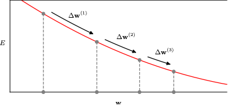

::bottom::

  
Takeaway: We can now approximate any function with a neural network.

But is function approximation enough?

---
section: approximation
layout: bonn-two-cols-header
---

::left:: 

# What is wrong here?

  
🧑‍🍳 Takeaway: The Pizza Baker Apprentice does not need to hold 📦 boxes to pick up a 🍕 pizza.

::right::

  <video
    src="./assets/pizza.mp4"
    controls
    class="rounded-xl shadow-lg max-h-[400px]"
    style="max-width: 230px;"
  ></video>

---
section: approximation
layout: bonn-two-cols-header
---

# Approximation vs Generalization

::left::

## Approximation

When training, we minimize the empirical risk

$$
\widehat{\mathcal{R}}(\theta)
= \frac{1}{N}\sum_{i=1}^{N}
\mathcal{L}\bigl(f_{\theta}(\mathbf{x}_i), \mathbf{y}_i\bigr)
$$

## Generalization

But in practice, we want the population (test) risk to be small

$$
\mathcal{R}(\theta)
= \mathbb{E}_{(\mathbf{x},\mathbf{y}) \sim \mathcal{P}}
\mathcal{L}\bigl(f_\theta(\mathbf{x}),\mathbf{y}\bigr)
$$

::right::

    <OverfittingDemo />

---
section: approximation
---

# What is needed for a system to learn?

<AspectsOfLearningDiagram/>

---
layout: bonn-section
sectionColor: "#00457c"
section: data
sectionTitle: Data
---

# Data Samples and Distributions

  </img>

---
section: data
---

# Reality → Distribution → Dataset

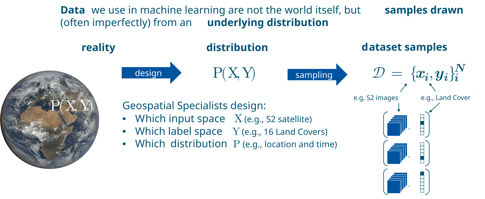

---
section: data
---

# Reality → Distribution: Generative Perspective

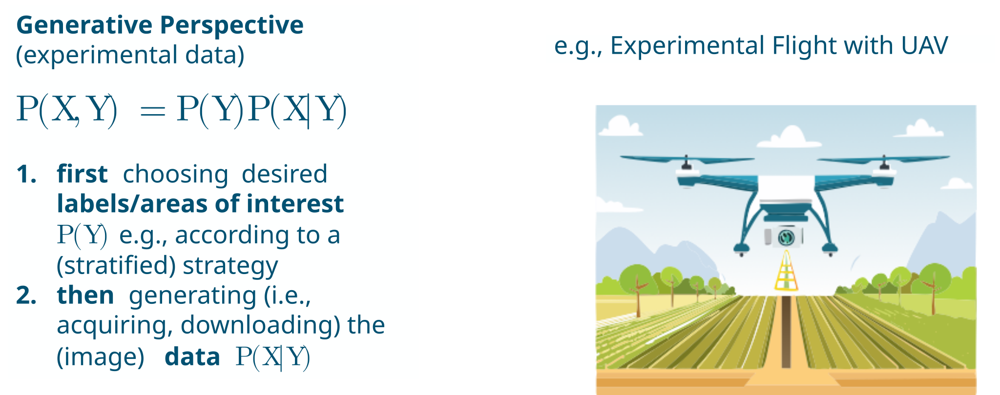

---
section: data
---

# Reality → Distribution: Discriminative Perspective

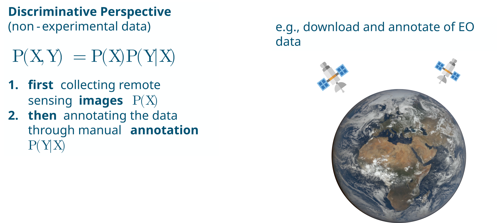

---
section: data
---

# Data as Samples from a Distribution

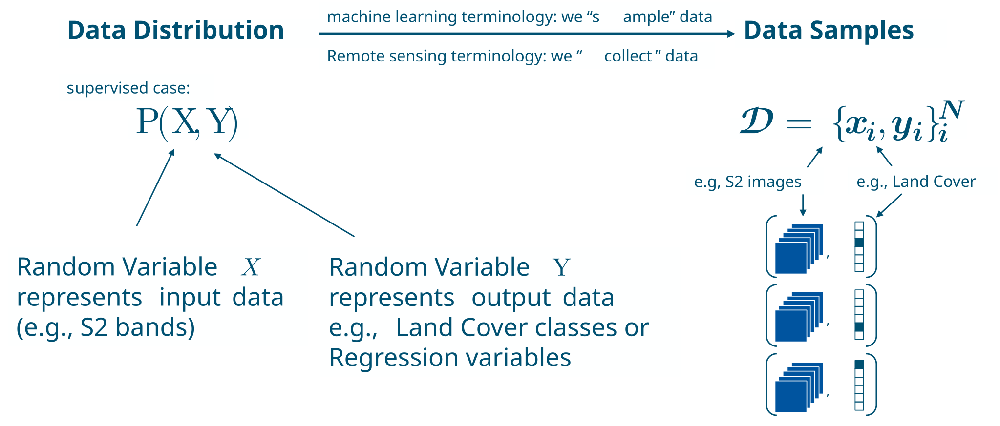

---
section: data
---

# Distribution → Dataset: I.I.D Assumption

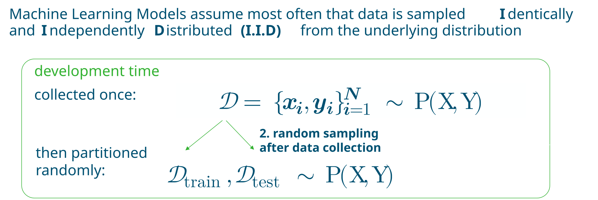

---
section: data
---

# Distribution → Dataset: In-Distribution Generalization

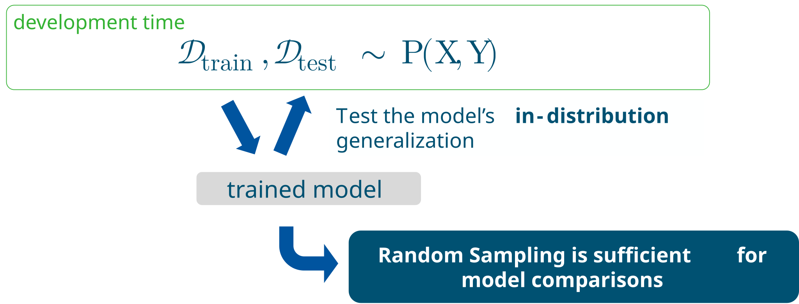

---
section: data
---

# In Practice: Training, Validation, Test Data

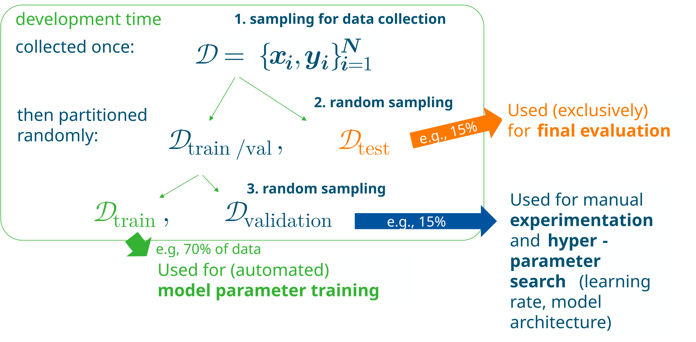

---
section: data
---

# Distribution → Dataset: Random Sampling

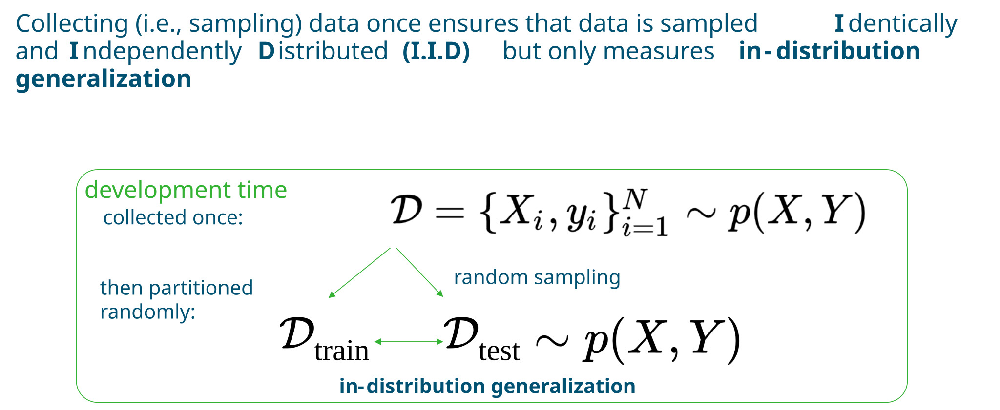

---
section: data
---

# Real-World Models need to generalize Out-of-Distribution

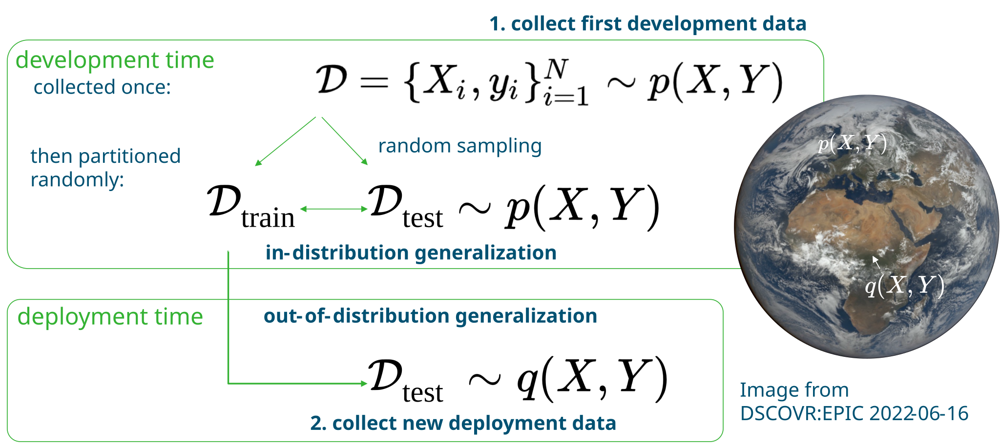

---
section: data
---

# Chanes between Development and Deployment

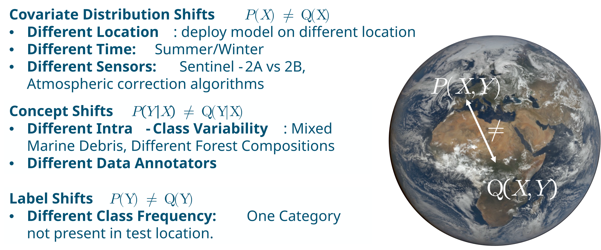

---
section: data
---

# Geospatial Models Need to Generalize Out-of-Distribution

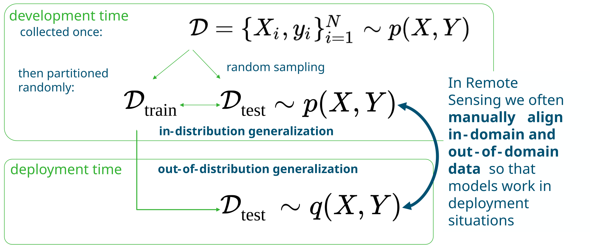

---
section: data
layout: bonn-image-right
image: ./assets/window.jpg
---

# Takeaway: Data

* We model our world as distributions from which we sample (i.e., collect) datasets
* We use training data to train model weights, validation data for experimentation, and test data for final evaluation
* Random sampling of train, val, test data measures in-distribution accuracy and is sufficient for model comparisons
* Real-world deployments must consider distribution shifts 𝑃(𝑋│𝑌)≠𝑄(𝑋│𝑌) and assessing out-of-distribution accuracy on separately collected test data

---
layout: bonn-section
sectionColor: "#00457c"
section: classical-generalization
sectionTitle: Classical Generalization
---

# Classical Generalization Theory

<!--
Block 1 placeholder. Topics to develop: finite datasets vs. underlying distribution, training vs. population loss, train/val/test splits, generalization gap, model capacity, underfitting/overfitting, bias–variance trade-off, regularization.
-->

---
section: classical-generalization
layout: bonn-two-cols-header
---

# The Hypothesis Space $\mathcal H$

::left::

A **hypothesis** is a prediction function:

$$
h:\mathcal X\rightarrow\mathcal Y
$$

The **hypothesis space** is the set of functions the model can represent:

$$
\mathcal H=\{h_\theta:\theta\in\Theta\}
$$

- $\Theta$ is the **parameter space**
- $\theta\in\Theta$ is one parameter choice
- $h_\theta\in\mathcal H$ is the corresponding prediction function
- Training selects a hypothesis from $\mathcal H$

$$
\boxed{\text{parameters }\theta
\quad\longrightarrow\quad
\text{hypothesis }h_\theta}
$$

::right::

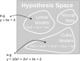

---
section: classical-generalization
layout: bonn-two-cols-header
---

# Example $\mathcal H_\text{linear}$

::left::

A **hypothesis** is a prediction function:

$$
h:\mathcal X\rightarrow\mathcal Y
$$

The **hypothesis space** is the set of functions the model can represent:

$$
\mathcal H=\{h_\theta:\theta\in\Theta\}
$$

- $\Theta$ is the **parameter space**
- $\theta\in\Theta$ is one parameter choice
- $h_\theta\in\mathcal H$ is the corresponding prediction function
- Training selects a hypothesis from $\mathcal H$

$$
\boxed{\text{parameters }\theta
\quad\longrightarrow\quad
\text{hypothesis }h_\theta}
$$

::right::

**Example:** $\mathcal H_{\text{linear}} = \{h_{w,b}(x) = wx+b : (w,b) \in \mathbb{R}^2\}$

<LinearHypothesisDemo />

---
section: classical-generalization
layout: bonn-two-cols-header
---

# Parameter Space and Hypothesis Space

## Two parameter sets can map to the same Hypothesis

::left::

The **parameter space** contains the numerical values optimized during training:

$$
\theta\in\Theta
$$

The **hypothesis space** contains the prediction functions the model can represent:

$$
h_\theta\in\mathcal H
$$

A parameterization maps parameter values to hypotheses:

$$
\Phi:\Theta\rightarrow\mathcal H,
\qquad
\theta\mapsto h_\theta
$$

This mapping does not have to be one-to-one:

$$
\theta_1\neq\theta_2
\qquad\text{but}\qquad
\Phi(\theta_1)=\Phi(\theta_2)
$$

::right::

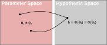

**Training moves through parameter space, but predictions are determined by the corresponding hypothesis.**

---
section: classical-generalization
layout: bonn-two-cols-header
---

# From Optimization to a Learned Hypothesis

::left::

## Navigate parameter space

Gradient descent updates the parameters in a direction that aims to reduce the empirical risk:

::right::

## Induce a path through $\mathcal H$

Every parameter value represents a prediction function:

$$
h_{\theta^{(0)}}
\rightarrow
h_{\theta^{(1)}}
\rightarrow\cdots\rightarrow
h_{\theta^{(T)}}\text{, so that } 
\hat h_D=h_{\theta^{(T)}}\in\mathcal H
$$

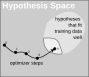

---
section: classical-generalization
layout: bonn-two-cols-header
---

# Occam's Razor Idea

## Simpler functions should generalize better.

::left::

Willian of Ockham (c. 1287 – 9/10 April 1347)

::right::

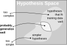

---
section: classical-generalization
layout: bonn-two-cols-header
---

# Bias and Variance

$$
\text{test risk}
=
\underbrace{\text{training risk}}_{\text{related to bias}}
+
\underbrace{
\left(\text{test risk}-\text{training risk}\right)
}_{\text{related to variance}}
$$

::left::

## Bias

**How systematically wrong is the model?**

$$
\operatorname{Bias}(x)
=
\mathbb E_D[\hat f_D(x)]-f^*(x)
$$

- Difference between the average learned model and the true function
- Often caused by a restrictive hypothesis space
- High bias leads to underfitting
- Both training and test error are typically high

::right::

## Variance

**How much does the model depend on the dataset?**

$$
\operatorname{Var}(x)
=
\mathbb E_D\!\left[
\left(
\hat f_D(x)-\mathbb E_D[\hat f_D(x)]
\right)^2
\right]
$$

- Measures variation across different training datasets
- Often increases with model flexibility
- High variance leads to overfitting
- Test error can be much higher than training error

---
section: classical-generalization
layout: bonn-two-cols-header
---

# Example: Linear Regression 

  <BiasVarianceDemo />

::left::

  
Task 1: Discuss the bias and variance of Linear Regression models.

::right::

  
Task 2: Increase and Decrease the dataset size N, how does the variance change?

---
section: classical-generalization
layout: bonn-two-cols-header
---

# Controlling Bias and Variance

::left::

## Strategy 1: Introduce Inductive Bias

Use domain knowledge to **restrict or prioritize** hypotheses:

- choose informative features;
- select an appropriate architecture;
- encode known invariances;
- regularize model complexity.

## Strategy 2: Reduce Variance by more Data

Use additional information to rule out hypotheses that fit only by chance:

- collect more labelled data;
- apply valid data augmentation;
- exploit unlabelled data through pretraining.

::right::

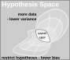

---
section: classical-generalization
layout: bonn-two-cols-header
---

# Bias Variance Trade-Off

::left::

- **Under-fitting of simpler models** have high bias: they do not fit the training data well. Their predictions are fairly consistent across different training sets, so they have low variance.

- **Over-fitting of complex models** have lower bias: they fit the training data closely, sometimes perfectly. Their predictions depend more strongly on the training sample, so they have high variance and may perform poorly on new data.

- The classical **sweet spot** balances bias and variance to minimize test risk.

::right::

---
section: classical-generalization
layout: bonn-two-cols-header
---

# Vapnik-Chervonenkis (VC) Dimension 

## How to measure the Capacity of H

::left::

A set of $n$ points is **shattered** by $\mathcal H$ if classifiers in $\mathcal H$ can realize all $2^n$ possible binary labelings. The **VC dimension** is the largest number of points that $\mathcal H$ can shatter:

$$
\operatorname{VCdim}(\mathcal H)
=
\max\left\{
n:\text{some }n\text{ points are shattered by }\mathcal H
\right\}.
$$

  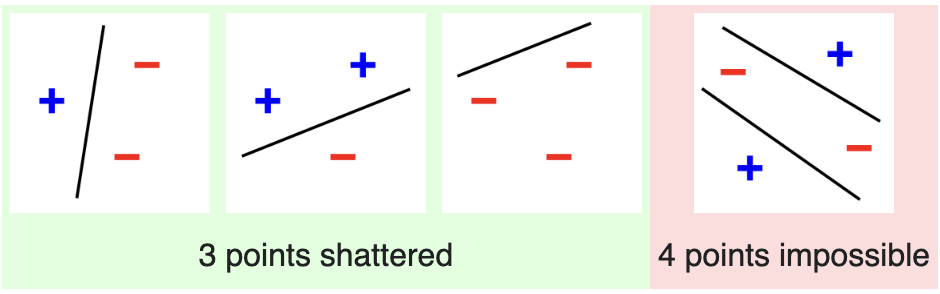
  

    Image: <a href="https://en.wikipedia.org/wiki/Vapnik%E2%80%93Chervonenkis_dimension" target="_blank" rel="noopener noreferrer">Wikipedia</a>, CC BY-SA 3.0
  

::right::

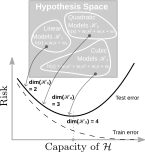

---
section: classical-generalization
layout: bonn-two-cols-header
---

# Worst-Case Generalization Gap

For a bounded loss, ignoring constants and logarithmic terms:

$$
\left|R(h)-\widehat R_D(h)\right|
\lesssim
\sqrt{\frac{d}{n}}
$$

with VC dimension $d$ and sample size $n$

::left::

- A larger VC dimension gives a weaker guarantee for the same sample size.
- More training data reduces the worst-case gap approximately as $1/\sqrt n$.
- For a target gap $\varepsilon$, the required sample size scales approximately as

  $$
  n \propto \frac{d}{\varepsilon^2}.
  $$

- The guarantee is useful only when $d\ll n$. When $d\approx n$, the bound becomes uninformative.

::right::

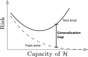

**VC bounds are distribution-free and robust, but often pessimistic.**

---
section: classical-generalization
---

# Example Polynomial Regression: 
## Increasing Polynomial Degree D: ↓ Bias ↑ Variance

  <PolynomialBiasVarianceDemo2 />

---
section: classical-generalization
layout: bonn-two-cols-header
---

# Takeaways Classical Generalization Theory

::left::

- Training minimizes **training risk**, while the goal is low **testing risk**.
- Simpler models are more stable but may underfit because of high bias.
- More flexible models reduce bias but may overfit because of high variance.
- When overfitting, reduce model complexity, increase regularization, or use more data.
- When underfitting, increase model capacity or reduce regularization.
- Use validation data to find the model complexity that best balances bias and variance.

::right::

---
layout: bonn-section-image-right
sectionColor: "#00457c"
section: modern-generalization
sectionTitle: Modern Generalization
image: ./assets/sailor.jpg
---

# Generalization beyond the Interpolation Threshold

<a href="https://www.pexels.com/@ludvighedenborg/" target="_blank" rel="noopener noreferrer">
Photo by Ludvig Hedenborg, Pexels License
</a>

---
section: modern-generalization
---

# Beyond the Threshold: Double Descent in Polynomial Regression

  <PolynomialBiasVarianceDemo3 />

---
section: modern-generalization
---

# Polynomial Regression in Interpolation Regime

Underfitting — Degree 3

  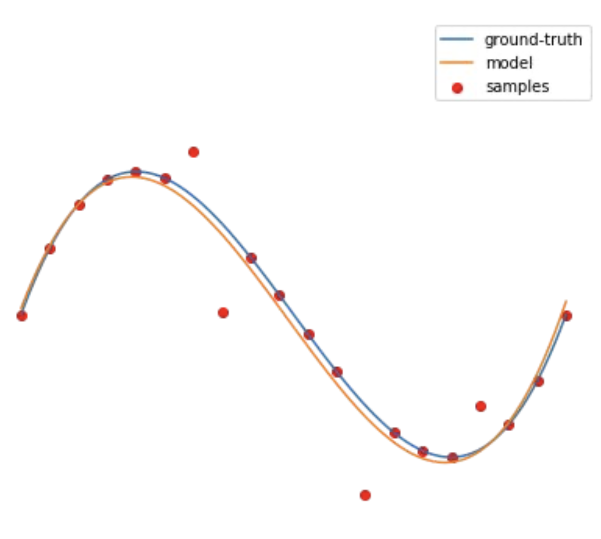

Overfitting — Degree 20

  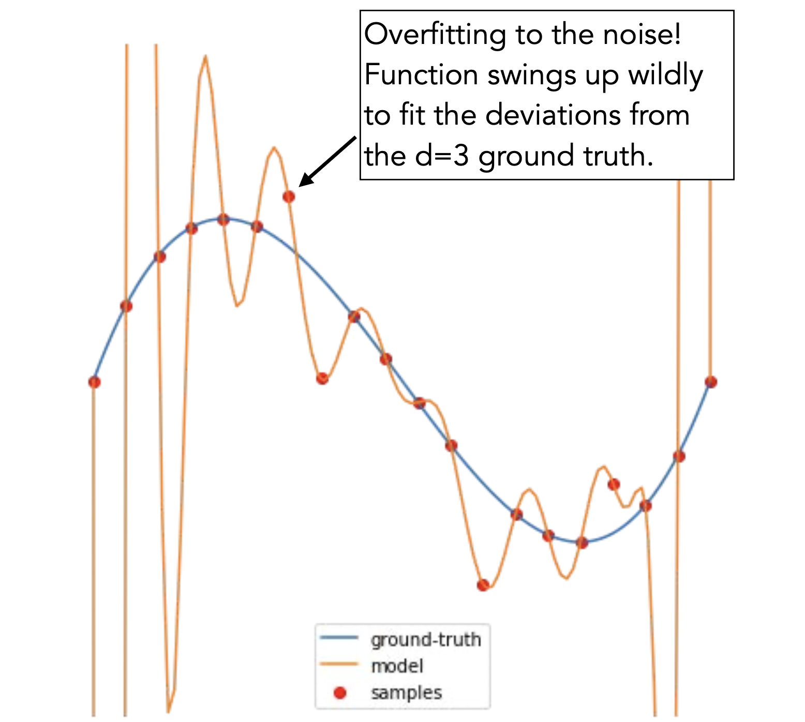

Interpolating — Degree 1000

  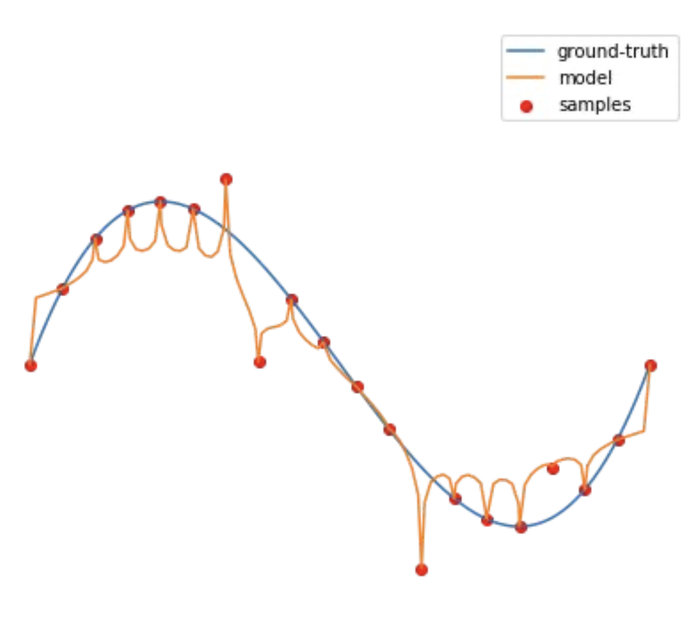

Credit: Philip Isola, MIT 6.7960 Deep Learning (Fall 2024), Lecture 6: NN Generalization, <a href="https://ocw.mit.edu/courses/6-7960-deep-learning-fall-2024/resources/mit6_7960f24_lec06_captions_vtt/" target="_blank" rel="noopener noreferrer">MIT OpenCourseWare</a>

---
section: modern-generalization
---

# Double Descent Phenomenon

## Overparamterized Models Improve Again after Overfitting

Credit: Belkin et al., 2019. <a href="https://arxiv.org/abs/1812.11118">Reconciling modern machine learning practice and the bias-variance trade-off</a>

---
section: modern-generalization
layout: bonn-two-cols-header
---

# The Simple + Spiky Hypothesis

::left::

  

::right::

$$
\boxed{
\text{learned model}
=
\underbrace{\text{“simple”}}_{\text{predictive component}}
+
\underbrace{\text{“spiky”}}_{\text{overfitting / memorization component}}
}
$$

Belkin, Rakhlin &amp; Tsybakov, 2018. <a href="https://arxiv.org/abs/1806.09471" target="_blank" rel="noopener noreferrer">Does data interpolation contradict statistical optimality?</a>

::bottom::

Credit: Philip Isola, MIT 6.7960 Deep Learning (Fall 2024), Lecture 6: NN Generalization, <a href="https://ocw.mit.edu/courses/6-7960-deep-learning-fall-2024/resources/mit6_7960f24_lec06_captions_vtt/" target="_blank" rel="noopener noreferrer">MIT OpenCourseWare</a>

---
section: modern-generalization
layout: bonn-two-cols-header
---

# Neural Networks Interpolate and Generalize

## The same hypothesis class can memorize noise and learn structure

::left::

## The experiment

**Inception on CIFAR-10**

| Training labels | Train accuracy | Test accuracy |
|---|---:|---:|
| **True labels** | 100% | 85.75% |
| **Random labels** | 100% | 9.78% |

::right::

  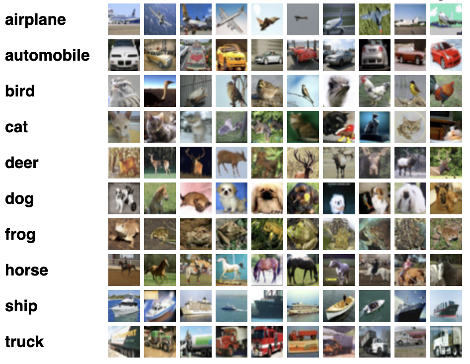

## The VC bound becomes vacuous and does not explain Deep Networks' generalization

* **No contradiction:** The VC bound remains valid, but it is too pessimistic to distinguish the two learned solutions.

::bottom::

Zhang et al. (2017). <em>Understanding Deep Learning Requires Rethinking Generalization.</em> ICLR. <a href="https://arxiv.org/abs/1611.03530">arXiv:1611.03530</a>

---
section: modern-generalization
layout: bonn-two-cols-header
---

# How to measure the Model Complexity now??

::left::

## By the number of distinct functions the model can represent? (VC-dimension)

→ **No.** Not helpful — the generalization bound is too pessimistic. Following classical theory, neural networks should not generalize.

Slide from Philip Isola, MIT 6.7960 Deep Learning (Fall 2024), Lecture 6: NN Generalization, <a href="https://ocw.mit.edu/courses/6-7960-deep-learning-fall-2024/resources/mit6_7960f24_lec06_captions_vtt/" target="_blank" rel="noopener noreferrer">MIT OpenCourseWare</a>

  
Why parameter count alone doesn't determine generalization for deep learning is still an open question.

::right::

## By the number of parameters in a neural network?

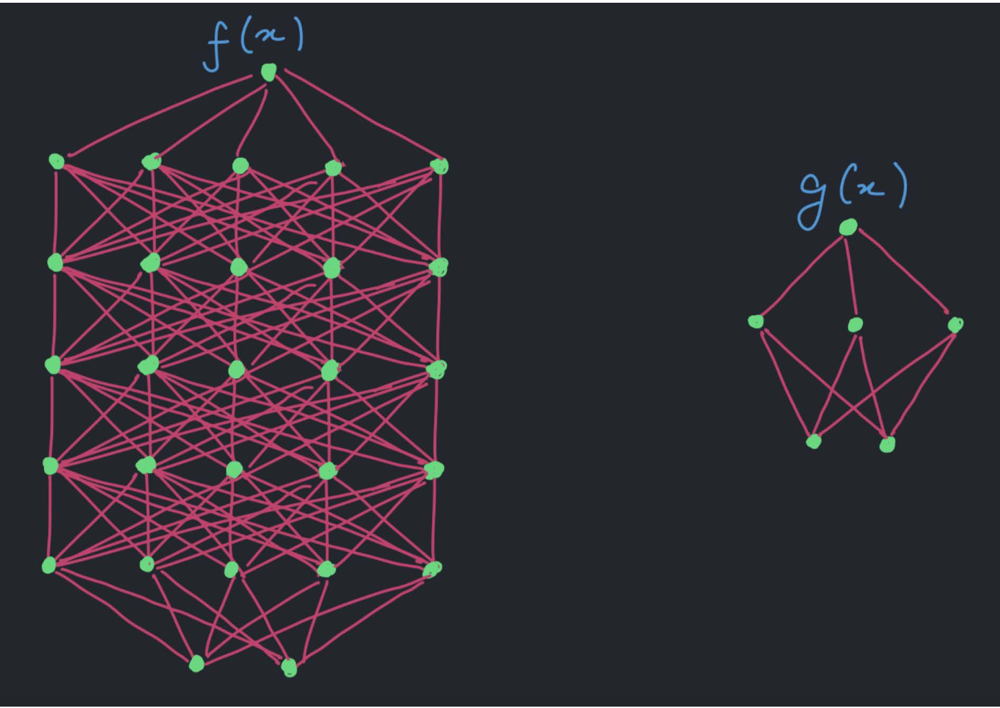

Consider $h(x) = 10^{-100} f(x) + (1 - 10^{-100}) g(x)$. How many parameters does it have? Does it matter? **Not really.**

---
section: modern-generalization
layout: bonn-two-cols-header
---

# "Effective" Model Capacity

<b>“Capacity” is intentionally abstract.</b> Parameter count may indicate when interpolation becomes possible, but it does not determine the complexity of the learned solution or its test performance.

---
section: modern-generalization
layout: bonn-two-cols-header
---

# Recap So Far

::left::

What we observed

**Deep networks generalize.**  
They make accurate predictions on inputs that were not part of the training data.

**Deep networks also interpolate.**  
The same architectures can perfectly fit true labels and random labels.

**Training fit alone cannot explain generalization.**  
Zero training error does not distinguish learning useful structure from memorizing the sample.

::right::

What this implies

**Generalization requires inductive bias.**  
Training must favor some interpolating solutions over many others that fit the data equally well.

**Worst-case capacity is insufficient.**  
Parameter count and VC dimension describe the entire hypothesis space, but their bounds become vacuous for highly expressive neural networks.

**The selected solution matters.**  
Architecture, optimization, regularization, and data properties all influence which solution training finds.

::bottom::

**Next question:** Which inductive biases make interpolating neural networks generalize?

Slide from Philip Isola, MIT 6.7960 Deep Learning (Fall 2024), Lecture 6: NN Generalization, <a href="https://ocw.mit.edu/courses/6-7960-deep-learning-fall-2024/resources/mit6_7960f24_lec06_captions_vtt/" target="_blank" rel="noopener noreferrer">MIT OpenCourseWare</a>

---
section: modern-generalization
layout: bonn-two-cols-header
---

# Version Space

::left::

The **version space** contains all hypotheses that fit the training data perfectly:

$$
\mathcal V_{\mathcal H}(D)
=
\left\{
h\in\mathcal H:
\widehat R_D(h)=0
\right\}.
$$

- In overparameterized models, many hypotheses belong to this set.
- Some generalize to unseen data, while others merely memorize.
- Training error cannot distinguish between them.

**Deep models do generalize. Therefore, the training system must favor generalizing hypotheses within the version space.**

::right::

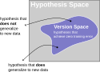

<!--
---
section: modern-generalization
---

# Phillip Isola - MIT Lecture Generalization (2024)

  <iframe width="100%" height="100%" src="https://www.youtube.com/embed/EiO8BBa-xdc?si=VBaY9A3PfJe9_F2x&amp;start=3911&amp;end=3971" title="YouTube video player" frameborder="0" allow="accelerometer; autoplay; clipboard-write; encrypted-media; gyroscope; picture-in-picture; web-share" referrerpolicy="strict-origin-when-cross-origin" allowfullscreen></iframe>

Excerpt from &ldquo;Lec 06: Generalization Theory,&rdquo; Philip Isola, MIT 6.7960 Deep Learning, Fall 2024. MIT OpenCourseWare. Licensed under CC BY-NC-SA 4.0. <a href="https://www.youtube.com/watch?v=EiO8BBa-xdc&t=3651s" target="_blank" rel="noopener noreferrer">Source</a> · <a href="https://creativecommons.org/licenses/by-nc-sa/4.0/" target="_blank" rel="noopener noreferrer">License</a>

-->
---
section: modern-generalization
layout: bonn-two-cols-header
---

# Inductive Biases Select Interpolating Solutions

::left::

## Sources of inductive bias

- **Architecture:** locality, parameter sharing, recurrence, and equivariance
- **Parameterization:** makes some functions easier to represent and reach
- **Initialization:** influences the path taken through parameter space
- **Optimization and loss:** SGD, batch size, learning rate, and loss function
- **Explicit regularization:** weight decay, dropout, and early stopping
- **Data and augmentation:** encode structure, invariances, and prior knowledge

::right::

## What does “simpler” mean?

<strong>Not necessarily fewer parameters.</strong>

Depending on the setting, training may favor solutions with:

- low norm or large margin
- smoothness or invariance
- compressible representations

There is no single universal measure of the effective complexity of a deep network.

::bottom::

For concrete proposed theories, check Phillip Isola.
<a href="https://ocw.mit.edu/courses/6-7960-deep-learning-fall-2024/resources/mit6_7960f24_lec06_mp4/" target="_blank">
<em>Lecture 6: Generalization Theory</em>
</a>.
MIT 6.7960 Deep Learning, Fall 2024.

---
layout: bonn-section
sectionColor: "#00457c"
section: ai-acceleration
sectionTitle: Modern AI Acceleration
---

# The Modern AI Acceleration

---
section: ai-acceleration
layout: bonn-two-cols-header
---

# Scaling Laws for Transformers

## Held-out loss follows power laws of compute, data, and model size

  

**Compute**

$$
L(C_{\min})
=
\left(
\frac{C_{\min}}{2.3\times10^{8}}
\right)^{-0.050}
$$

**Training data**

$$
L(D)
=
\left(
\frac{D}{5.4\times10^{13}}
\right)^{-0.095}
$$

**Model size**

$$
L(N)
=
\left(
\frac{N}{8.8\times10^{13}}
\right)^{-0.076}
$$

::bottom::

Kaplan et al. (2020).
<a href="https://arxiv.org/abs/2001.08361">
<em>Scaling Laws for Neural Language Models.</em>
</a>

---
section: ai-acceleration
layout: bonn-two-cols-header
---

# Modern AI Acceleration

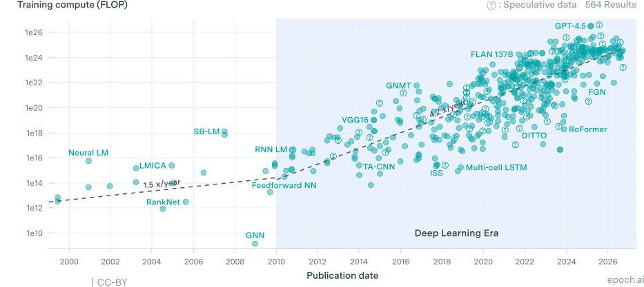

Epoch AI Database provided with CC-BY License

---
section: ai-acceleration
layout: bonn-two-cols-header
---

# Larger Datasets and More Parameters

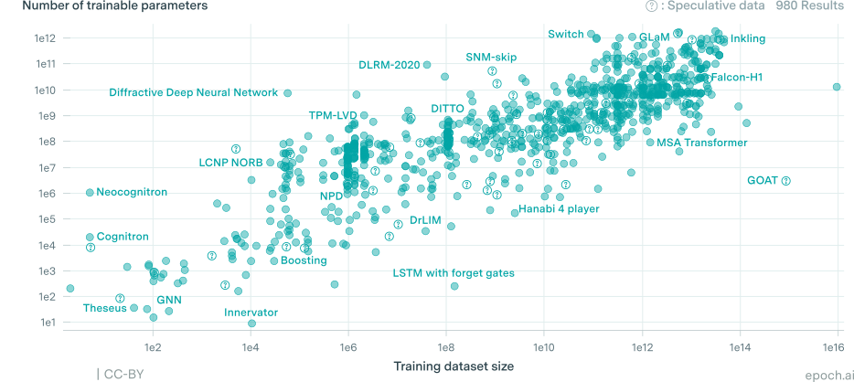

Epoch AI Database provided with CC-BY License

---
section: ai-acceleration
layout: bonn-two-cols-header
---

# LLMs and Next Token Prediction

::left::

Recap - LLMs are Transformers trained with ordinary cross entropy to predict the next token.

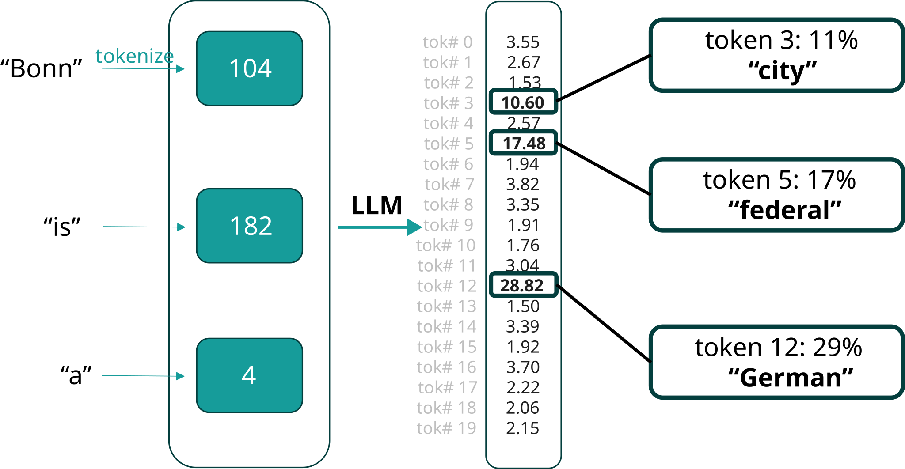

::right::

  <video
    src="./assets/sutskever_detective.mp4"
    controls
    class="rounded-xl shadow-lg max-h-[400px]"
    style="max-width: 150px;"
  ></video>

Copyright NVIDIA: <a href="https://resources.nvidia.com/en-us-summer-of-learning-for-students/gtcspring23-s52092" rel="noopener noreferrer">NVIDIA Fireside Chat with Ilya Sutskever</a>

---
section: ai-acceleration
layout: bonn-two-cols-header
---

# ... and the murderer is ___!

## Prediction requires more than memorization

::left::

Modern AI models **approximate** large corpora of training data while also **generalizing** by combining learned patterns into simple, plausible solutions for new inputs.

<strong v-click>Outlook: Lecture 6 will focus on self-supervised training objectives for modern AI models.</strong>

::right::

  <video
    src="./assets/sutskever2.mp4"
    controls
    class="rounded-xl shadow-lg max-h-[400px]"
    style="max-width: 250px;"
  ></video>

Copyright NVIDIA: <a href="https://resources.nvidia.com/en-us-summer-of-learning-for-students/gtcspring23-s52092" rel="noopener noreferrer">NVIDIA Fireside Chat with Ilya Sutskever</a>

